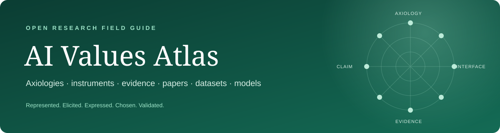

# AI Values Atlas

**A field guide to how values are represented, measured, expressed, chosen, and steered in AI systems.**

[Explore the atlas](https://ikanam-ai.github.io/ai-values-atlas/) · [Field map](#-field-map) · [Axiologies](#-axiologies-and-value-spaces) · [Literature](#-literature-by-research-domain) · [Datasets & benchmarks](#-datasets-benchmarks-and-instruments) · [Contribute](CONTRIBUTING.md)

**701 works · 10 research domains · 1,013 source links · 94 standalone resources**

The Atlas separates value theories, measurement interfaces, benchmarks, scorers, model behavior, and alignment targets instead of treating them as one interchangeable construct.

## 🧭 Field map

| Domain | Research question | Works |
|---|---|---:|
| 🧭 **Value theory and axiologies** | Which values exist, and how are they structured? | 4 |
| 📏 **Measurement and profiling** | How are AI values elicited and summarized? | 107 |
| 🔬 **Reliability, validity, and auditing** | When is a reported value result stable and valid? | 19 |
| ⚖️ **Moral and value understanding** | Can systems identify, explain, or reason about values and norms? | 71 |
| 🎯 **Choice, action, and behavior** | Which values govern choices and behavior under conflict? | 17 |
| 🌍 **Culture, opinions, and social representation** | Whose cultures, opinions, and social perspectives are represented? | 264 |
| 🗣️ **Pluralism and preference aggregation** | How should heterogeneous values and preferences be represented or aggregated? | 57 |
| 🧰 **Alignment and steering** | How are normative targets used to train or steer systems? | 104 |
| 📐 **Value representations and model internals** | How is value information represented, learned, or causally encoded? | 39 |
| 🗺️ **Field reviews, reporting, and governance** | How is the field organized, documented, and governed? | 50 |

## 🧠 Axiologies and value spaces

An axiology describes which values exist and how they relate. The registry currently
contains **17 representations across 7 classes**. Counts and representation classes
stay visible below; the long lists of named dimensions are collapsed for readability.
An axiology is not the questionnaire, prompt, scorer, or benchmark used to measure it.

| Axiology or value space | Class | Numerical structure | Typical use in AI research |
|---|---|---:|---|
| [Schwartz Theory of Basic Human Values](https://doi.org/10.1016/S0065-2601(08)60281-6) | 🧭 Basic human values | **10 values** | questionnaires, scenarios, text scoring, value conflict |
| [Schwartz higher-order dimensions](https://doi.org/10.1016/S0065-2601(08)60281-6) | 🧭 Basic human values | **4 groups** | aggregated profiles and trade-off analysis |
| [Refined Schwartz Theory](https://doi.org/10.1037/a0029393) | 🧭 Basic human values | **19 values** | higher-granularity human and AI profiling |
| [Moral Foundations Theory](https://doi.org/10.1037/a0015141) | ⚖️ Moral values | **6 foundations**; original model: **5** | moral-language classification and profiling |
| [World Values Survey](https://www.worldvaluessurvey.org/) | 🌍 Cultural values | open item space; **7 waves**, **300+ indicators** in Wave 7 | human–AI comparison and political attitudes |
| [Inglehart–Welzel Cultural Map](https://www.worldvaluessurvey.org/WVSContents.jsp) | 🌍 Cultural values | **2 dimensions** | country- and culture-level comparison |
| [Hofstede cultural dimensions](https://geerthofstede.com/research-and-vsm/dimension-data-matrix/) | 🌍 Cultural values | **6 dimensions** | cultural alignment and language/persona audits |
| [GLOBE cultural dimensions](https://globeproject.com/study_2004_2007) | 🌍 Cultural values | **9 dimensions** | cross-cultural model evaluation |
| [Rokeach Value System](https://psycnet.apa.org/record/2011-15663-000) | 🧭 Basic human values | **36 values**: 18 terminal + 18 instrumental | ranked value priorities |
| [Social Value Orientation](https://doi.org/10.1002/ejsp.1773) | 🤝 Social preferences | **1 continuum**; **6 primary items** | allocation choices and behavioral games |
| [Functional Theory of Human Values](https://doi.org/10.1016/j.paid.2013.07.043) | 🧭 Basic human values | **18 values**, **6 subfunctions** | alternative named human-value profiling |
| [GPLA](https://aclanthology.org/2025.acl-long.585/) | 🧠 AI-native values | **123 atomic values → 5 factors** | AI-native value-system construction |
| [UniVaR](https://aclanthology.org/2025.naacl-long.274/) | 🧠 AI-native values | latent space; **8 source LLMs**, **15 evaluated models**, **25 languages/cultures** | model–language embeddings and comparison |
| [Value Kaleidoscope](https://doi.org/10.1609/aaai.v38i18.29970) | 📜 Rights, duties & principles | **3 entity types** | pluralistic reasoning and conflict-aware alignment |
| [Helpful, Honest, and Harmless](https://arxiv.org/abs/2112.00861) | 📜 Rights, duties & principles | **3 principles** | assistant behavior and preference modeling |
| [Constitutional AI](https://arxiv.org/abs/2212.08073) | 📜 Rights, duties & principles | configurable; **no fixed count** | critique, revision, and alignment targets |
| [Generative Psychometrics / GPV](https://doi.org/10.1609/aaai.v39i25.34839) | ✨ Open value space | supplied dynamically; **no fixed count** | free-response extraction and value scoring |

<strong>🔎 Show named dimensions and structural details</strong>

- **Schwartz-10:** Self-Direction, Stimulation, Hedonism, Achievement, Power, Security, Conformity, Tradition, Benevolence, Universalism.
- **Schwartz-4:** Openness to Change, Conservation, Self-Enhancement, Self-Transcendence.
- **Refined Schwartz-19:** Self-Direction–Thought, Self-Direction–Action, Stimulation, Hedonism, Achievement, Power–Dominance, Power–Resources, Face, Security–Personal, Security–Societal, Tradition, Conformity–Rules, Conformity–Interpersonal, Humility, Benevolence–Dependability, Benevolence–Caring, Universalism–Concern, Universalism–Nature, Universalism–Tolerance.
- **Moral Foundations Theory:** Care/Harm, Fairness/Cheating, Loyalty/Betrayal, Authority/Subversion, Sanctity/Degradation, Liberty/Oppression. The original formulation used the first five.
- **World Values Survey:** a changing multilingual item bank rather than a fixed vector; seven completed waves since 1981, coverage of almost 120 countries/societies, and 300+ indicators in Wave 7.
- **Inglehart–Welzel:** Traditional ↔ Secular-Rational; Survival ↔ Self-Expression.
- **Hofstede-6:** Power Distance, Individualism, Masculinity, Uncertainty Avoidance, Long-Term Orientation, Indulgence.
- **GLOBE-9:** Performance Orientation, Assertiveness, Future Orientation, Humane Orientation, Institutional Collectivism, In-Group Collectivism, Gender Egalitarianism, Power Distance, Uncertainty Avoidance.
- **Rokeach terminal values (18):** A Comfortable Life, An Exciting Life, A Sense of Accomplishment, A World at Peace, A World of Beauty, Equality, Family Security, Freedom, Happiness, Inner Harmony, Mature Love, National Security, Pleasure, Salvation, Self-Respect, Social Recognition, True Friendship, Wisdom.
- **Rokeach instrumental values (18):** Ambitious, Broad-Minded, Capable, Cheerful, Clean, Courageous, Forgiving, Helpful, Honest, Imaginative, Independent, Intellectual, Logical, Loving, Obedient, Polite, Responsible, Self-Controlled.
- **Social Value Orientation:** allocation preference from competitive/individualistic to prosocial/altruistic; the common Slider Measure uses six primary items.
- **Functional Theory (18):** Excitement — Emotion, Pleasure, Sexuality; Promotion — Power, Prestige, Success; Existence — Personal Stability, Health, Survival; Suprapersonal — Beauty, Knowledge, Maturity; Interactive — Affectivity, Belonging, Social Support; Normative — Obedience, Religiosity, Tradition.
- **GPLA-5:** Social Responsibility, Risk-Taking, Rule-Following, Self-Competence, Rationality, induced from 123 atomic values.
- **UniVaR:** a continuous latent representation without named value axes, learned contrastively from value-eliciting question–answer sets.
- **Value Kaleidoscope:** Values, Rights, Duties; an ontology rather than a fixed-dimensional profile.
- **HHH:** Helpful, Honest, Harmless.
- **Constitutional AI:** a configurable collection of natural-language normative principles, not a universal fixed-dimensional axiology.
- **GPV:** values are supplied at measurement time and may later be aggregated into Schwartz, Hofstede, or another named space.

## 💾 Datasets, benchmarks, and instruments

Numbers refer to the released resource or the primary paper. A count is omitted
when it changes by release and the authors do not identify one canonical size.

| Resource | Scale | Labels, dimensions, or task | Links |
|---|---|---|---|
| Value Portrait | **104 queries × 5 responses = 520 items**, rated by **681 people**; benchmarked on **44 LLMs** | correlations with **10 Schwartz values** and **5 Big Five traits**; **549 + 287** significant item–trait correlations retained | [[paper](https://aclanthology.org/2025.acl-long.838/)] |
| ValueBench | **44 psychometric inventories**, **453 dimensions**, evaluation on **6 LLMs** | orientation plus value-to-item and item-to-value understanding tasks | [[paper](https://aclanthology.org/2024.acl-long.111/)] [[code](https://github.com/Value4AI/ValueBench)] |
| WorldValuesBench | **21,492,393 examples**, **93,278 respondents**, **239 value questions**, **42 demographic variables**; probe: **8,280 examples / 36 questions** | demographic context + value question → ordinal human response distribution | [[paper](https://aclanthology.org/2024.lrec-main.1539/)] |
| ValueNet | **21,374 text scenarios** | human attitudes scored across **10 Schwartz values** | [[dataset](https://liang-qiu.github.io/ValueNet/)] |
| ValueEval | **9,324 arguments** from **6 sources**, each labeled by **3 annotators** | **54 fine-grained values** mapped to **20** multi-label categories | [[paper](https://aclanthology.org/2023.semeval-1.313/)] |
| Value FULCRA | **20,000 (LLM output, value vector) pairs** | **10 Schwartz dimensions** and **58 fine-grained value items** | [[paper](https://aclanthology.org/2024.naacl-long.486/)] |
| ValuePrism / Value Kaleidoscope | **218,000 values, rights, and duties** linked to **31,000 situations**; human quality acceptance **91%** | generation, explanation, relevance, and **3-way valence**: supports / opposes / either | [[paper](https://doi.org/10.1609/aaai.v38i18.29970)] [[code](https://github.com/tsor13/kaleido)] |
| ETHICS | **130,000+ examples** in **5 sub-benchmarks** | Justice, Virtue Ethics, Deontology, Utilitarianism, Commonsense Morality | [[paper](https://openreview.net/forum?id=dNy_RKzJacY)] [[code](https://github.com/hendrycks/ethics)] |
| Social Chemistry 101 | **104,000 situations**, **292,000 rules-of-thumb**, **4.5M+ annotations** | **12 judgment dimensions**, including moral foundation, legality, pressure, and social approval | [[paper](https://aclanthology.org/2020.emnlp-main.48/)] |
| Moral Stories | **12,000 narratives × 7 sentences** | norm, situation, intention, moral/immoral action, and corresponding consequences | [[paper](https://aclanthology.org/2021.emnlp-main.54/)] [[code](https://github.com/demelin/moral_stories)] |
| World Values Survey | **7 completed waves** since 1981; almost **120 countries/societies**; Wave 7: **97,220 cases, 66 countries, 606 variables** | changing multilingual batteries on social, political, cultural, moral, and religious values | [[project](https://www.worldvaluessurvey.org/)] |
| PVQ-40 / PVQ-RR | **40 items / 10 values** and **57 items / 19 values** | self-report portrait questionnaires for the original and refined Schwartz spaces | [[measurement source](https://doi.org/10.1177/0022022101032005001)] |

## 🧰 Models, scorers, and representation tools

These are computational components, not value theories. Their output only has
meaning together with the prompt, input unit, value space, aggregation policy,
coverage, and validation evidence.

| Tool | Scale and construction | Exact output | Links |
|---|---|---|---|
| ValueLlama-3-8B | **8B-parameter** Llama-3 model fine-tuned on ValueBench and ValuePrism; English | **2 tasks:** binary relevance, then **3-way valence** (supports / opposes / neutral-context-dependent) for any supplied value | [[model](https://huggingface.co/Value4AI/ValueLlama-3-8B)] [[code](https://github.com/Value4AI/gpv)] |
| UniVaR lambda-1 | **137M-parameter** Nomic-BERT encoder; trained contrastively from value-eliciting QA sets produced by **8 source LLMs** | one dense model–language embedding with **no named value coordinates**; paper evaluates **15 models × 25 languages/cultures** | [[model](https://huggingface.co/CAiRE/UniVaR-lambda-1)] [[code](https://github.com/HLTCHKUST/UniVaR)] |
| MoralBERT | BERT-family classifiers fine-tuned on Twitter, Reddit, and Facebook corpora | **10 separate binary classifiers** for virtue/vice poles of the original **5 MFT foundations**; Liberty/Oppression weights are not released | [[code](https://github.com/vjosapreniqi/MoralBERT)] |
| Kaleido | **5 released model sizes:** small, base, large, XL, XXL; trained from **218k** ValuePrism records | candidate generation, explanation, binary relevance, and **3-way valence** over value / right / duty entities | [[code](https://github.com/tsor13/kaleido)] |
| FULCRA / BaseAlign | pipeline trained on **20k output–vector pairs** | a **10-dimensional** Schwartz profile plus **58 item-level** priorities for generated text | [[paper](https://aclanthology.org/2024.naacl-long.486/)] |
| CLAVE | two-model evaluator calibrated with **<100 human labels per value type**; evaluated on **13k+ tuples**, **3 value systems**, and **12+ evaluators** | adaptable reference-free label for a supplied value definition | [[paper](https://arxiv.org/abs/2407.10725)] |

## 🔎 How the domain lists are organized

The Atlas does not score or rank papers. Works are grouped by research question and listed by publication year (newest first), then alphabetically. Contribution types and released artifacts are filters, not quality judgments.

## 📚 Literature by research domain

### 🧭 Value theory and axiologies

Which values exist, and how are they structured?

- ⭐ **Moral Foundations Theory: The Pragmatic Validity of Moral Pluralism** — Elsevier journal or book, 2013 · [[paper](https://papers.ssrn.com/sol3/papers.cfm?abstract_id=2184440)] [[paper version](https://sciencedirect.com/science/article/abs/pii/B9780124072367000024)]
   - Consolidates Moral Foundations Theory, its pluralist assumptions and empirical record, incorporates critiques, and specifies five criteria for recognizing a moral foundation.
- ⭐ **Extending the Cross-Cultural Validity of the Theory of Basic Human Values with a Different Method of Measurement** — SAGE journal, 2001 · [[paper](https://doi.org/10.1177/0022022101032005001)]
   - Introduces the less abstract Portrait Values Questionnaire and validates the ten-value relational structure in large South African, Italian, and Ugandan samples.
- ⭐ **Universals in the Content and Structure of Values: Theoretical Advances and Empirical Tests in 20 Countries** — Elsevier journal or book, 1992 · [[paper](https://psycnet.apa.org/record/2003-00370-001)] [[paper version](https://sciencedirect.com/science/article/pii/S0065260108602816)]
   - Defines and empirically tests the ten motivational value types and their relational structure across 20 countries, providing the foundational Schwartz value space.
- ⭐ **Strategy-Proofness and Arrow's Conditions: Existence and Correspondence Theorems for Voting Procedures and Social Welfare Functions** — Elsevier journal or book, 1975 · [[paper](https://sciencedirect.com/science/article/pii/0022053175900502)]
   - Establishes foundational existence and correspondence results linking strategy-proof voting procedures to Arrow-style social-welfare conditions, informing preference aggregation limits.
### 📏 Measurement and profiling

How are AI values elicited and summarized?

- 📄 **A Scalable Approach to Evaluating Moral Sensitivity in LLMs** — arXiv, 2026 · [[paper](https://arxiv.org/abs/2607.02972)]
   - Tests robustness of moral feature identification, adjacent to but distinct from profiling value priorities.
- 📄 **Agent-ValueBench: A Comprehensive Benchmark for Evaluating Agent Values** — arXiv, 2026 · [[paper](https://arxiv.org/abs/2605.10365)]
   - Directly extends value profiling from text-only LLMs to deployed agent systems and exposes harness-conditioned values.
- 📄 **AI and My Values: User Perceptions of LLMs' Ability to Extract, Embody, and Explain Human Values from Casual Conversations** — arXiv, 2026 · [[paper](https://arxiv.org/abs/2601.22440)]
   - Directly tests whether users interpret conversational value models as understanding and aligned embodiment.
- 📄 **Apparent Psychological Profiles of Large Language Models are Largely a Measurement Artifact** — arXiv, 2026 · [[paper](https://arxiv.org/abs/2606.20205)]
   - Direct challenge to the validity of questionnaire-derived value and psychological profiles.
- 📄 **Are Language Models Sensitive to Morally Irrelevant Distractors?** — arXiv, 2026 · [[paper](https://arxiv.org/abs/2602.09416)]
   - Direct evidence against treating elicited moral preferences as stable across irrelevant context.
- 📄 **Are LLMs Bad at Moral Reasoning?** — arXiv, 2026 · [[paper](https://arxiv.org/abs/2606.11635)]
   - Relevant to what moral-evaluation scores license, though centered on competence rather than value profiles.
- ⭐ **Beyond Self-Interest: Modeling Social-Oriented Motivation for Human-like Multi-Agent Interactions** — AAMAS Oral, 2026 · [[paper](https://arxiv.org/abs/2603.13890)] [[code](https://github.com/jingzhe-lin/ASVO)]
   - Directly represents social motivation and value trade-offs in multi-agent behavior.
- 📄 **Beyond Value Benchmarks: Measuring Value-Structure Alignment in Large Language Models via Symmetric Q-Sorts** — arXiv, 2026 · [[paper](https://arxiv.org/abs/2606.21939)]
   - Symmetric Q-sorts and factor-geometry comparison add structural value alignment beyond itemwise agreement.
- 📄 **Can LLMs Imagine Moral Alternatives Beyond Binary Dilemmas?** — arXiv, 2026 · [[paper](https://arxiv.org/abs/2606.31213)]
   - The dataset tests compromise and reframing rather than accepting a benchmark's binary moral choice space.
- 📄 **Can Persona-Prompted LLMs Emulate Subgroup Values? An Empirical Analysis of Generalisability and Fairness in Cultural Alignment** — arXiv, 2026 · [[paper](https://arxiv.org/abs/2604.12851)]
   - Tests subgroup-level WVS fidelity, OOD generalization, and fairness rather than national averages.

Show all 107 works in this domain

- 📄 **Can Revealed Preferences Clarify LLM Alignment and Steering?** — arXiv, 2026 · [[paper](https://arxiv.org/abs/2605.08556)]
   - Recovers decision costs from model choices and tests coherence, self-report fidelity, and steerability.
- 📄 **Context-Value-Action Architecture for Value-Driven Large Language Model Agents** — arXiv, 2026 · [[paper](https://arxiv.org/abs/2604.05939)]
   - Uses human-grounded dynamic value activation to combat population polarization over 1.1M traces.
- 📄 **Culturally Grounded Personas in Large Language Models: Characterization and Alignment with Socio-Psychological Value Frameworks** — arXiv, 2026 · [[paper](https://arxiv.org/abs/2601.22396)]
   - Triangulates synthetic personas against WVS, Inglehart-Welzel geometry, and Moral Foundations Theory.
- 📄 **Event-Centric Human Value Understanding in News-Domain Texts: An Actor-Conditioned, Multi-Granularity Benchmark** — arXiv, 2026 · [[paper](https://arxiv.org/abs/2603.17838)]
   - NEVU adds actor, event, direction, four granularities, and 168,061 value instances to news value detection.
- 📄 **Every Act Has Its Price: Compressed Moral Composition in Frontier LLMs** — arXiv, 2026 · [[paper](https://arxiv.org/abs/2606.11232)]
   - Calibrates component moral acts before testing non-additive composition across ten models.
- ⭐ **How do LLMs reflect human moral foundations? a study using the moral foundations framework** — Taylor & Francis journal, 2026 · [[paper](https://tandfonline.com/doi/full/10.1080/29974100.2026.2678495)]
   - Compares MFQ profiles with 461 students and tests prompt interventions across moral foundations.
- 📄 **Incoherent Values? Probing LLM Preferences Through Parametric Variation** — arXiv, 2026 · [[paper](https://arxiv.org/abs/2606.21102)]
   - Parametric dominance tests directly challenge claims that forced-choice preferences form a coherent value core.
- 📄 **LLMs Contain Multitudes: How Deployment Context Reshapes Model-Level Preferences and Values** — arXiv, 2026 · [[paper](https://arxiv.org/abs/2606.13944)]
   - Over 1.2M decisions show deployment framing changes rankings and cardinal trade-offs far beyond ordinary prompt controls.
- 📄 **Measuring the Authority Stack of AI Systems: Empirical Analysis of 366,120 Forced-Choice Responses Across 8 AI Models** — arXiv, 2026 · [[paper](https://arxiv.org/abs/2604.11216)]
   - Maps values, evidence preferences, source trust, variant sensitivity, and retest reliability in one large forced-choice instrument.
- 📄 **Mechanistic Origin of Moral Indifference in Language Models** — arXiv, 2026 · [[paper](https://arxiv.org/abs/2603.15615)]
   - Combines 251K moral vectors, 23-model representation analysis, and targeted SAE topology reconstruction.
- 📄 **Mitigating Cross-Lingual Cultural Inconsistencies in LLMs via Consensus-Driven Preference Optimisation** — arXiv, 2026 · [[paper](https://arxiv.org/abs/2605.12515)]
   - Defines a hallucination-resilient consistency metric and mitigates prompt-language overwriting of explicit cultural identity.
- 📄 **Moral Lenses, Political Coordinates: Towards Ideological Positioning of Morally Conditioned LLMs** — arXiv, 2026 · [[paper](https://arxiv.org/abs/2601.08634)]
   - Treats moral endorsement as an intervention and measures robust value-specific ideological shifts.
- 📄 **Moral Sensitivity in LLMs: A Tiered Evaluation of Contextual Bias via Behavioral Profiling and Mechanistic Interpretability** — arXiv, 2026 · [[paper](https://arxiv.org/abs/2605.03217)]
   - Links a seven-tier behavioral bias index to circuit-level interventions across capability tiers.
- 📄 **Normative Robustness as a Frontier for Non-Verifiable Reasoning in LLMs** — arXiv, 2026 · [[paper](https://arxiv.org/abs/2606.12731)]
   - A 48K multi-turn adversarial study quantifies order, duration, distractor, and user-view effects on moral deliberation.
- ⭐ **On the Alignment of Large Language Models with Global Human Opinion** — AAAI 2026 Best Paper (AI Alignment Track), 2026 · [[paper](https://arxiv.org/abs/2509.01418)] [[code](https://github.com/ku-nlp/global-opinion-alignment)]
   - Extends WVS opinion alignment across countries, prompt languages, and historical periods with released artifacts.
- ⭐ **On the Credibility of Evaluating LLMs using Survey Questions** — MME, 2026 · [[paper](https://aclanthology.org/2026.mme-main.2/)] [[preprint](https://arxiv.org/abs/2602.04033)]
   - Directly tests the credibility and protocol sensitivity of LLM value-survey measurement.
- 📄 **Polar: A Benchmark for Evaluating Political Bias in LLMs** — arXiv, 2026 · [[paper](https://arxiv.org/abs/2606.12922)]
   - Measures likelihood-based political positioning across two ideological axes, eight issues, two national contexts, two languages, and 38 models.
- 📄 **Political Neutrality as Balanced Approval: A Large-Scale Human Evaluation of AI Responses** — arXiv, 2026 · [[paper](https://arxiv.org/abs/2605.28911)]
   - Offers an operational neutrality criterion and PARETO dataset with 208,152 evaluations from 7,434 participants across opposing political groups.
- 📄 **Prompt Perturbations Reveal Human-Like Biases in Large Language Model Survey Responses** — arXiv, 2026 · [[paper](https://arxiv.org/abs/2507.07188)]
   - Runs over 167,000 WVS interviews with ten perturbations and documents universal recency bias plus semantic prompt sensitivity.
- 📄 **Prompt Robustness Is Task-Dependent: Comparing Objective and Belief-Style Questions in LLM Evaluation** — arXiv, 2026 · [[paper](https://arxiv.org/abs/2607.05554)]
   - Directly contrasts robustness of objective tasks with Political Compass, ValueBench, and WVS under wording, framing, and format changes.
- 📄 **Pseudo-Deliberation in Language Models: When Reasoning Fails to Align Values and Actions** — arXiv, 2026 · [[paper](https://arxiv.org/abs/2605.09893)]
   - Defines pseudo-deliberation and introduces VALDI with 4,941 scenarios, three elicitation stages, and five value-adherence metrics plus an intervention framework.
- 📄 **Superficial Beliefs in LLM Decision-Making** — arXiv, 2026 · [[paper](https://arxiv.org/abs/2606.11016)]
   - Shows behaviorally inferred attribute priorities predict choices while self-reports and judge scores only partly recover those drivers.
- 📄 **Understanding Moral Reasoning Trajectories in Large Language Models: Toward Probing-Based Explainability** — arXiv, 2026 · [[paper](https://arxiv.org/abs/2603.16017)]
   - Defines framework-switch trajectories, localizes ethical encodings, links instability to attacks, and validates a representation-consistency metric.
- 📄 **Untangling Input Language from Reasoning Language: A Diagnostic Framework for Cross-Lingual Moral Alignment in LLMs** — arXiv, 2026 · [[paper](https://arxiv.org/abs/2601.10257)]
   - Factorially separates dilemma language from reasoning language across 13 models and interprets shifts through Moral Foundations Theory.
- 📄 **ValueFlow: Measuring the Propagation of Value Perturbations in Multi-Agent LLM Systems** — arXiv, 2026 · [[paper](https://arxiv.org/abs/2602.08567)]
   - Introduces agent susceptibility and system susceptibility to trace Schwartz-derived value perturbations across models, personas, and network topologies.
- 📄 **Whose Alignment? Comparing LLM Process Alignment Across Diverse Organizational Decision Contexts** — arXiv, 2026 · [[paper](https://arxiv.org/abs/2605.25256)]
   - Measures whether models reproduce organizational decision policies and shows process alignment can diverge from accuracy and normative desirability.
- 📄 **AdAEM: An Adaptively and Automated Extensible Measurement of LLMs' Value Difference** — OpenReview, 2025 · [[paper](https://openreview.net/forum?id=qNlTH4kYJZ)] [[preprint](https://arxiv.org/abs/2505.13531)]
   - The central object is comparative measurement of LLM value orientations and their change over time.
- 📄 **Alignment Revisited: Are Large Language Models Consistent in Stated and Revealed Preferences?** — arXiv, 2025 · [[paper](https://arxiv.org/abs/2506.00751)]
   - Formalizes stated-revealed preference deviation and demonstrates widespread format-driven pivots in contextual binary choices.
- ⭐ **Are the Values of LLMs Structurally Aligned with Humans? A Causal Perspective** — Findings of ACL, 2025 · [[paper](https://aclanthology.org/2025.findings-acl.1188/)] [[preprint](https://arxiv.org/abs/2501.00581)]
   - Directly addresses value representation, human-model comparison, and controlled value steering.
- ⭐ **Can Language Models Reason about Individualistic Human Values and Preferences?** — ACL, 2025 · [[paper](https://aclanthology.org/2025.acl-long.336/)] [[preprint](https://arxiv.org/abs/2410.03868)]
   - Introduces WVS-derived IndieValueCatalog and a Value Inequity Index to test person-level value generalization beyond demographic buckets.
- 📄 **Deep Value Benchmark: Measuring Whether Models Generalize Deep Values or Shallow Preferences** — arXiv, 2025 · [[paper](https://arxiv.org/abs/2511.02109)]
   - Uses controlled train-test deconfounding and a human-validated metric to show nine models follow shallow attributes over underlying moral principles.
- 📄 **Do Language Models Think Consistently? A Study of Value Preferences Across Varying Response Lengths** — arXiv, 2025 · [[paper](https://arxiv.org/abs/2506.02481)]
   - Directly compares short-form and multiple long-form value profiles and finds weak cross-format and cross-length consistency in five models.
- 📄 **Do Role-Playing Agents Practice What They Preach? Belief-Behavior Consistency in LLM-Based Simulations of Human Trust** — arXiv, 2025 · [[paper](https://arxiv.org/abs/2507.02197)]
   - Introduces belief-behavior consistency metrics and shows stated or imposed trust beliefs fail to predict role-play behavior at individual and population levels.
- 📄 **Dual Mechanisms of Value Expression: Intrinsic vs. Prompted Values in Large Language Models** — arXiv, 2025 · [[paper](https://arxiv.org/abs/2509.24319)]
   - Separates shared and unique value vectors and neurons for intrinsic versus prompted expression, with cross-language and causal-behavior evidence.
- ⭐ **Fairness through Difference Awareness: Measuring Desired Group Discrimination in LLMs** — ACL Best Paper, 2025 · [[paper](https://arxiv.org/abs/2502.01926)]
   - Separates descriptive, normative, and correlational group distinctions in a 16,000-question benchmark and shows color-blind mitigation can backfire.
- 📄 **Following the Whispers of Values: Unraveling Neural Mechanisms Behind Value-Oriented Behaviors in LLMs** — arXiv, 2025 · [[paper](https://arxiv.org/abs/2504.04994)]
   - Builds a bilingual Chinese Social Values benchmark, localizes value-associated neurons, and causally tests them through deactivation across four models.
- 📄 **From Stability to Inconsistency: A Study of Moral Preferences in LLMs** — arXiv, 2025 · [[paper](https://arxiv.org/abs/2504.06324)]
   - Introduces an MFT-grounded dilemma dataset and reports homogeneous yet inconsistent revealed moral preferences in frontier models.
- 📄 **Generative Value Conflicts Reveal LLM Priorities** — arXiv, 2025 · [[paper](https://arxiv.org/abs/2509.25369)]
   - Introduces ConflictScope to generate pairwise value conflicts and derive rankings from free text, revealing format-dependent priority shifts and partial prompt steerability.
- 📄 **Human Psychometric Questionnaires Mischaracterize LLM Behavior** — arXiv, 2025 · [[paper](https://arxiv.org/abs/2509.10078)]
   - Contrasts PVQ and BFI self-reports with generation probabilities, showing construct consistency and persona effects fail to transfer to everyday outputs.
- 📄 **Implicit Values Embedded in How Humans and LLMs Complete Subjective Everyday Tasks** — arXiv, 2025 · [[paper](https://arxiv.org/abs/2510.03384)]
   - Audits environmentalism, charity, diversity, and other implicit choices in 30 everyday tasks across six LLMs and 100 U.S. humans.
- 📄 **Improving Language Model Personas via Rationalization with Psychological Scaffolds** — arXiv, 2025 · [[paper](https://arxiv.org/abs/2504.17993)]
   - Adds theory-guided synthetic rationales from personality and world-belief frameworks to improve opinion and preference prediction.
- ⭐ **Investigating Value-Reasoning Reliability in Small Large Language Models** — EMNLP, 2025 · [[paper](https://aclanthology.org/2025.emnlp-main.395/)]
   - Operationalizes repeatability, paraphrase robustness, attack stability, and open-ended consistency for value reasoning while testing confidence calibration.
- 📄 **Measure what Matters: Psychometric Evaluation of AI with Situational Judgment Tests** — arXiv, 2025 · [[paper](https://arxiv.org/abs/2510.22170)]
   - Combines situated judgment tests, multidimensional IRT, external benchmarks, and human annotation to infer stable behavioral tendencies without personality claims.
- 📄 **Measurement of LLM's Philosophies of Human Nature** — arXiv, 2025 · [[paper](https://arxiv.org/abs/2504.02304)] [[code](https://github.com/kodenii/M-PHNS)]
   - Adapts a six-dimensional human-nature scale for LLMs and proposes scenario-loop learning to alter measured trust attitudes.
- ⭐ **Mind the Value-Action Gap: Do LLMs Act in Alignment with Their Values?** — EMNLP, 2025 · [[paper](https://aclanthology.org/2025.emnlp-main.154/)] [[preprint](https://arxiv.org/abs/2501.15463)]
   - The value-action gap is central to deciding whether different value elicitation interfaces are interchangeable.
- 📄 **Moral Susceptibility and Robustness under Persona Role-Play in Large Language Models** — arXiv, 2025 · [[paper](https://arxiv.org/abs/2511.08565)]
   - Separates across-persona susceptibility from within-persona robustness using sampling and logits across 15 models, revealing distinct family-level patterns.
- ⭐ **Multimodal understanding of human values in videos: A benchmark dataset and PLM-based method** — Elsevier journal or book, 2025 · [[paper](https://sciencedirect.com/science/article/pii/S0925231225008422)]
   - Introduces VVALUES with 5,104 annotated videos and a multimodal method for binary and 13-class value recognition.
- 📄 **On the Trustworthiness of Generative Foundation Models: Guideline, Assessment, and Perspective** — arXiv, 2025 · [[paper](https://arxiv.org/abs/2502.14296)]
   - Synthesizes governance principles and releases a modular dynamic trustworthiness platform across text, image, and vision-language models.
- ⭐ **Only a Little to the Left: A Theory-grounded Measure of Political Bias in Large Language Models** — ACL, 2025 · [[paper](https://aclanthology.org/2025.acl-long.1529/)] [[preprint](https://arxiv.org/abs/2503.16148)]
   - Replaces invalid Political Compass practice with survey-grounded design and analyzes 88,110 open responses across prompts and 11 models.
- ⭐ **Persuading voters using human–artificial intelligence dialogues, Nature** — Nature, 2025 · [[paper](https://nature.com/articles/s41586-025-09771-9)]
   - Uses preregistered randomized conversational experiments across three elections and a ballot measure to causally estimate LLM political persuasion and audit its factual strategies.
- 📄 **Quantifying Data Contamination in Psychometric Evaluations of LLMs** — arXiv, 2025 · [[paper](https://arxiv.org/abs/2510.07175)]
   - Quantifies contamination effects in BFI and PVQ evaluations and shows how exposure can invalidate apparent psychometric and value profiles of language models.
- 📄 **Revisiting LLM Value Probing Strategies: Are They Robust and Expressive?** — arXiv, 2025 · [[paper](https://arxiv.org/abs/2507.13490)]
   - Compares value-probing strategies for robustness and expressiveness and tests whether elicited profiles transfer to behavior, directly interrogating measurement validity.
- ⭐ **Simulating Human-like Daily Activities with Desire-driven Autonomy** — ICLR, 2025 · [[paper](https://openreview.net/forum?id=3ms8EQY7f8)] [[preprint](https://arxiv.org/abs/2412.06435)] [[code](https://github.com/zfw1226/D2A)]
   - Defines an agent value system grounded in a theory of needs and uses it to drive autonomous daily decisions, making internal priorities explicit in agent simulation.
- 📄 **The Moral Consistency Pipeline: Continuous Ethical Evaluation for Large Language Models** — arXiv, 2025 · [[paper](https://arxiv.org/abs/2512.03026)]
   - Proposes continuous, dataset-free generation and evaluation of ethical cases to monitor moral consistency as models change.
- ⭐ **The Staircase of Ethics: Probing LLM Value Priorities through Multi-Step Induction to Complex Moral Dilemmas** — EMNLP, 2025 · [[paper](https://aclanthology.org/2025.emnlp-main.806/)] [[preprint](https://arxiv.org/abs/2505.18154)]
   - Directly measures relative value priorities and how they change within evolving decisions.
- ⭐ **Understanding How Value Neurons Shape the Generation of Specified Values in LLMs** — Findings of EMNLP, 2025 · [[paper](https://aclanthology.org/2025.findings-emnlp.501/)] [[preprint](https://arxiv.org/abs/2505.17712)]
   - Directly studies internal encoding and causal manipulation of value-related generation.
- ⭐ **Value Compass Benchmarks: A Comprehensive, Generative and Self-Evolving Platform for LLMs' Value Evaluation** — ACL-DEMO, 2025 · [[paper](https://aclanthology.org/2025.acl-demo.64/)]
   - A central infrastructure contribution for multidimensional LLM value evaluation.
- 📄 **Value Compass Benchmarks: A Platform for Fundamental and Validated Evaluation of LLMs Values** — arXiv, 2025 · [[paper](https://arxiv.org/abs/2501.07071)]
   - Provides a generative, evolving benchmark platform with multiple basic-value systems, behavior-based items, pluralistic weighting, and fine-grained model comparisons.
- 📄 **Value Drifts: Tracing Value Alignment During LLM Post-Training** — arXiv, 2025 · [[paper](https://arxiv.org/abs/2510.26707)]
   - Traces when values change during SFT and preference optimization, disentangles datasets from algorithms, and shows that SFT usually establishes the measured value profile.
- ⭐ **Value Portrait: Assessing Language Models' Values through Psychometrically and Ecologically Valid Items** — ACL, 2025 · [[paper](https://aclanthology.org/2025.acl-long.838/)] [[preprint](https://arxiv.org/abs/2505.01015)] [[code](https://github.com/holi-lab/ValuePortrait)] [[dataset](https://github.com/holi-lab/ValuePortrait)] [[outputs](https://github.com/holi-lab/ValuePortrait)] [[project](https://holi-lab.github.io/ValuePortrait/)]
   - Direct benchmark contribution for LLM value profiling and the empirical basis for later STONIC layers.
- 📄 **Will AI Tell Lies to Save Sick Children? Litmus-Testing AI Values Prioritization with AIRiskDilemmas** — arXiv, 2025 · [[paper](https://arxiv.org/abs/2505.14633)]
   - Builds LitmusValues and AIRiskDilemmas to infer value priorities from forced trade-offs and shows that those priorities predict seen and unseen risky behavior.
- ⭐ **AI Psychometrics: Assessing the Psychological Profiles of Large Language Models Through Psychometric Inventories** — Perspectives on Psychological Science, 2024 · [[paper](https://journals.sagepub.com/doi/full/10.1177/17456916231214460)] [[code](https://github.com/feradauto/MoralCoT)]
   - Formulates AI psychometrics and demonstrates repurposing human inventories to compare model personalities, values, beliefs, and biases while explicitly discussing interpretive limits.
- 📄 **Are Large Language Models Consistent over Value-laden Questions?** — arXiv, 2024 · [[paper](https://arxiv.org/abs/2407.02996)] [[code](https://github.com/jlcmoore/ValueConsistency)] [[dataset](https://github.com/jlcmoore/ValueConsistency)] [[analysis](https://github.com/jlcmoore/ValueConsistency)] [[dataset](https://huggingface.co/datasets/jlcmoore/ValueConsistency)] [[outputs](https://drive.google.com/drive/folders/1SIduLOYD1YOhE8fdu6VuY2PMaeh31h3R)]
   - Defines four forms of value consistency and evaluates 8,000 questions across 300 topics, languages, formats, paraphrases, and a 165-person comparison.
- ⭐ **Assessing the Alignment of Large Language Models With Human Values for Mental Health Integration: Cross-Sectional Study Using Schwartz’s Theory of Basic Values** — JMIR, 2024 · [[paper](https://doi.org/10.2196/55988)] [[paper version](https://mental.jmir.org/2024/1/e55988)]
   - Directly tests Schwartz-based value profiling and transfer to decisions in a consequential deployment domain.
- 📄 **Beyond Human Norms: Unveiling Unique Values of Large Language Models through Interdisciplinary Approaches** — arXiv, 2024 · [[paper](https://arxiv.org/abs/2404.12744)]
   - ValueLex reconstructs a model-native value space from 30-plus LLMs through lexical elicitation, factor analysis, and semantic clustering, then builds projective tests for the resulting dimensions.
- 📄 **CLAVE: An Adaptive Framework for Evaluating Values of LLM Generated Responses** — arXiv, 2024 · [[paper](https://arxiv.org/abs/2407.10725)]
   - Directly addresses scorer calibration and value detection in generated responses, a central L3 measurement issue.
- 📄 **Cultural Value Differences of LLMs: Prompt, Language, and Model Size** — arXiv, 2024 · [[paper](https://arxiv.org/abs/2407.16891)]
   - Separately tests question order, prompt language, and model size and finds that language and scale materially alter elicited cultural-value profiles.
- 📄 **Do LLMs have Consistent Values?** — arXiv, 2024 · [[paper](https://proceedings.iclr.cc/paper_files/paper/2025/file/68fb4539dabb0e34ea42845776f42953-Paper-Conference.pdf)] [[preprint](https://arxiv.org/abs/2407.12878)]
   - Tests value rankings and correlations against psychological structure and demonstrates that apparent human-like consistency depends strongly on a specific value-anchoring prompt.
- 📄 **Evaluating Large Language Models with Psychometrics** — arXiv, 2024 · [[paper](https://arxiv.org/abs/2406.17675)]
   - Builds a 13-dataset benchmark across personality, values, emotional intelligence, theory of mind, and self-efficacy and exposes discrepancies between self-report and scenario responses.
- 📄 **Exploring Large Language Models on Cross-Cultural Values in Connection with Training Methodology** — arXiv, 2024 · [[paper](https://arxiv.org/abs/2412.08846)]
   - Relates cross-country cultural-value judgments to model size, multilingual corpus composition, alignment, and synthetic training data.
- 📄 **Exploring Multilingual Concepts of Human Value in Large Language Models: Is Value Alignment Consistent, Transferable and Controllable across Languages?** — arXiv, 2024 · [[paper](https://arxiv.org/abs/2402.18120)]
   - Maps seven value-concept directions across 16 languages and three model families, tests cross-lingual consistency and transfer, and demonstrates representation-level value control.
- 📄 **LocalValueBench: A Collaboratively Built and Extensible Benchmark for Evaluating Localized Value Alignment and Ethical Safety in Large Language Models** — arXiv, 2024 · [[paper](https://arxiv.org/abs/2408.01460)]
   - Develops an extensible local-value benchmark, ethical-reasoning typology, and interrogation method around Australian values as a template for regulators.
- ⭐ **Measuring Human and AI Values Based on Generative Psychometrics with Large Language Models** — AAAI, 2024 · [[paper](https://doi.org/10.1609/aaai.v39i25.34839)] [[paper version](https://ojs.aaai.org/index.php/AAAI/article/view/34839)] [[preprint](https://arxiv.org/abs/2409.12106)] [[code](https://github.com/Value4AI/gpv)]
   - Central to open-ended L3 value scoring and alternatives to questionnaire-only profiling.
- 📄 **Measuring Spiritual Values and Bias of Large Language Models** — arXiv, 2024 · [[paper](https://arxiv.org/abs/2410.11647)]
   - Measures spiritual-value profiles, links them to differential hate-speech sensitivity, and tests continued pretraining on spiritual texts as an intervention.
- ⭐ **NormAd: A Framework for Measuring the Cultural Adaptability of Large Language Models** — NAACL, 2024 · [[paper](https://aclanthology.org/2025.naacl-long.120/)] [[preprint](https://arxiv.org/abs/2404.12464)] [[code](https://github.com/Akhila-Yerukola/NormAd)]
   - Separates adaptation from knowledge and evaluates 2,600 etiquette situations across 75 countries under abstract values, country cues, and explicit social norms with human baselines.
- 📄 **Raising the Bar: Investigating the Values of Large Language Models via Generative Evolving Testing** — OpenReview, 2024 · [[paper](https://openreview.net/forum?id=0REM9ydeLZ)] [[preprint](https://arxiv.org/abs/2406.14230)]
   - Direct contribution to longitudinal and adaptive measurement of LLM value alignment.
- 📄 **Value-Spectrum: Quantifying Preferences of Vision-Language Models via Value Decomposition in Social Media Contexts** — arXiv, 2024 · [[paper](https://arxiv.org/abs/2411.11479)]
   - Builds a Schwartz-based VQA benchmark over more than 50,000 short videos and evaluates both value-oriented responses and persona-induced adaptation in vision-language agents.
- ⭐ **ValueBench: Towards Comprehensively Evaluating Value Orientations and Understanding of Large Language Models** — ACL, 2024 · [[paper](https://aclanthology.org/2024.acl-long.111/)] [[preprint](https://arxiv.org/abs/2406.04214)] [[code](https://github.com/Value4AI/ValueBench)]
   - A core benchmark for mapping axiologies, inventories, and value-related model capabilities.
- ⭐ **ValueCompass: A Framework for Measuring Contextual Value Alignment Between Human and LLMs** — WINLP, 2024 · [[paper](https://aclanthology.org/2025.winlp-main.15/)] [[preprint](https://arxiv.org/abs/2409.09586)]
   - Directly addresses contextual rather than pooled value alignment.
- 📄 **CValues: Measuring the Values of Chinese Large Language Models from Safety to Responsibility** — arXiv, 2023 · [[paper](https://arxiv.org/abs/2307.09705)] [[code](https://github.com/X-PLUG/CValues)] [[dataset](https://modelscope.cn/datasets/damo/CValues-Comparison/summary)]
   - Builds the first Chinese benchmark separating adversarial safety across ten scenarios from expert-designed responsibility across eight domains, with human and automatic evaluation.
- 📄 **Heterogeneous Value Alignment Evaluation for Large Language Models** — arXiv, 2023 · [[paper](https://arxiv.org/abs/2305.17147)] [[code](https://github.com/zowiezhang/A2EHV)] [[code](https://github.com/zowiezhang/HVAE)]
   - Uses Social Value Orientation to induce heterogeneous welfare priorities and introduces value rationality for testing whether five models behaviorally preserve assigned values.
- 📄 **Judging LLM-as-a-Judge with MT-Bench and Chatbot Arena** — arXiv, 2023 · [[paper](https://arxiv.org/abs/2306.05685)] [[code](https://github.com/lm-sys/FastChat/tree/main/fastchat/llm_judge)] [[dataset](https://huggingface.co/datasets/lmsys/chatbot_arena_conversations)] [[dataset](https://huggingface.co/datasets/lmsys/mt_bench_human_judgments)] [[model](https://huggingface.co/spaces/lmsys/chatbot-arena-leaderboard)]
   - Introduces MT-Bench and Chatbot Arena, documents judge position, verbosity, self-enhancement, and reasoning biases, and validates model judges against expert and crowd preferences.
- ⭐ **NLPositionality: Characterizing Design Biases of Datasets and Models** — ACL, 2023 · [[paper](https://aclanthology.org/2023.acl-long.505/)] [[project](https://nlpositionality.cs.washington.edu/)]
   - Continuously collects 16,299 judgments from 1,096 people in 87 countries and quantifies whose social-acceptability and hate-speech positions datasets and models represent.
- 📄 **Position: AI Evaluation Should Learn from How We Test Humans** — arXiv, 2023 · [[paper](https://arxiv.org/abs/2306.10512)]
   - Relevant methodological background for adaptive value testing, not a value-specific contribution.
- ⭐ **SocialDial: A Benchmark for Socially-Aware Dialogue Systems** — ACM Digital Library, 2023 · [[paper](https://dl.acm.org/doi/10.1145/3539618.3591877)] [[code](https://github.com/zhanhl316/SocialDial)]
   - Introduces a Chinese social-norm dialogue corpus with 1,563 human dialogues, 4,870 synthetic conversations, and fine-grained relation, context, distance, and norm labels.
- 📄 **The Touché23-ValueEval Dataset for Identifying Human Values behind Arguments** — arXiv, 2023 · [[paper](https://arxiv.org/abs/2301.13771)]
   - Releases 9,324 arguments from six domains, each annotated by three workers across 54 human values, enabling fine-grained value identification behind arguments.
- 📄 **ValueDCG: Measuring Comprehensive Human Value Understanding Ability of Language Models** — arXiv, 2023 · [[paper](https://arxiv.org/abs/2310.00378)]
   - Separates value understanding into discrimination and critique and operationalizes their gap as a metric, revealing non-monotonic scaling across four LLMs.
- 📄 **What does ChatGPT return about human values? Exploring value bias in ChatGPT using a descriptive value theory** — arXiv, 2023 · [[paper](https://arxiv.org/abs/2304.03612)]
   - Probes ChatGPT with PVQ items, Schwartz definitions, and value names, then tests construct and discriminant validity of generated value content using a theory-driven dictionary.
- ⭐ **BBQ: A hand-built bias benchmark for question answering** — Findings of ACL, 2022 · [[paper](https://aclanthology.org/2022.findings-acl.165/)]
   - Provides a controlled, hand-built QA benchmark across nine protected dimensions that separates stereotype reliance under ambiguous and informative contexts.
- ⭐ **Inertia in Moral and Value Judgments of Large Language Models** — NeurIPS, 2022 · [[paper](https://arxiv.org/abs/2408.09049)]
   - Uses large-scale randomized persona role-play to identify persistent value orientation and inertia, especially for harm avoidance and fairness.
- 📄 **ProsocialDialog: A Prosocial Backbone for Conversational Agents** — arXiv, 2022 · [[paper](https://arxiv.org/abs/2205.12688)]
   - Releases 58k dialogues, 160k rules of thumb, and 497k safety labels and uses them to build norm-generating and prosocial-response models.
- 📄 **Re-contextualizing Fairness in NLP: The Case of India** — arXiv, 2022 · [[paper](https://arxiv.org/abs/2209.12226)] [[code](https://github.com/google-research-datasets/nlp-fairness-for-india)]
   - Builds India-specific fairness resources, documents regional and religious stereotypes, and proposes a generalizable geo-cultural research agenda.
- ⭐ **Who is GPT-3? An Exploration of Personality, Values and Demographics** — EMNLP NLP+CSS workshop, 2022 · [[paper](https://aclanthology.org/2022.nlpcss-1.24/)] [[preprint](https://arxiv.org/abs/2209.14338)] [[code](https://github.com/ben-aaron188/who_is_gpt3)] [[dataset](https://github.com/ben-aaron188/who_is_gpt3)]
   - Directly profiles model-stated values and helped establish questionnaire-based LLM psychometrics.
- ⭐ **Measurement and Fairness** — ACM proceedings or journal, 2021 · [[paper](https://doi.org/10.1145/3442188.3445901)]
   - Supplies core measurement reasoning for AI-value profiling, but does not itself define or evaluate model values.
- 📄 **WebGPT: Browser-assisted question-answering with human feedback** — arXiv, 2021 · [[paper](https://arxiv.org/abs/2112.09332)] [[dataset](https://huggingface.co/datasets/openai/webgpt_comparisons)]
   - Combines browser-based imitation learning, cited evidence, preference modeling, and rejection sampling to optimize long-form answers for human judgments.
- 📄 **Learning to summarize from human feedback** — arXiv, 2020 · [[paper](https://arxiv.org/abs/2009.01325)] [[dataset](https://huggingface.co/datasets/openai/summarize_from_feedback)]
   - Establishes a scalable human-comparison, reward-model, and reinforcement-learning pipeline that optimizes perceived summary quality beyond reference and ROUGE proxies.
- ⭐ **Fairness and Abstraction in Sociotechnical Systems** — ACM proceedings or journal, 2019 · [[paper](https://doi.org/10.1145/3287560.3287598)]
   - Identifies five abstraction traps that make technical fairness interventions fail in social context and reframes design around sociotechnical processes and actors.

### 🔬 Reliability, validity, and auditing

When is a reported value result stable and valid?

- 📄 **A validity-guided workflow for robust large language model research in psychology** — arXiv, 2026 · [[paper](https://arxiv.org/abs/2507.04491)]
   - Directly applicable to questionnaire, persona, and value-construct research, although it covers AI psychology broadly.
- 📄 **Assessing the Reliability of Persona-Conditioned LLMs as Synthetic Survey Respondents** — arXiv, 2026 · [[paper](https://arxiv.org/abs/2602.18462)]
   - Direct validity evidence for persona-conditioned value-survey simulation.
- 📄 **EASE Configuration Facilitates A Reproducible Science of LLM Social Simulations** — arXiv, 2026 · [[paper](https://arxiv.org/abs/2605.30258)]
   - Modularizes environment, agent, engine, and evaluation choices into an open reproducible simulation sandbox.
- ⭐ **A large-scale replication of scenario-based experiments in psychology and management using large language models** — Nature Computational Science, 2025 · [[paper](https://nature.com/articles/s43588-025-00840-7)]
   - Replicates 156 experiments and finds high main-effect reproduction but inflated effects, false positives on nulls, and weaker sensitive-topic fidelity.
- ⭐ **A Theory of Response Sampling in LLMs: Part Descriptive and Part Prescriptive** — ACL 2025 Best Paper, 2025 · [[paper](https://aclanthology.org/2025.acl-long.1454/)] [[preprint](https://arxiv.org/abs/2402.11005)]
   - Argues and tests that model samples blend statistical norms with an implicit prescriptive ideal that systematically biases decisions.
- 📄 **Do Psychometric Tests Work for Large Language Models? Evaluation of Tests on Sexism, Racism, and Morality** — arXiv, 2025 · [[paper](https://arxiv.org/abs/2510.11254)]
   - Tests item and prompt reliability, convergent validity, and downstream ecological validity across 17 models, finding questionnaire scores often mispredict behavior.
- 📄 **From Prompts to Constructs: A Dual-Validity Framework for LLM Research in Psychology** — arXiv, 2025 · [[paper](https://arxiv.org/abs/2506.16697)]
   - Links measurement validity and causal inference to escalating evidence standards for measuring, characterizing, simulating, or modeling psychological constructs in LLMs.
- ⭐ **Large language models that replace human participants can harmfully misportray and flatten identity groups** — Nature Machine Intelligence, 2025 · [[paper](https://nature.com/articles/s42256-025-00986-z)]
   - Combines analytical arguments with 3,200 participants across 16 identities to demonstrate misportrayal, variance flattening, and essentialization harms.
- 📄 **Persistent Instability in LLM's Personality Measurements: Effects of Scale, Reasoning, and Conversation History** — arXiv, 2025 · [[paper](https://arxiv.org/abs/2508.04826)]
   - Tests more than two million responses from 25 models and shows order, reasoning, history, scale, and persona fail to stabilize personality measurement.
- 📄 **Psychometric Item Validation Using Virtual Respondents with Trait-Response Mediators** — arXiv, 2025 · [[paper](https://arxiv.org/abs/2507.05890)]
   - Uses trait-conditioned virtual respondents to validate personality, strengths, and Schwartz-value items, making it directly relevant to AI-assisted value psychometrics.

Show all 19 works in this domain

- 📄 **VAL-Bench: Belief Consistency as a measure for Value Alignment in Language Models** — arXiv, 2025 · [[paper](https://arxiv.org/abs/2510.05465)]
   - Builds 115,000 opposing-prompt pairs and a human-validated judge to measure whether stated value positions remain coherent under stance reversal and elicitation changes.
- ⭐ **Automating Dataset Updates Towards Reliable and Timely Evaluation of Large Language Models** — NeurIPS, 2024 · [[paper](https://arxiv.org/abs/2402.11894)]
   - Develops mimicking and Bloom-taxonomy extension strategies for refreshing general benchmarks and controlling difficulty, useful evaluation infrastructure but not value-specific.
- ⭐ **Large Language Models are not Fair Evaluators** — ACL, 2024 · [[paper](https://aclanthology.org/2024.acl-long.511/)] [[code](https://github.com/i-Eval/FairEval)] [[dataset](https://github.com/i-Eval/FairEval)]
   - Not a value study itself, but directly relevant to scorer and order dependence in L2/L3 value evaluation.
- ⭐ **Larger and more instructable language models become less reliable** — Nature, 2024 · [[paper](https://nature.com/articles/s41586-024-07930-y)]
   - A large Nature study separates correctness, avoidance, difficulty, and prompt stability and shows scaling and instruction shaping do not create a reliably safe operating region.
- 📄 **POSIX: A Prompt Sensitivity Index For Large Language Models** — arXiv, 2024 · [[paper](https://arxiv.org/abs/2410.02185)]
   - Methodologically useful for value-instrument robustness, but not specific to values or alignment.
- ⭐ **Revisiting the Reliability of Psychological Scales on Large Language Models** — EMNLP, 2024 · [[paper](https://arxiv.org/abs/2305.19926)]
   - Runs 2,500 settings per model to test Big Five response consistency and the controllability of persona and group simulations.
- ⭐ **You don't need a personality test to know these models are unreliable: Assessing the Reliability of Large Language Models on Psychometric Instruments** — NAACL, 2024 · [[paper](https://arxiv.org/abs/2311.09718)] [[code](https://github.com/orange0629/llm-personas)] [[dataset](https://github.com/orange0629/llm-personas)] [[outputs](https://drive.google.com/file/d/1IL839rl0_qs8jXuLy23IqwLdCYOADeJJ/view?usp=sharing)]
   - Tests 693 questions from 39 instruments and 115 persona axes across 17 models and finds severe option-order, wording, and negation instability.
- ⭐ **Closing the AI Accountability Gap: Defining an End-to-End Framework for Internal Algorithmic Auditing** — ACM proceedings or journal, 2020 · [[paper](https://doi.org/10.1145/3351095.3372873)]
   - Organizational values motivate audits, but model-value measurement and representation are not the research target.
- ⭐ **Model Cards for Model Reporting** — ACM proceedings or journal, 2019 · [[paper](https://doi.org/10.1145/3287560.3287596)]
   - Direct conceptual ancestor of value model cards, but not evidence about AI values or value measurement.

### ⚖️ Moral and value understanding

Can systems identify, explain, or reason about values and norms?

- 📄 **A Unified Moral-Value Dataset for Instruction Tuning** — arXiv, 2026 · [[paper](https://arxiv.org/abs/2607.21279)]
   - Direct artifact for moral/value instruction tuning and cross-dataset synthesis.
- ⭐ **How do Role Models Shape Collective Morality? Exemplar-Driven Moral Learning in Multi-Agent Simulation** — ACL Main, 2026 · [[paper](https://arxiv.org/abs/2603.13876)] [[code](https://github.com/MoralAgentSim/RoleModel-Moral-Sim)]
   - Uses controlled games and motivational ablations to study exemplar-driven value convergence.
- 📄 **PluriHarms: Benchmarking the Full Spectrum of Human Judgments on AI Harm** — arXiv, 2026 · [[paper](https://arxiv.org/abs/2601.08951)]
   - Jointly measures harm severity and disagreement using 15,000 ratings enriched with demographic, psychological, action, effect, and value features.
- ⭐ **Why Are We Moral? An LLM-based Agent Simulation Approach to Study Moral Evolution** — ACL Main (Oral, 2026 · [[paper](https://arxiv.org/abs/2509.17703)] [[code](https://github.com/MoralAgentSim/Simulation-Engine)]
   - Uses cognitively expressive LLM agents to test moral observability and communication effects in a simulated evolutionary society.
- 📄 **Analyzing the Ethical Logic of Eight Large Language Models** — arXiv, 2025 · [[paper](https://arxiv.org/abs/2501.08951)]
   - Triangulates self-described principles and five dilemmas through consequentialism, MFT, and Kohlberg frameworks across eight models.
- ⭐ **Are Rules Meant to be Broken? Understanding Multilingual Moral Reasoning as a Computational Pipeline with UniMoral** — ACL 2025 Best Resource Paper, 2025 · [[paper](https://aclanthology.org/2025.acl-long.294/)] [[preprint](https://arxiv.org/abs/2502.14083)]
   - Unifies dilemmas, choices, ethical principles, factors, consequences, and annotator profiles in six languages across four moral-reasoning tasks.
- 📄 **Diagnosing Moral Reasoning Acquisition in Language Models: Pragmatics and Generalization** — arXiv, 2025 · [[paper](https://arxiv.org/abs/2502.16600)]
   - Identifies a pragmatic dilemma in moral discourse as a generalization bottleneck shared by current moral-reasoning learning paradigms.
- ⭐ **Investigating machine moral judgement through the Delphi experiment, Nature Machine Intelligence** — Nature Machine Intelligence, 2025 · [[paper](https://nature.com/articles/s42256-024-00969-6)]
   - Builds Delphi and the 1.7-million-judgment Norm Bank, evaluates generalization and bias, and prototypes Rawls-inspired hybrid moral reasoning.
- 📄 **Normative Evaluation of Large Language Models with Everyday Moral Dilemmas** — arXiv, 2025 · [[paper](https://arxiv.org/abs/2501.18081)]
   - Compares blame judgments and explanations from seven LLMs on more than 10,000 naturalistic AITA dilemmas against community judgments and each other.
- ⭐ **Structured Moral Reasoning in Language Models: A Value-Grounded Evaluation Framework** — EMNLP, 2025 · [[paper](https://aclanthology.org/2025.emnlp-main.1541/)]
   - Values are a major grounding component, although the broader target is moral reasoning and task performance.

Show all 71 works in this domain

- ⭐ **What does AI consider praiseworthy?** — AI and Ethics, 2025 · [[paper](https://link.springer.com/article/10.1007/s43681-025-00682-z)]
   - Measures normative approval, criticism, and neutrality in realistic reactions to user intentions across politics, ethics, and world leaders rather than relying on direct value self-report.
- 📄 **Agent Alignment in Evolving Social Norms** — arXiv, 2024 · [[paper](https://arxiv.org/abs/2401.04620)]
   - Models agent alignment as evolutionary selection under changing social norms and evaluates whether agents track those norms while retaining task ability.
- ⭐ **Are Large Language Models Moral Hypocrites? A Study Based on Moral Foundations** — AIES, 2024 · [[paper](https://ojs.aaai.org/index.php/AIES/article/view/31704)]
   - Compares Moral Foundations Questionnaire profiles with concrete vignette judgments and finds cross-instrument contradictions despite within-instrument consistency in GPT-4 and Claude 2.1.
- 📄 **DailyDilemmas: Revealing Value Preferences of LLMs with Quandaries of Daily Life** — arXiv, 2024 · [[paper](https://arxiv.org/abs/2410.02683)] [[code](https://github.com/kellycyy/daily_dilemmas)] [[dataset](https://github.com/kellycyy/daily_dilemmas)] [[outputs](https://github.com/kellycyy/daily_dilemmas)] [[dataset](https://huggingface.co/datasets/kellycyy/daily_dilemmas)]
   - Provides 1,360 daily-life dilemmas with affected parties and action-linked values, analyzes choices through five theoretical frameworks, and tests whether system prompts can steer priorities.
- ⭐ **Decoding Multilingual Moral Preferences: Unveiling LLM's Biases through the Moral Machine Experiment** — AIES, 2024 · [[paper](https://ojs.aaai.org/index.php/AIES/article/view/31741)]
   - Runs 6,500 Moral Machine dilemmas across five model families and ten languages and compares model moral trade-offs with culturally grouped human preferences.
- 📄 **DeNEVIL: Towards Deciphering and Navigating the Ethical Values of Large Language Models via Instruction Learning** — OpenReview, 2024 · [[paper](https://openreview.net/forum?id=m3RRWWFaVe)]
   - The record is DeNEVIL, which dynamically elicits ethical vulnerabilities, releases 2,397 MoralPrompt items covering more than 500 principles, benchmarks models, and introduces VILMO alignment.
- ⭐ **Do Moral Judgment and Reasoning Capability of LLMs Change with Language? A Study using the Multilingual Defining Issues Test** — EACL, 2024 · [[paper](https://aclanthology.org/2024.eacl-long.176/)] [[preprint](https://arxiv.org/abs/2402.02135)]
   - Extends the Defining Issues Test to five additional languages and finds large language-dependent differences in moral judgment and post-conventional reasoning across three models.
- ⭐ **Does Cross-Cultural Alignment Change the Commonsense Morality of Language Models?** — C3NLP, 2024 · [[paper](https://arxiv.org/abs/2406.16316)]
   - Compares English-preference, translated, and Japanese morality supervision and shows that some moral alignment transfers cross-lingually while culture-specific components do not.
- ⭐ **Ethical Reasoning and Moral Value Alignment of LLMs Depend on the Language we Prompt them in** — LREC-COLING, 2024 · [[paper](https://aclanthology.org/2024.lrec-main.560/)] [[preprint](https://arxiv.org/abs/2404.18460)]
   - Directly shows that language changes measured moral-value behavior.
- 📄 **Evaluating Moral Beliefs across LLMs through a Pluralistic Framework** — arXiv, 2024 · [[paper](https://arxiv.org/abs/2411.03665)]
   - Combines 472 Chinese moral choices, preference rankings, and debate persistence to compare individualistic, collectivist, and gendered moral patterns across four models.
- ⭐ **Exploring and steering the moral compass of Large Language Models** — ICPR, 2024 · [[paper](https://arxiv.org/abs/2405.17345)]
   - Compares dilemma and Moral Foundations profiles and introduces activation steering that causally shifts a model toward different ethical schools.
- ⭐ **Extended Japanese Commonsense Morality Dataset with Masked Token and Label Enhancement, CIKM '24 (Short Paper)** — ACM Digital Library, 2024 · [[paper](https://dl.acm.org/doi/abs/10.1145/3627673.3679924)]
   - Expands Japanese Commonsense Morality from 13,975 to 31,184 examples using masked replacement with relabeling and improves culturally specific moral classification.
- 📄 **Inducing Human-like Biases in Moral Reasoning Language Models** — arXiv, 2024 · [[paper](https://arxiv.org/abs/2411.15386)]
   - Tests behavioral and fMRI supervision for moral reasoning and compares model activations with human brain data, finding no significant BrainScore improvement from fine-tuning.
- 📄 **Language Model Alignment in Multilingual Trolley Problems** — arXiv, 2024 · [[paper](https://arxiv.org/abs/2407.02273)]
   - Creates MultiTP in over 100 languages from the 40-million-response Moral Machine study and evaluates six moral dimensions across 19 models with paraphrase checks.
- 📄 **Large-scale moral machine experiment on large language models** — arXiv, 2024 · [[paper](https://arxiv.org/abs/2411.06790)]
   - Uses conjoint analysis to compare moral trade-offs in 52 models with human Moral Machine judgments and analyzes scale, architecture, and version effects.
- 📄 **LLMs as mirrors of societal moral standards: reflection of cultural divergence and agreement across ethical topics** — arXiv, 2024 · [[paper](https://arxiv.org/abs/2412.00962)]
   - Triangulates variance, country-cluster agreement, and direct comparative prompts against survey data and finds weak, variable representation of cross-cultural moral patterns.
- 📄 **MM-MoralBench: A MultiModal Moral Evaluation Benchmark for Large Vision-Language Models** — arXiv, 2024 · [[paper](https://arxiv.org/abs/2412.20718)]
   - Builds visual-dialogue dilemmas over six moral foundations and evaluates judgment, classification, and response behavior in more than 20 vision-language models.
- ⭐ **Moral Foundations of Large Language Models** — EMNLP, 2024 · [[paper](https://aclanthology.org/2024.emnlp-main.982/)] [[preprint](https://arxiv.org/abs/2310.15337)]
   - Directly profiles a non-Schwartz axiological space and tests its context dependence.
- 📄 **Moral Persuasion in Large Language Models: Evaluating Susceptibility and Ethical Alignment** — arXiv, 2024 · [[paper](https://arxiv.org/abs/2411.11731)]
   - Tests whether conversational persuaders shift initial moral decisions or induce adherence to named ethical frameworks and analyzes model, scenario, and dialogue-length effects.
- 📄 **MoralBench: Moral Evaluation of LLMs** — arXiv, 2024 · [[paper](https://arxiv.org/abs/2406.04428)] [[code](https://github.com/agiresearch/MoralBench)]
   - Releases dilemmas, metrics, and ethics-scholar-informed qualitative evaluation for comparing contextual moral reasoning across language models.
- 📄 **Political Bias in LLMs: Unaligned Moral Values in Agent-centric Simulations** — arXiv, 2024 · [[paper](https://arxiv.org/abs/2408.11415)]
   - Repeatedly administers Moral Foundations items to political persona models and finds high variance and weak correspondence with human ideological groups, especially conservatives.
- 📄 **Right vs. Right: Can LLMs Make Tough Choices?** — arXiv, 2024 · [[paper](https://arxiv.org/abs/2412.19926)]
   - Creates 1,730 dilemmas spanning four value conflicts and evaluates 20 models for sensitivity, consistency, consequence use, and explicit or implicit value steerability.
- ⭐ **SaGE: Evaluating Moral Consistency in Large Language Models** — LREC-COLING, 2024 · [[paper](https://arxiv.org/abs/2402.13709)]
   - Introduces Semantic Graph Entropy over inferred rules of thumb and a 50,000-example Moral Consistency Corpus, showing consistency is distinct from task accuracy.
- 📄 **The Moral Mind(s) of Large Language Models** — arXiv, 2024 · [[paper](https://arxiv.org/abs/2412.04476)]
   - Applies revealed-preference rationality tests to nearly 40 models, estimates moral utility functions, and constructs a non-parametric similarity network of moral heterogeneity.
- 📄 **The Moral Turing Test: Evaluating Human-LLM Alignment in Moral Decision-Making** — arXiv, 2024 · [[paper](https://arxiv.org/abs/2410.07304)]
   - Creates matched human and model moral responses and uses a 230-person study to separate substantive agreement, perceived authorship, linguistic cues, and anti-AI bias.
- 📄 **Whose Morality Do They Speak? Unraveling Cultural Bias in Multilingual Language Models** — arXiv, 2024 · [[paper](https://arxiv.org/abs/2412.18863)]
   - Administers MFQ-2 across eight languages and six moral foundations to four multilingual models and documents substantial within-model cultural and linguistic variation.
- 📄 **An Evaluation of GPT-4 on the ETHICS Dataset** — arXiv, 2023 · [[paper](https://arxiv.org/abs/2309.10492)]
   - Provides a focused five-subset ETHICS evaluation of GPT-4 and argues that high-consensus moral classification is substantially easier than unresolved ethical alignment.
- ⭐ **EALM: Introducing Multidimensional Ethical Alignment in Conversational Information Retrieval** — SIGIR-AP, 2023 · [[paper](https://dl.acm.org/doi/abs/10.1145/3624918.3625327)] [[code](https://github.com/wanng-ide/ealm)]
   - Integrates ethical screening into conversational retrieval and releases QA-ETHICS plus MP-ETHICS for binary and multidimensional judgments including justice and deontology.
- ⭐ **Evaluating the Moral Beliefs Encoded in LLMs** — NeurIPS, 2023 · [[paper](https://proceedings.neurips.cc/paper_files/paper/2023/hash/a2cf225ba392627529efef14dc857e22-Abstract-Conference.html)] [[preprint](https://arxiv.org/abs/2307.14324)]
   - Develops probabilistic choice, uncertainty, and consistency measures and administers 1,367 high- and low-ambiguity moral scenarios to 28 models.
- 📄 **Exploring the psychology of LLMs' Moral and Legal Reasoning** — arXiv, 2023 · [[paper](https://arxiv.org/abs/2308.01264)]
   - Replicates eight human moral and legal psychology experiments across four model families and identifies systematic variance compression and study-dependent human correspondence.
- ⭐ **Knowledge of cultural moral norms in large language models** — ACL, 2023 · [[paper](https://arxiv.org/abs/2306.01857)]
   - Uses World Values Survey and Pew morality data across up to 55 countries to test both fine-grained norm prediction and global patterns of agreement and divergence.
- ⭐ **Moral Mimicry: Large Language Models Produce Moral Rationalizations Tailored to Political Identity** — ACL Workshop, 2023 · [[paper](https://arxiv.org/abs/2209.12106)]
   - Shows GPT and OPT models reproduce Moral Foundations language associated with liberal and conservative identities and analyzes mimicry by scale.
- 📄 **MoralDial: A Framework to Train and Evaluate Moral Dialogue Systems via Moral Discussions** — arXiv, 2023 · [[paper](https://arxiv.org/abs/2212.10720)] [[code](https://github.com/thu-coai/MoralDial)]
   - Decomposes moral communication into expressing, explaining, revising, and inferring views and supplies discussion-based training plus multifaceted human-value evaluation.
- ⭐ **NormBank: A Knowledge Bank of Situational Social Norms** — ACL, 2023 · [[paper](https://aclanthology.org/2023.acl-long.429/)] [[preprint](https://arxiv.org/abs/2305.17008)]
   - Provides 155,000 norms grounded in 63,000 role, setting, attribute, physical, social, and cultural constraints and demonstrates non-monotonic contextual reasoning and transfer.
- ⭐ **Potential benefits of employing large language models in research in moral education and development** — Journal of Moral Education, 2023 · [[paper](https://tandfonline.com/doi/abs/10.1080/03057240.2023.2250570)]
   - Connects LLM capabilities to moral-development research through a review and preliminary experiments on ethical dilemmas, feedback revision, and moral exemplars.
- 📄 **Principle-Driven Self-Alignment of Language Models from Scratch with Minimal Human Supervision** — arXiv, 2023 · [[paper](https://arxiv.org/abs/2305.03047)] [[code](https://github.com/IBM/Dromedary)] [[dataset](https://huggingface.co/datasets/zhiqings/dromedary-65b-verbose-clone-v0)]
   - Introduces SELF-ALIGN, using a small human-written principle set and model-generated demonstrations to create Dromedary with minimal direct supervision.
- 📄 **Probing the Moral Development of Large Language Models through Defining Issues Test** — arXiv, 2023 · [[paper](https://arxiv.org/abs/2309.13356)]
   - Adapts the established Defining Issues Test to compare LLM moral-development profiles with human reference populations and exposes dilemma-level inconsistency.
- ⭐ **Safety and Ethical Concerns of Large Language Models** — CCL, 2023 · [[paper](https://aclanthology.org/2023.ccl-4.2/)]
   - Provides a broad tutorial overview of LLM bias, robustness, poisoning, and harmful-generation concerns without a distinct value construct or reported research artifact.
- 📄 **Safety Assessment of Chinese Large Language Models** — arXiv, 2023 · [[paper](https://arxiv.org/abs/2304.10436)] [[code](https://github.com/thu-coai/Safety-Prompts)] [[project](http://115.182.62.166:18000/)]
   - Contributes a Chinese safety benchmark, a 100k prompt-response release, and comparisons of 15 models across safety scenarios and instruction attacks.
- 📄 **SafetyBench: Evaluating the Safety of Large Language Models** — arXiv, 2023 · [[paper](https://arxiv.org/abs/2309.07045)] [[code](https://github.com/thu-coai/SafetyBench)] [[dataset](https://huggingface.co/datasets/thu-coai/SafetyBench)] [[project](https://llmbench.ai/safety)]
   - Provides an 11,435-item bilingual benchmark covering seven safety categories and reports broad evaluation across 25 models.
- 📄 **The Capacity for Moral Self-Correction in Large Language Models** — arXiv, 2023 · [[paper](https://arxiv.org/abs/2302.07459)]
   - Establishes scale- and RLHF-dependent moral self-correction across three experiments involving stereotyping, bias, discrimination, and harmful output avoidance.
- ⭐ **Towards Few-Shot Identification of Morality Frames using In-Context Learning** — NLP+CSS, 2023 · [[paper](https://aclanthology.org/2022.nlpcss-1.20/)]
   - Uses few-shot prompting to identify Moral Foundations and entity-level moral sentiment frames, reducing dependence on specialized human annotation.
- 📄 **TrustGPT: A Benchmark for Trustworthy and Responsible Large Language Models** — arXiv, 2023 · [[paper](https://arxiv.org/abs/2306.11507)] [[code](https://github.com/HowieHwong/TrustGPT)]
   - Combines toxicity, intergroup bias, and active/passive value-alignment tasks in one benchmark for conversational language models.
- 📄 **Western, Religious or Spiritual: An Evaluation of Moral Justification in Large Language Models** — arXiv, 2023 · [[paper](https://arxiv.org/abs/2311.07792)]
   - Compares moral justification across Western, Abrahamic, and spiritual/mystic principle categories and identifies preference and permissibility asymmetries.
- ⭐ **Despite "super-human" performance, current LLMs are unsuited for decisions about ethics and safety** — NeurIPS Workshop, 2022 · [[paper](https://arxiv.org/abs/2212.06295)]
   - Shows that super-human aggregate ETHICS accuracy masks systematic, adversarially exploitable errors and disturbing generated justifications.
- ⭐ **Does Moral Code Have a Moral Code? Probing Delphi's Moral Philosophy** — NAACL Workshop, 2022 · [[paper](https://arxiv.org/abs/2205.12771)]
   - Uses standardized morality questionnaires to recover higher-level ethical tendencies in Delphi and ties them to its annotator demographics.
- 📄 **Large Pre-trained Language Models Contain Human-like Biases of What is Right and Wrong to Do** — arXiv, 2022 · [[paper](https://arxiv.org/abs/2103.11790)]
   - Operationalizes a geometric moral direction in embedding space and demonstrates zero-shot normativity scoring and toxicity-oriented generation steering.
- 📄 **The Moral Foundations Reddit Corpus** — arXiv, 2022 · [[paper](https://arxiv.org/abs/2208.05545)]
   - Provides 16,123 multi-annotated Reddit comments across eight updated Moral Foundations categories and benchmarks encoder and LLM classification approaches.
- ⭐ **The Moral Integrity Corpus: A Benchmark for Ethical Dialogue Systems** — ACL, 2022 · [[paper](https://aclanthology.org/2022.acl-long.261/)] [[preprint](https://arxiv.org/abs/2204.03021)] [[code](https://github.com/SALT-NLP/mic)]
   - Captures 99k explanatory moral rules for 38k dialogue pairs, organizes them with nine attributes, and benchmarks explicit modeling of chatbot moral assumptions.
- ⭐ **When to Make Exceptions: Exploring Language Models as Accounts of Human Moral Judgment** — NeurIPS, 2022 · [[paper](https://proceedings.neurips.cc/paper_files/paper/2022/file/b654d6150630a5ba5df7a55621390daf-Paper-Conference.pdf)] [[paper version](https://proceedings.neurips.cc/paper_files/paper/2022/hash/b654d6150630a5ba5df7a55621390daf-Abstract-Conference.html)] [[preprint](https://arxiv.org/abs/2210.01478)] [[dataset](https://huggingface.co/datasets/feradauto/MoralExceptQA)]
   - Introduces MoralExceptQA and theory-grounded MORALCOT prompting to predict when humans permit rule breaking, outperforming seven LLM baselines.
- ⭐ **A Framework for Understanding Sources of Harm throughout the Machine Learning Life Cycle** — ACM proceedings or journal, 2021 · [[paper](https://doi.org/10.1145/3465416.3483305)]
   - Provides a seven-source lifecycle framework for locating downstream machine-learning harms from data collection through development and deployment.
- 📄 **Analysis of Moral Judgement on Reddit** — arXiv, 2021 · [[paper](https://arxiv.org/abs/2101.07664)]
   - Trains an AITA-derived moral-valence classifier and applies it to behavioral patterns across ten other subreddits.
- 📄 **Can Machines Learn Morality? The Delphi Experiment** — arXiv, 2021 · [[paper](https://arxiv.org/abs/2110.07574)] [[project](https://delphi.allenai.org/)]
   - Directly models moral judgments, though it predicts population norms rather than a multidimensional model-value profile.
- 📄 **Ethical and social risks of harm from Language Models** — arXiv, 2021 · [[paper](https://arxiv.org/abs/2112.04359)]
   - Synthesizes 21 language-model risks across six multidisciplinary areas, traces their origins, and links them to mitigation and organizational responsibility.
- ⭐ **Process for Adapting Language Models to Society (PALMS) with Values-Targeted Datasets** — NeurIPS, 2021 · [[paper](https://proceedings.neurips.cc/paper_files/paper/2021/file/2e855f9489df0712b4bd8ea9e2848c5a-Paper.pdf)] [[preprint](https://arxiv.org/abs/2106.10328)]
   - Introduces an iterative process for defining target values, curating correction data, fine-tuning models, and reevaluating value adherence without sacrificing general capability.
- ⭐ **CrowS-Pairs: A Challenge Dataset for Measuring Social Biases in Masked Language Models** — EMNLP, 2020 · [[paper](https://aclanthology.org/2020.emnlp-main.154/)] [[code](https://github.com/nyu-mll/crows-pairs)]
   - Introduces 1,508 minimally contrasting stereotype pairs across nine protected dimensions and demonstrates systematic stereotyped preferences in three masked LMs.
- 📄 **Learning Norms from Stories: A Prior for Value Aligned Agents** — arXiv, 2020 · [[paper](https://arxiv.org/abs/1912.03553)]
   - Learns a normative prior from naturally occurring didactic stories and tests transfer of normative versus non-normative situation classification.
- ⭐ **Moral Foundations Twitter Corpus: A Collection of 35k Tweets Annotated for Moral Sentiment** — SAGE journal, 2020 · [[paper](https://journals.sagepub.com/doi/10.1177/1948550619876629)] [[paper version](https://journals.sagepub.com/doi/epub/10.1177/1948550619876629)]
   - Releases 35,108 tweets from seven domains, each annotated by at least three trained raters across ten Moral Foundations sentiment categories with annotator metadata.
- ⭐ **Moral Stories: Situated Reasoning about Norms, Intents, Actions, and their Consequences** — EMNLP, 2020 · [[paper](https://aclanthology.org/2021.emnlp-main.54/)] [[preprint](https://arxiv.org/abs/2012.15738)] [[code](https://github.com/demelin/moral_stories)]
   - Useful for studying value-informed action and consequences, though centered on social norms rather than explicit value profiles.
- ⭐ **Scruples: A Corpus of Community Ethical Judgments on 32,000 Real-Life Anecdotes** — 000 real-life anecdotes. Lourie et al. AAAI., 2020 · [[paper](https://ojs.aaai.org/index.php/AAAI/article/view/17589/17396)] [[preprint](https://arxiv.org/abs/2008.09094)] [[code](https://github.com/allenai/scruples)]
   - Contributes 625,000 distributed ethical judgments over 32,000 real-life anecdotes and methods that separate irreducible disagreement from model uncertainty.
- ⭐ **Social Chemistry 101: Learning to Reason about Social and Moral Norms** — EMNLP, 2020 · [[paper](https://aclanthology.org/2020.emnlp-main.48/)] [[preprint](https://arxiv.org/abs/2011.00620)] [[dataset](https://maxwellforbes.com/social-chemistry/)] [[project](https://maxwellforbes.com/social-chemistry/)]
   - Major source for contextual moral/value artifacts, but primarily represents human social norms rather than LLM value identity.

### 🎯 Choice, action, and behavior

Which values govern choices and behavior under conflict?

- 📄 **Bridging Values and Behavior: A Hierarchical Framework for Proactive Embodied Agents** — arXiv, 2026 · [[paper](https://arxiv.org/abs/2604.27699)]
   - ValuePlanner explicitly links value trade-offs, symbolic subgoals, and grounded long-horizon action.
- 📄 **D2VBench: Benchmarking Large Language Models with Value Dilemmas in Daily Scenarios** — arXiv, 2026 · [[paper](https://arxiv.org/abs/2607.19834)]
   - Provides 10,000 mixed-format daily dilemmas over 158 manually annotated value concepts.
- 📄 **Should LLM Agents Decide in Social Simulations? Comparing Finite-State and LLM-Based Decision Policies** — arXiv, 2026 · [[paper](https://arxiv.org/abs/2606.12369)]
   - Shows across 10,000 decisions that LLM selectors inconsistently preserve explicit Markov policies and are hundreds of times slower.
- ⭐ **Value-Based Human–Robot-Interaction: A Perceptual Control Theory Approach Toward Socially Intelligent Agents** — Springer journal or proceedings, 2026 · [[paper](https://link.springer.com/chapter/10.1007/978-3-031-99290-2_7)]
   - Proposes a perceptual-control framework for robots to dynamically arbitrate human values at interaction time rather than only at design time.
- 📄 **CLASH: Evaluating Language Models on Judging High-Stakes Dilemmas from Multiple Perspectives** — arXiv, 2025 · [[paper](https://arxiv.org/abs/2504.10823)]
   - Provides 345 high-stakes dilemmas and 3,795 value-diverse perspectives to test ambivalence, discomfort, temporal value shifts, and steerability across 14 models.
- ⭐ **Implicit Behavioral Alignment of Language Agents in High-Stakes Crowd Simulations** — EMNLP, 2025 · [[paper](https://aclanthology.org/2025.emnlp-main.1562/)]
   - Formalizes persona-environment distribution matching and iteratively evolves personas to reproduce expert crowd behavior in an active-shooter simulation.
- ⭐ **Mind the Value-Action Gap: Do LLMs Act in Alignment with Their Values?** — EMNLP, 2025 · [[paper](https://aclanthology.org/2025.emnlp-main.154/)] [[preprint](https://arxiv.org/abs/2501.15463)]
   - The value-action gap is central to deciding whether different value elicitation interfaces are interchangeable.
- 📄 **Pluralistic Behavior Suite: Stress-Testing Multi-Turn Adherence to Custom Behavioral Policies** — arXiv, 2025 · [[paper](https://arxiv.org/abs/2511.05018)]
   - Contributes a broad suite of 300 behavioral policies across 30 industries and exposes large multi-turn failures in adherence to user- or organization-defined normative policies.
- ⭐ **The Staircase of Ethics: Probing LLM Value Priorities through Multi-Step Induction to Complex Moral Dilemmas** — EMNLP, 2025 · [[paper](https://aclanthology.org/2025.emnlp-main.806/)] [[preprint](https://arxiv.org/abs/2505.18154)]
   - Directly measures relative value priorities and how they change within evolving decisions.
- ⭐ **What's the most important value? INVP: INvestigating the Value Priorities of LLMs through Decision-making in Social Scenarios** — COLING, 2025 · [[paper](https://aclanthology.org/2025.coling-main.317/)]
   - Directly measures value trade-offs through choices and is an important contrast to questionnaire profiling.

Show all 17 works in this domain

- ⭐ **How developments in natural language processing help us in understanding human behaviour, 2024.10 Nature Human Behavior** — Nature Human Behaviour, 2024 · [[paper](https://nature.com/articles/s41562-024-01938-0.pdf)]
   - Reviews how computational language analysis complements surveys and hand coding for studying human psychology and behavior, with values as one possible application rather than the focus.
- ⭐ **How large language models can reshape collective intelligence** — Nature Human Behavior, 2024 · [[paper](https://nature.com/articles/s41562-024-01959-9)]
   - Synthesizes how LLMs may alter idea generation, information aggregation, deliberation, preference aggregation, and diversity in collective decision systems.
- 📄 **Language Model Alignment in Multilingual Trolley Problems** — arXiv, 2024 · [[paper](https://arxiv.org/abs/2407.02273)]
   - Creates MultiTP in over 100 languages from the 40-million-response Moral Machine study and evaluates six moral dimensions across 19 models with paraphrase checks.
- 📄 **Align on the Fly: Adapting Chatbot Behavior to Established Norms** — arXiv, 2023 · [[paper](https://arxiv.org/abs/2312.15907)] [[code](https://github.com/GAIR-NLP/OPO)]
   - Stores updateable legal and moral rules in external memory and performs streaming on-the-fly preference optimization without modifying model parameters.
- 📄 **Red Teaming Language Models to Reduce Harms: Methods, Scaling Behaviors, and Lessons Learned** — arXiv, 2022 · [[paper](https://arxiv.org/abs/2209.07858)] [[dataset](https://huggingface.co/datasets/Anthropic/hh-rlhf)]
   - Systematizes model red teaming across scale and training regimes and releases 38,961 attacks with methodological and uncertainty documentation.
- 📄 **Social Bias Frames: Reasoning about Social and Power Implications of Language** — arXiv, 2019 · [[paper](https://arxiv.org/abs/1911.03891)] [[dataset](https://maartensap.com/social-bias-frames/)] [[project](https://maartensap.com/social-bias-frames/)]
   - Defines a structured pragmatic representation of social bias and power and contributes 150k annotations covering more than 34k implications about roughly 1,000 groups.
- ⭐ **The theory of planned behavior** — Elsevier journal or book, 1991 · [[paper](https://sciencedirect.com/science/article/pii/074959789190020T)]
   - Provides the foundational intention–attitude–norm–control model of human behavior, useful context for distinguishing stated values from action but not an AI-value method.

### 🌍 Culture, opinions, and social representation

Whose cultures, opinions, and social perspectives are represented?

- 📄 **ACE-Align: Attribute Causal Effect Alignment for Cultural Values under Varying Persona Granularities** — arXiv, 2026 · [[paper](https://arxiv.org/abs/2601.12962)]
   - Direct work on cultural-value representation, heterogeneity, and alignment.
- 📄 **Affective Computing in the Era of Large Language Models: A Survey from the NLP Perspective** — arXiv, 2026 · [[paper](https://arxiv.org/abs/2408.04638)]
   - Emotion and affect are neighboring constructs rather than direct AI-value representation or measurement.
- 📄 **Aligning Language Models from User Interactions** — arXiv, 2026 · [[paper](https://arxiv.org/abs/2603.12273)]
   - Learns user preferences implicitly, but does not explicitly identify or validate human value constructs.
- 📄 **AlpsBench: An LLM Personalization Benchmark for Real-Dialogue Memorization and Preference Alignment** — arXiv, 2026 · [[paper](https://arxiv.org/abs/2603.26680)]
   - Relevant to user preferences and inferred traits, but broader and more operational than human-value modeling.
- 📄 **APM: Evaluating Style Personalization in LLMs with Arbitrary Preference Mappings** — arXiv, 2026 · [[paper](https://arxiv.org/abs/2605.21063)]
   - Useful measurement design for preferences, but targets style rather than axiological or moral values.
- 📄 **APS: Bias-Controlled Adaptive Prototype Simulation for Population-Scale LLM Agents** — arXiv, 2026 · [[paper](https://arxiv.org/abs/2605.27419)]
   - Can scale value/opinion simulations, but does not itself validate or measure value representation.
- 📄 **Beyond Isolated Behaviors: Hierarchical User Modeling for LLM Personalization** — arXiv, 2026 · [[paper](https://arxiv.org/abs/2606.02300)]
   - Stable dispositions can include values, but the evaluated construct is general personalization rather than axiology.
- 📄 **Beyond Marginal Distributions: A Framework to Evaluate the Representativeness of Demographic-Aligned LLMs** — arXiv, 2026 · [[paper](https://arxiv.org/abs/2601.15755)]
   - Directly relevant to whether value-survey outputs reproduce coherent population value structures.
- 📄 **Can Persona-Prompted LLMs Emulate Subgroup Values? An Empirical Analysis of Generalisability and Fairness in Cultural Alignment** — arXiv, 2026 · [[paper](https://arxiv.org/abs/2604.12851)]
   - Tests subgroup-level WVS fidelity, OOD generalization, and fairness rather than national averages.
- 📄 **CCBENCH: Assessing LLM Cultural Competence via Implicitly Signaled Norms using Health Queries** — arXiv, 2026 · [[paper](https://arxiv.org/abs/2607.05405)]
   - Evaluates adaptation to implicit norm adherence across 3,120 health interactions and six cultures.

Show all 264 works in this domain

- 📄 **Characterizing the ability of LLMs to recapitulate Americans' distributional responses to public opinion polling questions across political issues** — arXiv, 2026 · [[paper](https://arxiv.org/abs/2603.20229)]
   - Distribution prompting offers a cheaper and more predictable alternative to simulated individual respondents.
- 📄 **CoPA: Benchmarking Personalized Question Answering with Data-Informed Cognitive Factors** — arXiv, 2026 · [[paper](https://arxiv.org/abs/2604.14773)]
   - Data-mined preference divergence yields six factor-level personalization dimensions and 1,985 profiles.
- 📄 **Cultural Adaptation in Large Language Models for Political Discourse** — arXiv, 2026 · [[paper](https://arxiv.org/abs/2605.23332)]
   - Provides a three-level adaptation taxonomy and evaluation matrix for culturally faithful political NLP.
- 📄 **Cultural Value Alignment Via Latent Activation Steering in Large Language Models** — arXiv, 2026 · [[paper](https://arxiv.org/abs/2605.26365)]
   - Maps latent cultural coordinates from 300 behavioral dilemmas and tests activation steering and entanglement.
- 📄 **Culturally Grounded Personas in Large Language Models: Characterization and Alignment with Socio-Psychological Value Frameworks** — arXiv, 2026 · [[paper](https://arxiv.org/abs/2601.22396)]
   - Triangulates synthetic personas against WVS, Inglehart-Welzel geometry, and Moral Foundations Theory.
- 📄 **CultureForest: Understanding and Evaluating Cultural Norm Grounded Reasoning in LLMs** — arXiv, 2026 · [[paper](https://arxiv.org/abs/2606.01879)]
   - A 5,378-item, 53-region benchmark separates cultural knowledge acquisition from grounded use.
- 📄 **CuMA: Aligning LLMs with Sparse Cultural Values via Demographic-Aware Mixture of Adapters** — arXiv, 2026 · [[paper](https://arxiv.org/abs/2601.04885)]
   - Treats cultural alignment as conditional capacity separation and tests against dense and semantic-only mixtures.
- 📄 **Distribution-First Population Simulation: Collapse, Calibration, and Recall in Non-WEIRD LLM Persona Modeling** — arXiv, 2026 · [[paper](https://arxiv.org/abs/2607.18310)]
   - Quantifies independent-agent collapse, sampling over-dispersion, weak behavior transfer, and memorization on real non-WEIRD microdata.
- 📄 **Distributional Open-Ended Evaluation of LLM Cultural Value Alignment Based on Value Codebook** — arXiv, 2026 · [[paper](https://arxiv.org/abs/2604.06210)]
   - DOVE compares human and model free-text distributions through a learned codebook and unbalanced optimal transport.
- 📄 **EconSimulacra: A Digital Twin Platform of Socio-Economic Systems Powered by LLM Agents** — arXiv, 2026 · [[paper](https://arxiv.org/abs/2606.26883)]
   - Couples economic, mobility, and social domains through shared agent state in an integrated simulator.
- 📄 **Evaluating the Effectiveness of Persona Simulation in Opinion Prediction with GPT-4.1** — arXiv, 2026 · [[paper](https://arxiv.org/abs/2607.20589)]
   - Tests one frontier model on election and health-opinion persona prediction.
- 📄 **From Correctness to Preference: A Framework for Personalized Agentic Reinforcement Learning** — arXiv, 2026 · [[paper](https://arxiv.org/abs/2605.23382)]
   - Separates task and user rewards and links preference identification, RL, and skill memory.
- 📄 **From Demographics to Survey Anchors: Evaluating LLM Agents for Modeling Retirement Attitudes** — arXiv, 2026 · [[paper](https://arxiv.org/abs/2605.16303)]
   - Shows survey-anchored agents reproduce errors and interactions missed by demographics-only personas.
- 📄 **From Empathy to Personalized Empathy: Adapting Empathetic Strategies to Individual Users** — arXiv, 2026 · [[paper](https://arxiv.org/abs/2606.00728)]
   - Introduces long-history personalized-empathy data and dynamic reward criteria.
- 📄 **From Recall to Forgetting: Benchmarking Long-Term Memory for Personalized Agents** — arXiv, 2026 · [[paper](https://arxiv.org/abs/2604.20006)]
   - Memora tests remembering, reasoning, recommending, and obsolete-memory penalties over long conversations.
- 📄 **From Volume to Value: Preference-Aligned Memory Construction for On-Device RAG** — arXiv, 2026 · [[paper](https://arxiv.org/abs/2605.18271)]
   - EPIC makes preference relevance the selection and retrieval criterion under severe on-device constraints.
- 📄 **Improving Cross-Cultural Survey Simulation with Calibrated Value Personas** — arXiv, 2026 · [[paper](https://arxiv.org/abs/2605.16193)]
   - Samples personas from observed cultural value distributions and calibrates diversity for population predictions.
- 📄 **Know You Before You Speak: User-State Modeling for LLM Personalization in Multi-Turn Conversation** — arXiv, 2026 · [[paper](https://arxiv.org/abs/2605.24647)]
   - PUMA models latent user-state dynamics and prospective actions in counseling dialogues.
- 📄 **Language Models Don't Know What You Want: Evaluating Personalization in Deep Research Needs Real Users** — arXiv, 2026 · [[paper](https://arxiv.org/abs/2603.16120)]
   - Real-user interviews expose nine personalization errors missed by synthetic users and LLM judges.
- 📄 **Learning to summarize user information for personalized reinforcement learning from human feedback** — OpenReview, 2026 · [[paper](https://openreview.net/forum?id=Ar078WR3um)]
   - PLUS jointly learns interpretable user summaries and personalized reward predictions with new-user gains.
- 📄 **Lessons Without Borders? Evaluating Cultural Alignment of LLMs Using Multilingual Story Moral Generation** — arXiv, 2026 · [[paper](https://arxiv.org/abs/2604.08797)]
   - Human-written morals across fourteen language-culture pairs reveal accurate central tendencies but reduced value diversity.
- 📄 **MATO: Multi-objective Personalized Alignment with Test-time Optimization for Large Language Models** — arXiv, 2026 · [[paper](https://arxiv.org/abs/2605.25342)]
   - Discovers natural-language objective rewards and dynamically balances them during decoding without retraining.
- 📄 **Meta-Learning Preferences for Multilingual LLM Alignment** — arXiv, 2026 · [[paper](https://arxiv.org/abs/2607.13315)]
   - Transfers reward and policy initialization to languages with only 100 preference samples and adds theory.
- 📄 **Mind the Gap in Cultural Alignment: Task-Aware Culture Management for Large Language Models** — arXiv, 2026 · [[paper](https://arxiv.org/abs/2602.22475)]
   - Separates culture adapters and routes task-specific web-grounded cultural knowledge across ten national cultures.
- 📄 **Mitigating Cultural Bias in LLMs via Multi-Agent Cultural Debate** — arXiv, 2026 · [[paper](https://arxiv.org/abs/2601.12091)]
   - Adds an explicit neutral category and culturally represented debate with Chinese-English and Arabic testing.
- 📄 **NextQuill: Causal Preference Modeling for Enhancing LLM Personalization** — OpenReview, 2026 · [[paper](https://openreview.net/forum?id=xYpVlKMFqv)]
   - Targets causal preference effects and preference-bearing tokens instead of indiscriminate personalization fine-tuning.
- 📄 **Opinion dynamics and mutual influence with LLM agents through dialog simulation** — arXiv, 2026 · [[paper](https://arxiv.org/abs/2602.12583)]
   - Maps LLM dialogue histories to DeGroot and Friedkin-Johnsen opinion dynamics.
- 📄 **P-GenRM: Personalized Generative Reward Model with Test-time User-based Scaling** — OpenReview, 2026 · [[paper](https://openreview.net/forum?id=hXNApWLBZG)]
   - Introduces adaptive persona-and-rubric reward chains plus individual- and prototype-level test-time scaling for sparse personalized feedback.
- 📄 **PAST-Bench: Benchmarking the Foundations of Recursive Self-Improvement in Personal Agents** — arXiv, 2026 · [[paper](https://arxiv.org/abs/2608.04003)]
   - Provides matched retained-experience interventions and pathway diagnostics for persistent agents across 204 episodes.
- 📄 **Persona-Based Simulation of Human Opinion at Population Scale** — arXiv, 2026 · [[paper](https://arxiv.org/abs/2603.27056)]
   - Builds psychologically grounded semi-structured personas from social traces and validates population-scale opinion simulation against a representative panel.
- 📄 **Personalized Benchmarking: Evaluating LLMs by Individual Preferences** — arXiv, 2026 · [[paper](https://arxiv.org/abs/2604.18943)]
   - Shows strong divergence between aggregate and user-specific model rankings and relates it to query topic and style features.
- 📄 **Personalized Group Relative Policy Optimization for Heterogenous Preference Alignment** — arXiv, 2026 · [[paper](https://arxiv.org/abs/2603.10009)]
   - Replaces batch-wide GRPO normalization with preference-group reward histories to preserve heterogeneous alignment signals.
- 📄 **Personalized Reasoning: Just-in-time Personalization and Why LLMs Fail at It** — OpenReview, 2026 · [[paper](https://openreview.net/forum?id=O1hfVE0UxG)]
   - Defines personalized reasoning and introduces PREFDISCO, revealing systematic failures to elicit and use sparse user preferences across 21 models.
- 📄 **Personalized RewardBench: Evaluating Reward Models with Human Aligned Personalization** — arXiv, 2026 · [[paper](https://arxiv.org/abs/2604.07343)]
   - Creates rubric-controlled response pairs and demonstrates stronger correlation with personalized downstream BoN and PPO performance than general RM benchmarks.
- 📄 **PersonaVLM: Long-Term Personalized Multimodal LLMs** — arXiv, 2026 · [[paper](https://arxiv.org/abs/2604.13074)]
   - Combines chronological multimodal memory, retrieval reasoning, and evolving personality inference with a 2,000-case long-term benchmark.
- 📄 **Political Alignment in Large Language Models: A Multidimensional Audit of Psychometric Identity and Behavioral Bias** — arXiv, 2026 · [[paper](https://arxiv.org/abs/2601.06194)]
   - Separates prompt and model effects across three political inventories and finds psychometric positioning does not predict downstream news-bias errors.
- 📄 **Preference Heads in Large Language Models: A Mechanistic Framework for Interpretable Personalization** — arXiv, 2026 · [[paper](https://arxiv.org/abs/2604.22345)]
   - Uses causal masking to identify sparse attention heads and training-free differential decoding to strengthen user-specific topical and stylistic preferences.
- 📄 **Preference-Aware Rubric Learning for Personalized Evaluation** — arXiv, 2026 · [[paper](https://arxiv.org/abs/2605.31545)]
   - Learns and self-validates user-specific rubrics from histories, then optimizes their discriminative power against competitive outputs.
- 📄 **Silicon Sampling via Cross-Survey Transfer** — arXiv, 2026 · [[paper](https://arxiv.org/abs/2607.03091)]
   - Introduces individual-level cross-survey prediction to distinguish coherent respondent simulation from aggregate pattern matching.
- 📄 **Steerable Cultural Preference Optimization of Reward Models** — arXiv, 2026 · [[paper](https://arxiv.org/abs/2606.18606)]
   - Introduces balanced reward-model training for seven national subcommunities and evaluates minority performance and cultural bias separately.
- 📄 **Steering LLMs for Culturally Localized Generation** — arXiv, 2026 · [[paper](https://arxiv.org/abs/2603.23301)]
   - Extracts sparse-autoencoder cultural embeddings that diagnose latent bias and enable controllable white-box localization beyond prompting.
- 📄 **Swap-guided Preference Learning for Personalized Reinforcement Learning from Human Feedback** — OpenReview, 2026 · [[paper](https://openreview.net/forum?id=nc28mSbyVG)]
   - Identifies posterior collapse in variational preference learning and uses fictitious swap annotators to recover informative user-specific latents.
- 📄 **Test-Time Personalization: A Diagnostic Framework and Probabilistic Fix for Scaling Failures** — arXiv, 2026 · [[paper](https://arxiv.org/abs/2605.10991)]
   - Derives a measurable Best-of-N personalization scaling law and addresses user collapse and query-level reward hacking probabilistically.
- 📄 **The GaoYao Benchmark: A Comprehensive Framework for Evaluating Multilingual and Multicultural Abilities of Large Language Models** — arXiv, 2026 · [[paper](https://arxiv.org/abs/2604.20225)]
   - Unifies three cultural layers and nine cognitive sublayers in a 182,300-sample, 26-language, 51-region benchmark with expert localization.
- 📄 **The Personalization Mirage: How LLMs Fabricate User Profiles, and Why Self-Monitoring Misleads** — arXiv, 2026 · [[paper](https://arxiv.org/abs/2608.04570)]
   - Introduces MirageBench and human-validated claim labels, finding pervasive user-profile over-inference and misleading cross-model self-monitoring.
- 📄 **Think-While-Generating: On-the-Fly Reasoning for Personalized Long-Form Generation** — OpenReview, 2026 · [[paper](https://openreview.net/forum?id=lle0aGQyQb)]
   - Introduces parallel latent reasoning that updates token-level guidance during personalized long-form generation without sequential reasoning bottlenecks.
- 📄 **Toward Culturally Aligned LLMs through Ontology-Guided Multi-Agent Reasoning** — arXiv, 2026 · [[paper](https://arxiv.org/abs/2601.21700)]
   - Builds a WVS-derived cultural-value ontology and retrieves both value relations and demographically proximate profiles for multi-agent synthesis.
- 📄 **Toward Culturally Grounded Natural Language Processing** — arXiv, 2026 · [[paper](https://arxiv.org/abs/2603.26013)]
   - Synthesizes over 50 papers and proposes a communicative-ecology agenda spanning provenance, mixed elicitation, validation, and resource maintenance.
- 📄 **TriAlign: Towards Universal Truth Consistency in Personalized LLM Alignment** — arXiv, 2026 · [[paper](https://arxiv.org/abs/2606.01755)]
   - Defines truth-invariant personalization and jointly optimizes objective accuracy, cross-group consistency, and subjective adaptation using offline MARL.
- 📄 **Understanding Cultural Alignment in Multilingual LLMs via Natural Debate Statements** — arXiv, 2026 · [[paper](https://arxiv.org/abs/2602.12878)]
   - Creates human-checked debate statements mapped to Hofstede dimensions and compares culturally distinct LLM groups against human patterns.
- 📄 **What's In My Human Feedback? Learning Interpretable Descriptions of Preference Data** — OpenReview, 2026 · [[paper](https://openreview.net/forum?id=sC6A1bFDUt)]
   - Uses sparse features to separate measurable from expressed preferences across seven datasets and demonstrates actionable safety curation and personalization.
- 📄 **XCR-Bench: Benchmarking Cross-Cultural Reasoning in LLMs via Culture-Specific Items and Hall's Triad** — arXiv, 2026 · [[paper](https://arxiv.org/abs/2601.14063)]
   - Builds 4,100 parallel sentences and 1,098 culture-specific items spanning observable practices through implicit norms and values.
- 📄 **XL-SafetyBench: A Country-Grounded Cross-Cultural Benchmark for LLM Safety and Cultural Sensitivity** — arXiv, 2026 · [[paper](https://arxiv.org/abs/2605.05662)]
   - Separates jailbreak robustness, neutral safety, and cultural sensitivity across 5,500 locally annotated cases and 37 models.
- 📄 **'Too much alignment; not enough culture': Re-balancing cultural alignment practices in LLMs** — arXiv, 2025 · [[paper](https://arxiv.org/abs/2509.26167)]
   - Critiques demographic and benchmark proxies and proposes thick, context-anchored cultural outputs plus qualitative ethnographic evaluation.
- 📄 **A Personalized Conversational Benchmark: Towards Simulating Personalized Conversations** — arXiv, 2025 · [[paper](https://arxiv.org/abs/2505.14106)]
   - Integrates personalized history and multi-user conversation across three tasks and ten Reddit-derived domains.
- 📄 **Algorithmic Fidelity of Large Language Models in Generating Synthetic German Public Opinions: A Case Study** — arXiv, 2025 · [[paper](https://arxiv.org/abs/2412.13169)]
   - Tests demographic persona fidelity against open-ended German election responses and exposes party- and prompt-variable asymmetries.
- 📄 **Aligning VLM Assistants with Personalized Situated Cognition** — arXiv, 2025 · [[paper](https://arxiv.org/abs/2506.00930)]
   - Operationalizes role-set cognition through an 18,000-instance action benchmark and a personalized action-based reward model.
- 📄 **Amulet: ReAlignment During Test Time for Personalized Preference Adaptation of LLMs** — arXiv, 2025 · [[paper](https://arxiv.org/abs/2502.19148)]
   - Formulates token decoding as closed-form online preference adaptation for training-free real-time personalization.
- 📄 **An Evaluation of Cultural Value Alignment in LLM** — arXiv, 2025 · [[paper](https://arxiv.org/abs/2504.08863)]
   - Compares questionnaire-derived outputs of ten models with human cultural-value scores across 20 countries and languages.
- 📄 **Are LLMs (Really) Ideological? An IRT-based Analysis and Alignment Tool for Perceived Socio-Economic Bias in LLMs** — arXiv, 2025 · [[paper](https://arxiv.org/abs/2503.13149)]
   - Separates avoidance from answered-response ideology using item difficulty and challenges interpretations of non-engagement as political bias.
- ⭐ **Artificial Hivemind: The Open-Ended Homogeneity of Language Models (and Beyond)** — NeurIPS D&B Track Best Paper, 2025 · [[paper](https://arxiv.org/abs/2510.22954)]
   - Introduces 26,000 open-ended prompts, a diversity taxonomy, and 31,250 annotations to measure inter- and intra-model homogeneity and idiosyncratic preferences.
- ⭐ **Benchmarking Distributional Alignment of Large Language Models** — NAACL, 2025 · [[paper](https://aclanthology.org/2025.naacl-long.2/)] [[preprint](https://arxiv.org/abs/2411.05403)]
   - Benchmarks demographic opinion distributions across question domains, steering methods, expression methods, and human baselines.
- 📄 **Benchmarking Multi-National Value Alignment for Large Language Models** — arXiv, 2025 · [[paper](https://arxiv.org/abs/2504.12911)]
   - Builds NaVAB through scalable extraction, screening, and conflict-reduced generation of policy, legal, and moral values for five countries.
- 📄 **Better Aligned with Survey Respondents or Training Data? Unveiling Political Leanings of LLMs on U.S. Supreme Court Cases** — arXiv, 2025 · [[paper](https://arxiv.org/abs/2502.18282)]
   - Quantifies political patterns in pretraining corpora and finds model positions track them more than surveyed human opinions across 32 cases.
- ⭐ **Break the Checkbox: Challenging Closed-Style Evaluations of Cultural Alignment in LLMs** — EMNLP, 2025 · [[paper](https://aclanthology.org/2025.emnlp-main.2/)] [[preprint](https://arxiv.org/abs/2502.08045)]
   - Direct evidence that elicitation format changes inferred cultural and value alignment.
- 📄 **C-VARC: A Large-Scale Chinese Value Rule Corpus for Value Alignment of Large Language Models** — arXiv, 2025 · [[paper](https://arxiv.org/abs/2506.01495)]
   - Defines a 3-level Chinese value hierarchy, 250,000 human-enhanced rules, and 400,000 rule-based dilemmas for evaluating value conflicts across 17 models.
- 📄 **Can LLMs Grasp Implicit Cultural Values? Benchmarking LLMs' Cultural Intelligence with CQ-Bench** — arXiv, 2025 · [[paper](https://arxiv.org/abs/2504.01127)]
   - Builds validated conversational stories and graded attitude, selection, and extraction tasks for values implicit in WVS and GlobalOpinions content.
- 📄 **CARE: Multilingual Human Preference Learning for Cultural Awareness** — arXiv, 2025 · [[paper](https://arxiv.org/abs/2504.05154)]
   - Releases 3,490 culturally specific questions and 31,700 native-judged responses, showing small high-quality local feedback can outperform generic preference data.
- 📄 **CAReDiO: Cultural Alignment via Representativeness and Distinctiveness Guided Data Optimization** — arXiv, 2025 · [[paper](https://arxiv.org/abs/2504.08820)]
   - Optimizes cultural data for both within-culture coverage and cross-culture distinctiveness, reporting effective alignment with 200 examples across 15 cultures.
- 📄 **CoSteer: Collaborative Decoding-Time Personalization via Local Delta Steering** — arXiv, 2025 · [[paper](https://arxiv.org/abs/2507.04756)]
   - Uses private local context deltas to steer a cloud model at decoding time without centralized fine-tuning.
- 📄 **Cross-cultural value alignment frameworks for responsible AI governance: Evidence from China-West comparative analysis** — arXiv, 2025 · [[paper](https://arxiv.org/abs/2511.17256)]
   - Combines temporal dilemmas, cultural fidelity, first-token distributions, and interpretable reasoning to audit more than 20 China- and West-origin models.
- 📄 **CulFiT: A Fine-grained Cultural-aware LLM Training Paradigm via Multilingual Critique Data Synthesis** — arXiv, 2025 · [[paper](https://arxiv.org/abs/2505.19484)]
   - Synthesizes multilingual cultural critiques, decomposes them into verifiable reward units, and contributes GlobalCultureQA for open-ended evaluation.
- 📄 **Cultural Alignment in Large Language Models Using Soft Prompt Tuning** — arXiv, 2025 · [[paper](https://arxiv.org/abs/2503.16094)]
   - Uses black-box differential evolution over soft prompts to align non-differentiable survey-derived cultural dimensions without changing model weights.
- ⭐ **Cultural Learning-Based Culture Adaptation of Language Models** — ACL, 2025 · [[paper](https://aclanthology.org/2025.acl-long.156/)] [[preprint](https://arxiv.org/abs/2504.02953)]
   - Fine-tunes on simulated culturally adapted social interactions and evaluates cultural-value shifts against WVS measurements across architectures.
- ⭐ **Cultural tendencies in generative AI** — Nature Human Behaviour, 2025 · [[paper](https://nature.com/articles/s41562-025-02242-1)]
   - Shows language-conditioned shifts in social orientation and cognitive style across GPT and ERNIE and demonstrates downstream advertising effects.
- 📄 **Cultural Value Alignment in Large Language Models: A Prompt-based Analysis of Schwartz Values in Gemini, ChatGPT, and DeepSeek** — arXiv, 2025 · [[paper](https://arxiv.org/abs/2505.17112)]
   - Directly profiles LLMs in Schwartz space, though the design is narrower than general measurement frameworks.
- 📄 **Culture is Not Trivia: Sociocultural Theory for Cultural NLP** — arXiv, 2025 · [[paper](https://arxiv.org/abs/2502.12057)]
   - Connects recurring proxy, coverage, and static-benchmark failures to a sociocultural theory of culture and advocates contextual localization.
- 📄 **CultureSynth: A Hierarchical Taxonomy-Guided and Retrieval-Augmented Framework for Cultural Question-Answer Synthesis** — arXiv, 2025 · [[paper](https://arxiv.org/abs/2509.10886)]
   - Contributes a 12-domain, 130-topic taxonomy and 19,360-item multilingual cultural QA benchmark with 4,149 manually verified cases.
- 📄 **CURE: Cultural Understanding and Reasoning Evaluation - A Framework for "Thick" Culture Alignment Evaluation in LLMs** — arXiv, 2025 · [[paper](https://arxiv.org/abs/2511.12014)]
   - Replaces decontextualized correctness with situated cultural reasoning and four metrics that expose overestimation and instability in thin evaluations.
- 📄 **Distribution Shift Alignment Helps LLMs Simulate Survey Response Distributions** — arXiv, 2025 · [[paper](https://arxiv.org/abs/2510.21977)]
   - Learns changes between background-conditioned survey distributions and reports large data savings across five public datasets.
- 📄 **DIWALI: Diversity and Inclusivity aWare cuLture specific Items for India: Dataset and Assessment of LLMs for Cultural Text Adaptation in Indian Context** — arXiv, 2025 · [[paper](https://arxiv.org/abs/2509.17399)] [[code](https://github.com/pramitsahoo/culture-evaluation)] [[dataset](https://huggingface.co/datasets/nlip/DIWALI)] [[project](https://nlip-lab.github.io/nlip/publications/diwali/)]
   - Provides roughly 8,000 culture-specific concepts over 17 facets and 36 Indian subregions with LLM and human adaptation evaluation.
- 📄 **Drift: Decoding-time Personalized Alignments with Implicit User Preferences** — arXiv, 2025 · [[paper](https://arxiv.org/abs/2502.14289)]
   - Models preferences as interpretable attributes and steers frozen models with only 50–100 examples at decoding time.
- 📄 **Embodied Agents Meet Personalization: Investigating Challenges and Solutions Through the Lens of Memory Utilization** — arXiv, 2025 · [[paper](https://arxiv.org/abs/2505.16348)]
   - Creates MEMENTO and a hierarchical user-memory module for personalized object semantics and routine-based embodied planning.
- 📄 **EMBRACE: Shaping Inclusive Opinion Representation by Aligning Implicit Conversations with Social Norms** — arXiv, 2025 · [[paper](https://arxiv.org/abs/2507.20264)]
   - Evaluates implicit conversational stances as proxies for normative opinion representation using both online classifiers and instruction-tuned models.
- 📄 **EmpathyAgent: Can Embodied Agents Conduct Empathetic Actions?** — arXiv, 2025 · [[paper](https://arxiv.org/abs/2503.16545)]
   - Introduces 10,000 multimodal cases, empathetic action plans, and process metrics for embodied support behavior.
- 📄 **Evaluating and Improving Cultural Awareness of Reward Models for LLM Alignment** — arXiv, 2025 · [[paper](https://arxiv.org/abs/2509.21798)]
   - Builds CARB across ten cultures, diagnoses surface-feature reward shortcuts, and improves generative RM reasoning with locally structured criteria.
- 📄 **Everyone Deserves A Reward: Learning Customized Human Preferences** — arXiv, 2025 · [[paper](https://arxiv.org/abs/2309.03126)]
   - Contributes a four-domain preference dataset and staged training strategy for customized reward models that retain general capabilities.
- 📄 **Exploring Cultural Variations in Moral Judgments with Large Language Models** — arXiv, 2025 · [[paper](https://arxiv.org/abs/2506.12433)]
   - Compares log-probability moral judgments with WVS and Pew data across model generations and regions, documenting persistent WEIRD alignment asymmetry.
- 📄 **Extended Inductive Reasoning for Personalized Preference Inference from Behavioral Signals** — arXiv, 2025 · [[paper](https://arxiv.org/abs/2505.18071)]
   - Learns explicit, incrementally updateable preference descriptions from behavioral histories through synthetic cold start and online reinforcement learning.
- 📄 **From 1,000,000 Users to Every User: Scaling Up Personalized Preference for User-level Alignment** — arXiv, 2025 · [[paper](https://arxiv.org/abs/2503.15463)]
   - Defines a psychological-behavioral preference space, releases 1.3 million personalized examples, and compares direct persona conditioning with preference-distribution bridging.
- 📄 **From Generic Empathy to Personalized Emotional Support: A Self-Evolution Framework for User Preference Alignment** — arXiv, 2025 · [[paper](https://arxiv.org/abs/2505.16610)]
   - Uses reflection, refinement, and iterative DPO to adapt emotional support to inferred personality, emotion, and situation preferences.
- 📄 **From Surveys to Narratives: Rethinking Cultural Value Adaptation in LLMs** — arXiv, 2025 · [[paper](https://arxiv.org/abs/2505.16408)]
   - Shows WVS-only adaptation homogenizes norms and harms factual knowledge, while narrative augmentation improves cultural distinctiveness.
- ⭐ **Generative language models exhibit social identity biases, Nature Computational Science** — Nature Computational Science, 2025 · [[paper](https://nature.com/articles/s43588-024-00741-1)]
   - Grounds ingroup solidarity and outgroup hostility in social identity theory across 77 models, training interventions, and real conversations.
- 📄 **GIMMICK -- Globally Inclusive Multimodal Multitask Cultural Knowledge Benchmarking** — arXiv, 2025 · [[paper](https://arxiv.org/abs/2502.13766)] [[code](https://github.com/floschne/gimmick)] [[model](https://huggingface.co/floschne)]
   - Benchmarks six multimodal tasks over 144 countries, 728 cultural facets, and 31 language or vision-language models.
- 📄 **Hire Your Anthropologist! Rethinking Culture Benchmarks Through an Anthropological Lens** — arXiv, 2025 · [[paper](https://arxiv.org/abs/2510.05931)]
   - Audits 20 benchmarks with a four-part anthropological framing and identifies six recurring failures plus community-grounded remedies.
- 📄 **How Many Human Survey Respondents is a Large Language Model Worth? An Uncertainty Quantification Perspective** — arXiv, 2025 · [[paper](https://arxiv.org/abs/2502.17773)]
   - Turns human-LLM misalignment into calibrated confidence sets and an adaptive effective-human-sample-size measure across surveys.
- 📄 **Human Preferences in Large Language Model Latent Space: A Technical Analysis on the Reliability of Synthetic Data in Voting Outcome Prediction** — arXiv, 2025 · [[paper](https://arxiv.org/abs/2502.16280)]
   - Combines demographic and prompt audits with latent probes across 14 models to expose compressed political-opinion variation.
- 📄 **IssueBench: Millions of Realistic Prompts for Measuring Issue Bias in LLM Writing Assistance** — arXiv, 2025 · [[paper](https://arxiv.org/abs/2502.08395)]
   - Scales realistic issue-bias measurement to 2.49 million prompts derived from user tasks and 212 political issues across ten models.
- ⭐ **Language Model Fine-Tuning on Scaled Survey Data for Predicting Distributions of Public Opinions** — ACL, 2025 · [[paper](https://aclanthology.org/2025.acl-long.1028/)] [[preprint](https://arxiv.org/abs/2502.16761)]
   - Releases SubPOP with 3,362 questions and 70,000 subgroup pairs and improves unseen opinion-distribution prediction through direct fine-tuning.
- ⭐ **Large language models (LLM) in computational social science: prospects, current state, and challenges** — Social Network Analysis and Mining, 2025 · [[paper](https://link.springer.com/article/10.1007/s13278-025-01428-9)]
   - Reviews broad opportunities and methodological challenges for LLMs in computational social science.
- 📄 **Linear Representations of Political Perspective Emerge in Large Language Models** — arXiv, 2025 · [[paper](https://arxiv.org/abs/2503.02080)]
   - Finds attention-head representations predictive of lawmaker and news-source ideology and causally steers political perspective in three open models.
- 📄 **LLM Alignment for the Arabs: A Homogenous Culture or Diverse Ones?** — arXiv, 2025 · [[paper](https://arxiv.org/abs/2503.15003)]
   - Challenges language-equals-culture assumptions and reframes Arabic alignment around within-community cultural diversity.
- 📄 **LLM Ethics Benchmark: A Three-Dimensional Assessment System for Evaluating Moral Reasoning in Large Language Models** — arXiv, 2025 · [[paper](https://arxiv.org/abs/2505.00853)]
   - Proposes a public benchmark over moral principles, robustness, and cross-scenario value consistency.
- ⭐ **Machine Bias. How Do Generative Language Models Answer Opinion Polls?** — Sociological Methods & Research, 2025 · [[paper](https://doi.org/10.1177/00491241251330582)]
   - Defines machine bias as strong low-variance yet topic-random survey deviation and shows current models cannot replace opinion respondents.
- 📄 **Made-in China, Thinking in America:U.S. Values Persist in Chinese LLMs** — arXiv, 2025 · [[paper](https://arxiv.org/abs/2512.13723)]
   - Compares 20 Chinese and U.S. models with thousands of human MFQ and WVS responses and finds persistent U.S.-like profiles across language and persona conditions.
- 📄 **Meta-Cultural Competence: Climbing the Right Hill of Cultural Awareness** — arXiv, 2025 · [[paper](https://arxiv.org/abs/2502.09637)]
   - Distinguishes static cultural knowledge from the capacity to adapt appropriately even to unseen cultures and sketches measurement principles.
- 📄 **MFTCXplain: A Multilingual Benchmark Dataset for Evaluating the Moral Reasoning of LLMs through Multi-hop Hate Speech Explanation** — arXiv, 2025 · [[paper](https://arxiv.org/abs/2506.19073)]
   - Annotates 3,000 tweets in four languages with hate labels, moral foundations, spans, and rationales to separate detection from moral explanation.
- 📄 **MiCRo: Mixture Modeling and Context-aware Routing for Personalized Preference Learning** — arXiv, 2025 · [[paper](https://arxiv.org/abs/2505.24846)]
   - Proves irreducible error for a single Bradley-Terry reward under mixture preferences and learns unlabeled mixture components with context-aware routing.
- ⭐ **Multi3Hate: Multimodal, Multilingual, and Multicultural Hate Speech Detection with Vision–Language Models** — NAACL, 2025 · [[paper](https://aclanthology.org/2025.naacl-long.490/)] [[code](https://github.com/MinhDucBui/Multi3Hate)] [[dataset](https://huggingface.co/datasets/MinhDucBui/Multi3Hate)]
   - Creates 300 parallel memes in five languages and directly measures country-level annotation disagreement and U.S.-leaning VLM fit.
- 📄 **Multilingual != Multicultural: Evaluating Gaps Between Multilingual Capabilities and Cultural Alignment in LLMs** — arXiv, 2025 · [[paper](https://arxiv.org/abs/2502.16534)]
   - Uses WVS distributions and mixed-effects models across four languages and two model families to separate language ability from cultural alignment.
- 📄 **NileChat: Towards Linguistically Diverse and Culturally Aware LLMs for Local Communities** — arXiv, 2025 · [[paper](https://arxiv.org/abs/2505.18383)]
   - Builds and releases community-specific synthetic and retrieval data plus a 3B model for Egyptian and Moroccan language, heritage, and values.
- 📄 **NoveltyBench: Evaluating Language Models for Humanlike Diversity** — arXiv, 2025 · [[paper](https://arxiv.org/abs/2504.05228)]
   - Benchmarks distinct high-quality generation on real prompts across 20 models and finds persistent human-model diversity gaps.
- ⭐ **Only a Little to the Left: A Theory-grounded Measure of Political Bias in Large Language Models** — ACL, 2025 · [[paper](https://aclanthology.org/2025.acl-long.1529/)] [[preprint](https://arxiv.org/abs/2503.16148)]
   - Replaces invalid Political Compass practice with survey-grounded design and analyzes 88,110 open responses across prompts and 11 models.
- 📄 **Persona-judge: Personalized Alignment of Large Language Models via Token-level Self-judgment** — arXiv, 2025 · [[paper](https://arxiv.org/abs/2504.12663)]
   - Cross-validates draft tokens with a preference-conditioned judge for training-free alignment to unseen preferences.
- 📄 **PersonaAgent: Bridging Memory and Action for Personalized LLM Agents** — arXiv, 2025 · [[paper](https://arxiv.org/abs/2506.06254)]
   - Integrates episodic-semantic memory, personalized tools, and test-time persona optimization for dynamic agent behavior.
- 📄 **PersonaFeedback: A Large-scale Human-annotated Benchmark For Personalization** — arXiv, 2025 · [[paper](https://arxiv.org/abs/2506.12915)]
   - Provides 8,298 human-annotated explicit-persona comparisons at three difficulty levels and isolates generation from persona inference.
- 📄 **PersonaLens: A Benchmark for Personalization Evaluation in Conversational AI Assistants** — arXiv, 2025 · [[paper](https://arxiv.org/abs/2506.09902)]
   - Evaluates preference use during task-oriented dialogues through rich profiles, histories, simulated users, and separate task and personalization judgments.
- 📄 **Personalized LLM Decoding via Contrasting Personal Preference** — arXiv, 2025 · [[paper](https://arxiv.org/abs/2506.12109)]
   - Introduces contrastive preference-guided decoding after parameter-efficient personalization and reports gains across five generation tasks.
- 📄 **PEToolLLM: Towards Personalized Tool Learning in Large Language Models** — arXiv, 2025 · [[paper](https://arxiv.org/abs/2502.18980)]
   - Develops personalized tool-use learning and evaluation around heterogeneous user preferences, extending personalization beyond response style.
- 📄 **POPI: Personalizing LLMs via Optimized Natural Language Preference Inference** — arXiv, 2025 · [[paper](https://arxiv.org/abs/2510.17881)]
   - Infers compact natural-language preference summaries that transfer across generators, offering a reusable mechanism for response personalization rather than value measurement itself.
- 📄 **POW: Political Overton Windows of Large Language Models** — arXiv, 2025 · [[paper](https://arxiv.org/abs/2509.08853)]
   - Measures the range of political positions models will express across 28 systems and connects refusal and stance patterns to political-value benchmarks.
- 📄 **PrefPalette: Personalized Preference Modeling with Latent Attributes** — arXiv, 2025 · [[paper](https://arxiv.org/abs/2507.13541)]
   - Learns interpretable latent preference attributes and counterfactual training examples from 45 online communities, directly modeling heterogeneous normative preferences.
- 📄 **PRIME: Large Language Model Personalization with Cognitive Dual-Memory and Personalized Thought Process** — arXiv, 2025 · [[paper](https://arxiv.org/abs/2507.04607)]
   - Combines long- and short-term user memory with personalized reasoning to improve conversational adaptation, with values only implicit in user profiles.
- 📄 **Prompts to Proxies: Emulating Human Preferences via a Compact LLM Ensemble** — arXiv, 2025 · [[paper](https://arxiv.org/abs/2509.11311)]
   - Builds a compact proxy ensemble for population preference emulation and validates it against 14 waves of the American Trends Panel plus World Values Survey data.
- 📄 **Randomness, Not Representation: The Unreliability of Evaluating Cultural Alignment in LLMs** — arXiv, 2025 · [[paper](https://arxiv.org/abs/2503.08688)] [[code](https://github.com/ariba-k/llm-cultural-alignment-evaluation)] [[dataset](https://github.com/ariba-k/llm-cultural-alignment-evaluation)] [[dataset](https://huggingface.co/datasets/akhan02/cultural-dimension-cover-letters)]
   - Systematically tests stability, extrapolability, and steerability of cultural survey simulations and challenges the interpretation of sampled responses as population representation.
- 📄 **Reasoning Meets Personalization: Unleashing the Potential of Large Reasoning Model for Personalized Generation** — arXiv, 2025 · [[paper](https://arxiv.org/abs/2505.17571)]
   - Introduces explicit reasoning over user histories for personalized generation, but primarily evaluates preference satisfaction rather than value constructs.
- 📄 **RLHF: A comprehensive Survey for Cultural, Multimodal and Low Latency Alignment Methods** — arXiv, 2025 · [[paper](https://arxiv.org/abs/2511.03939)]
   - Surveys RLHF variants with sections on cultural, multimodal, and efficient alignment, providing broad context rather than a focused values contribution.
- ⭐ **Specializing Large Language Models to Simulate Survey Response Distributions for Global Populations** — NAACL, 2025 · [[paper](https://aclanthology.org/2025.naacl-long.162/)] [[preprint](https://arxiv.org/abs/2502.07068)]
   - Specializes models to reproduce population survey distributions globally, providing useful methodology for opinion simulation but not specifically value measurement.
- 📄 **STEER-BENCH: A Benchmark for Evaluating the Steerability of Large Language Models** — arXiv, 2025 · [[paper](https://arxiv.org/abs/2505.20645)]
   - Provides 10,000 preference pairs and 5,500 multiple-choice items across 30 contrasting community personas to evaluate whether models can follow diverse normative directions.
- 📄 **Steering Large Language Models for Machine Translation Personalization** — arXiv, 2025 · [[paper](https://arxiv.org/abs/2505.16612)]
   - Uses sparse features to personalize machine-translation style; it is technically relevant to steering but does not study normative or axiological preferences.
- ⭐ **Survey of Cultural Awareness in Language Models: Text and Beyond** — Computational Linguistics, 2025 · [[paper](https://direct.mit.edu/coli/article/51/3/907/130804/Survey-of-Cultural-Awareness-in-Language-Models)] [[preprint](https://arxiv.org/abs/2411.00860)] [[code](https://github.com/siddheshih/culture-awareness-llms)] [[project](https://github.com/siddheshih/culture-awareness-llms)]
   - Defines cultural awareness from anthropology and psychology and surveys datasets, inclusion strategies, benchmarks, multimodality, ethics, and HCI implications.
- 📄 **SynthesizeMe! Inducing Persona-Guided Prompts for Personalized Reward Models in LLMs** — arXiv, 2025 · [[paper](https://arxiv.org/abs/2506.05598)]
   - Induces persona-guided prompts for personalized reward models and evaluates preference gains across 854 users, but treats values mainly as latent user preference.
- 📄 **Teaching Language Models to Evolve with Users: Dynamic Profile Modeling for Personalized Alignment** — arXiv, 2025 · [[paper](https://arxiv.org/abs/2505.15456)]
   - Models evolving user profiles for longitudinal personalization, contributing to preference alignment without defining or measuring values explicitly.
- ⭐ **The AI Gap: How Socioeconomic Status Affects Language Technology Interactions** — ACL Best Social Impact Paper, 2025 · [[paper](https://arxiv.org/abs/2505.12158)]
   - Combines a 1,000-person survey with 6,482 interaction prompts to document socioeconomic inequality in language-technology use rather than AI value systems.
- 📄 **Toward Multi-Session Personalized Conversation: A Large-Scale Dataset and Hierarchical Tree Framework for Implicit Reasoning** — arXiv, 2025 · [[paper](https://arxiv.org/abs/2503.07018)]
   - Contributes 2,500 multi-session conversations and a hierarchical memory framework for implicit personalized reasoning; preferences are central but values are not separately modeled.
- 📄 **Towards Faithful and Controllable Personalization via Critique-Post-Edit Reinforcement Learning** — arXiv, 2025 · [[paper](https://arxiv.org/abs/2510.18849)]
   - Uses critique-post-edit reinforcement learning and a general reward model for controllable personalization, with no direct axiological measurement component.
- ⭐ **Towards Realistic Evaluation of Cultural Value Alignment: Diversity Enhancement for Survey Simulation** — Elsevier journal or book, 2025 · [[paper](https://sciencedirect.com/science/article/abs/pii/S030645732500041X)]
   - Introduces memory-based diversity enhancement and distributional metrics for comparing simulated U.S. and Chinese survey responses with human cultural-value distributions across eleven models.
- 📄 **When Harry Meets Superman: The Role of The Interlocutor in Persona-Based Dialogue Generation** — arXiv, 2025 · [[paper](https://arxiv.org/abs/2505.24613)]
   - Studies how interlocutor persona disclosure affects dialogue imitation and speaker identification, with no explicit normative or axiological construct.
- 📄 **When Personalization Meets Reality: A Multi-Faceted Analysis of Personalized Preference Learning** — arXiv, 2025 · [[paper](https://arxiv.org/abs/2502.19158)]
   - Evaluates eight personalization methods across three datasets for accuracy, fairness, adaptability, and safety, finding large performance differences and up to 20% safety misalignment.
- 📄 **Whispers of Many Shores: Cultural Alignment through Collaborative Cultural Expertise** — arXiv, 2025 · [[paper](https://arxiv.org/abs/2506.00242)]
   - Routes queries among soft-prompt cultural experts and reports large cultural-sensitivity gains without modifying the base model.
- 📄 **AI PERSONA: Towards Life-long Personalization of LLMs** — arXiv, 2024 · [[paper](https://arxiv.org/abs/2412.13103)]
   - Defines lifelong personalization, supplies a scalable adaptation framework, and proposes synthetic benchmarks for changing user profiles; values remain implicit.
- 📄 **Aligning Language Models with Demonstrated Feedback** — arXiv, 2024 · [[paper](https://arxiv.org/abs/2406.00888)]
   - DITTO converts fewer than ten demonstrations into iterative preference comparisons and improves customization across style and task domains.
- ⭐ **Aligning Large Language Models with Diverse Political Viewpoints** — EMNLP, 2024 · [[paper](https://aclanthology.org/2024.emnlp-main.412/)]
   - Political viewpoints are a salient value domain, though the primary construct is viewpoint-conditioned generation rather than general value measurement.
- 📄 **Aligning LLMs with Individual Preferences via Interaction** — arXiv, 2024 · [[paper](https://arxiv.org/abs/2410.03642)]
   - Trains models to infer unspoken preferences through dialogue using 3,310 personas, a tree-structured multi-turn dataset, and the ALOE evaluation benchmark.
- 📄 **An image speaks a thousand words, but can everyone listen? On image transcreation for cultural relevance** — arXiv, 2024 · [[paper](https://arxiv.org/abs/2404.01247)] [[code](https://github.com/simran-khanuja/image-transcreation)]
   - Defines image transcreation, releases 700 culturally grounded evaluation images, and uses multifaceted human evaluation to expose severe cultural-relevance failures.
- 📄 **Are Large Language Models Chameleons? An Attempt to Simulate Social Surveys** — arXiv, 2024 · [[paper](https://arxiv.org/abs/2405.19323)]
   - Runs millions of European Social Survey simulations and develops distributional comparison methods, showing fundamental prompt, cultural, age, and gender sensitivity.
- 📄 **Attributing Culture-Conditioned Generations to Pretraining Corpora** — arXiv, 2024 · [[paper](https://arxiv.org/abs/2412.20760)] [[code](https://github.com/huihanlhh/CultureGenAttr)]
   - Introduces MEMOed and traces food and clothing generations for 110 cultures to memorized pretraining entities, clarifying one source of cultural bias.
- ⭐ **BAPO: Base-Anchored Preference Optimization for Overcoming Forgetting in Large Language Models Personalization** — Findings of EMNLP, 2024 · [[paper](https://aclanthology.org/2024.findings-emnlp.398/)]
   - Documents preference-heterogeneity-dependent forgetting and anchors optimization to base-model responses to preserve general knowledge during personalization.
- 📄 **Beyond Aesthetics: Cultural Competence in Text-to-Image Models** — arXiv, 2024 · [[paper](https://arxiv.org/abs/2407.06863)] [[code](https://github.com/google-research-datasets/cube)]
   - Creates CUBE-1K and a larger cultural artifact space spanning eight countries and evaluates both cultural awareness and diversity in text-to-image systems.
- 📄 **Beyond Partisan Leaning: A Comparative Analysis of Political Bias in Large Language Models** — arXiv, 2024 · [[paper](https://arxiv.org/abs/2412.16746)]
   - Evaluates 43 models without persona conditioning using separate partisan-orientation and engagement axes and clusters their political expression profiles.
- 📄 **BLEnD: A Benchmark for LLMs on Everyday Knowledge in Diverse Cultures and Languages** — arXiv, 2024 · [[paper](https://arxiv.org/abs/2406.09948)] [[code](https://github.com/nlee0212/BLEnD)]
   - Releases 52,600 human-crafted questions across 16 regions and 13 languages and quantifies large disparities in everyday cultural knowledge.
- 📄 **Bridging Cultural Nuances in Dialogue Agents through Cultural Value Surveys** — arXiv, 2024 · [[paper](https://arxiv.org/abs/2401.10352)] [[code](https://github.com/yongcaoplus/cuDialog)]
   - Introduces cuDialog and incorporates dimensions from cultural value surveys into dialogue representations to test culturally conditioned generation.
- ⭐ **CIVICS: Building a Dataset for Examining Culturally-Informed Values in Large Language Models** — AIES, 2024 · [[paper](https://ojs.aaai.org/index.php/AIES/article/view/31710)] [[preprint](https://arxiv.org/abs/2405.13974)]
   - Builds a handcrafted multilingual corpus of value-laden social issues and evaluates both log-probability and long-form value expression across languages and sources.
- 📄 **CLIcK: A Benchmark Dataset of Cultural and Linguistic Intelligence in Korean** — arXiv, 2024 · [[paper](https://arxiv.org/abs/2403.06412)] [[code](https://github.com/rladmstn1714/CLIcK)]
   - Contributes 1,995 Korean-native questions with fine-grained cultural and linguistic annotations and benchmarks 13 models, but chiefly measures knowledge rather than values.
- ⭐ **CMoralEval: A Moral Evaluation Benchmark for Chinese Large Language Models** — Findings of ACL, 2024 · [[paper](https://aclanthology.org/2024.findings-acl.703/)]
   - Builds a Chinese morality taxonomy and more than 30,000 explicit and dilemma scenarios from culturally grounded media, newspapers, and scholarship with assisted human annotation.
- ⭐ **ComPO: Community Preferences for Language Model Personalization** — NAACL, 2024 · [[paper](https://aclanthology.org/2025.naacl-long.419/)] [[preprint](https://arxiv.org/abs/2410.16027)]
   - Introduces community-conditioned preference optimization and releases ComPRed, showing that meaningful community identifiers improve group-level personalization.
- 📄 **Controllable Safety Alignment: Inference-Time Adaptation to Diverse Safety Requirements** — arXiv, 2024 · [[paper](https://arxiv.org/abs/2410.08968)]
   - Introduces natural-language safety configurations, an alignment method, a human-authored benchmark, and a controllability metric for adapting safety behavior to plural requirements at inference time.
- ⭐ **Cultural Commonsense Knowledge for Intercultural Dialogues** — CIKM, 2024 · [[paper](https://dl.acm.org/doi/pdf/10.1145/3627673.3679768)] [[dataset](https://mango.mpi-inf.mpg.de/)]
   - MANGO distills 167,000 cultural assertions covering 30,000 concepts and 11,000 cultures and improves intercultural dialogue in human evaluation.
- 📄 **Cultural Conditioning or Placebo? On the Effectiveness of Socio-Demographic Prompting** — arXiv, 2024 · [[paper](https://arxiv.org/abs/2406.11661)]
   - Uses culturally sensitive and neutral prompts and datasets across four models to show that apparent cultural conditioning can be indistinguishable from arbitrary prompt perturbation.
- 📄 **CulturalBench: A Robust, Diverse, and Challenging Cultural Benchmark by Human-AI CulturalTeaming** — arXiv, 2024 · [[paper](https://arxiv.org/abs/2410.02677)]
   - Contributes 1,696 human-written and five-rater-verified questions spanning 45 regions and 17 topics, with a difficult subset that exposes major cultural-knowledge gaps.
- 📄 **Culturally Aware and Adapted NLP: A Taxonomy and a Survey of the State of the Art** — arXiv, 2024 · [[paper](https://arxiv.org/abs/2406.03930)]
   - Provides a fine-grained taxonomy of culture and systematically maps resources, methods, and research gaps in culturally aware NLP.
- 📄 **CulturalTeaming: AI-Assisted Interactive Red-Teaming for Challenging LLMs' (Lack of) Multicultural Knowledge** — arXiv, 2024 · [[paper](https://arxiv.org/abs/2404.06664)]
   - Develops human-AI cultural red-teaming and shows in workshops that model assistance helps annotators create difficult, culturally grounded evaluation questions.
- ⭐ **CultureBank: An Online Community-Driven Knowledge Base Towards Culturally Aware Language Technologies** — Findings of EMNLP, 2024 · [[paper](https://aclanthology.org/2024.findings-emnlp.288/)] [[preprint](https://arxiv.org/abs/2404.15238)]
   - Builds a public knowledge base of 23,000 contextualized cultural descriptors from community self-narratives and demonstrates evaluation and fine-tuning uses.
- ⭐ **CultureLLM: Incorporating Cultural Differences into Large Language Models** — NeurIPS, 2024 · [[paper](https://proceedings.neurips.cc/paper_files/paper/2024/hash/9a16935bf54c4af233e25d998b7f4a2c-Abstract-Conference.html)] [[preprint](https://arxiv.org/abs/2402.10946)] [[code](https://github.com/Scarelette/CultureLLM)]
   - Uses 50 World Values Survey seeds with validated semantic augmentation to train models for nine cultures and evaluates them on 60 cultural datasets.
- ⭐ **CulturePark: Boosting Cross-cultural Understanding in Large Language Models** — NeurIPS, 2024 · [[paper](https://proceedings.neurips.cc/paper_files/paper/2024/hash/77f089cd16dbc36ddd1caeb18446fbdd-Abstract-Conference.html)] [[preprint](https://arxiv.org/abs/2405.15145)]
   - Generates 41,000 cross-cultural dialogues with multi-agent simulations and evaluates tuned models on moderation, Hofstede value alignment, and human cultural education.
- 📄 **DOSA: A Dataset of Social Artifacts from Different Indian Geographical Subcultures** — arXiv, 2024 · [[paper](https://arxiv.org/abs/2403.14651)] [[code](https://github.com/microsoft/DOSA)]
   - Uses participatory collection with 260 people from 19 Indian subcultures to create 615 community-described artifacts and benchmark regional cultural familiarity.
- ⭐ **Ethical Reasoning and Moral Value Alignment of LLMs Depend on the Language we Prompt them in** — LREC-COLING, 2024 · [[paper](https://aclanthology.org/2024.lrec-main.560/)] [[preprint](https://arxiv.org/abs/2404.18460)]
   - Directly shows that language changes measured moral-value behavior.
- 📄 **Evaluating the Prompt Steerability of Large Language Models** — arXiv, 2024 · [[paper](https://arxiv.org/abs/2411.12405)]
   - Formally defines prompt steerability over joint behavioral distributions and measures baseline skew, directional asymmetry, and steering effort across persona dimensions.
- 📄 **Exploring Changes in Nation Perception with Nationality-Assigned Personas in LLMs** — arXiv, 2024 · [[paper](https://arxiv.org/abs/2406.13993)]
   - Tests 193 nationality personas across four models and shows persistent regional favoritism, persona-induced in-group effects, and imperfect correspondence to human country evaluations.
- 📄 **Exploring Cross-Cultural Differences in English Hate Speech Annotations: From Dataset Construction to Analysis** — arXiv, 2024 · [[paper](https://arxiv.org/abs/2308.16705)] [[code](https://github.com/nlee0212/CREHate)]
   - Collects cross-cultural hate-speech labels in five countries and quantifies substantial disagreement, providing strong evidence that safety annotations encode cultural judgment.
- 📄 **Extrinsic Evaluation of Cultural Competence in Large Language Models** — arXiv, 2024 · [[paper](https://arxiv.org/abs/2406.11565)]
   - Moves cultural evaluation into open-ended QA and story generation and shows that nationality-conditioned lexical changes correlate only weakly with country-level cultural values.
- 📄 **Few-shot Personalization of LLMs with Mis-aligned Responses** — arXiv, 2024 · [[paper](https://arxiv.org/abs/2406.18678)]
   - Iteratively improves personalized prompts using user profiles, prior opinions, and model misalignment examples for few-shot preference adaptation.
- ⭐ **FoodieQA: A Multimodal Dataset for Fine-Grained Understanding of Chinese Food Culture** — EMNLP, 2024 · [[paper](https://aclanthology.org/2024.emnlp-main.1063/)] [[code](https://github.com/lyan62/FoodieQA)] [[dataset](https://huggingface.co/datasets/lyan62/FoodieQA)]
   - Provides a carefully curated multimodal benchmark of regional Chinese food knowledge, but does not operationalize values or normative preferences.
- 📄 **Having Beer after Prayer? Measuring Cultural Bias in Large Language Models** — arXiv, 2024 · [[paper](https://arxiv.org/abs/2305.14456)] [[code](https://github.com/tareknaous/camel)]
   - Introduces CAMeL with 628 natural prompts and 20,368 Arab- and Western-associated entities and audits 16 models plus six Arabic pretraining corpora.
- 📄 **How Well Do LLMs Represent Values Across Cultures? Empirical Analysis of LLM Responses Based on Hofstede Cultural Dimensions** — arXiv, 2024 · [[paper](https://arxiv.org/abs/2406.14805)]
   - Uses advice scenarios, five Hofstede dimensions, 36 country personas, and associated languages to distinguish recognition of cultural differences from actually value-conditioned advice.
- 📄 **Investigating Cultural Alignment of Large Language Models** — arXiv, 2024 · [[paper](https://arxiv.org/abs/2402.13231)]
   - Compares Arabic and English survey simulations with human Egyptian and U.S. data, varies pretraining mixtures, and introduces anthropological prompting for cultural alignment.
- 📄 **Language Model Alignment in Multilingual Trolley Problems** — arXiv, 2024 · [[paper](https://arxiv.org/abs/2407.02273)]
   - Creates MultiTP in over 100 languages from the 40-million-response Moral Machine study and evaluates six moral dimensions across 19 models with paraphrase checks.
- 📄 **Large Language Model Safety: A Holistic Survey** — arXiv, 2024 · [[paper](https://arxiv.org/abs/2412.17686)]
   - Offers a broad safety taxonomy spanning value misalignment, adversarial robustness, misuse, autonomous risks, agents, interpretability, industry roadmaps, and governance.
- 📄 **Large Language Models Empowered Personalized Web Agents** — arXiv, 2024 · [[paper](https://arxiv.org/abs/2410.17236)]
   - Defines personalized web agents, introduces PersonalWAB, and combines retrieved user history with fine-tuning and preference optimization for customized actions.
- ⭐ **Large language models, social demography, and hegemony: comparing authorship in human and synthetic text** — Springer journal or proceedings, 2024 · [[paper](https://link.springer.com/article/10.1186/s40537-024-00986-7)]
   - Compares over 150,000 human admissions essays with 25,000 model essays and finds synthetic writing resembles more socially privileged male authors and has reduced stylistic variation.
- ⭐ **Llama meets EU: Investigating the European Political Spectrum through the Lens of LLMs** — NAACL (Short Paper, 2024 · [[paper](https://arxiv.org/abs/2403.13592)]
   - Audits EU political positioning and fine-tunes party-specific models on European Parliament speeches, showing substantial and measurable ideological steering.
- 📄 **LLM-GLOBE: A Benchmark Evaluating the Cultural Values Embedded in LLM Output** — arXiv, 2024 · [[paper](https://arxiv.org/abs/2411.06032)]
   - Adapts the validated GLOBE cultural framework to open-ended model outputs and compares Chinese and U.S. systems using an automated jury pipeline.
- 📄 **LLMs are Biased Teachers: Evaluating LLM Bias in Personalized Education** — arXiv, 2024 · [[paper](https://arxiv.org/abs/2410.14012)]
   - Introduces two bias metrics and audits more than 17,000 personalized educational explanations across nine models and multiple protected dimensions.
- 📄 **M5 -- A Diverse Benchmark to Assess the Performance of Large Multimodal Models Across Multilingual and Multicultural Vision-Language Tasks** — arXiv, 2024 · [[paper](https://arxiv.org/abs/2407.03791)] [[code](https://github.com/floschne/m5b)]
   - Combines eight datasets, five vision-language tasks, and 41 languages and exposes large resource-dependent multimodal disparities, but primarily measures capability rather than values.
- 📄 **MAP: Multi-Human-Value Alignment Palette** — OpenReview, 2024 · [[paper](https://openreview.net/forum?id=NN6QHwgRrQ)] [[preprint](https://arxiv.org/abs/2410.19198)]
   - Formulates multi-value alignment as constrained optimization, analyzes feasibility and trade-offs theoretically, and solves user-specified value targets with a primal-dual method.
- 📄 **Mapping and Influencing the Political Ideology of Large Language Models using Synthetic Personas** — arXiv, 2024 · [[paper](https://arxiv.org/abs/2412.14843)]
   - Maps Political Compass distributions under synthetic personas and reveals asymmetric ideological steerability toward opposed political targets.
- 📄 **Massively Multi-Cultural Knowledge Acquisition & LM Benchmarking** — arXiv, 2024 · [[paper](https://arxiv.org/abs/2402.09369)] [[code](https://github.com/yrf1/LLM-MassiveMulticultureNormsKnowledge-NCLB)]
   - Builds CultureAtlas by navigating cultural Wikipedia networks to cover sub-country regions and ethnolinguistic groups for knowledge extraction and benchmarking.
- 📄 **MetaAlign: Align Large Language Models with Diverse Preferences during Inference Time** — arXiv, 2024 · [[paper](https://arxiv.org/abs/2410.14184)]
   - Trains on a constructed meta-alignment dataset so models can follow explicit or implicit preferences supplied only at inference time.
- ⭐ **Navigating the Cultural Kaleidoscope: A Hitchhiker's Guide to Sensitivity in Large Language Models** — NAACL, 2024 · [[paper](https://aclanthology.org/2025.naacl-long.388/)] [[preprint](https://arxiv.org/abs/2410.12880)] [[code](https://github.com/NeuralSentinel/CulturalKaleidoscope)]
   - Contributes a cultural-harm test set and a diverse-annotator preference dataset and uses them to reduce culturally insensitive outputs through fine-tuning.
- ⭐ **NormAd: A Framework for Measuring the Cultural Adaptability of Large Language Models** — NAACL, 2024 · [[paper](https://aclanthology.org/2025.naacl-long.120/)] [[preprint](https://arxiv.org/abs/2404.12464)] [[code](https://github.com/Akhila-Yerukola/NormAd)]
   - Separates adaptation from knowledge and evaluates 2,600 etiquette situations across 75 countries under abstract values, country cues, and explicit social norms with human baselines.
- 📄 **PAL: Sample-Efficient Personalized Reward Modeling for Pluralistic Alignment** — OpenReview, 2024 · [[paper](https://openreview.net/forum?id=1kFDrYCuSu)]
   - Develops a modular personalized reward framework that separates shared and individual preference components and adapts to new users with as few as 20 labels while using far fewer parameters.
- 📄 **Persona-DB: Efficient Large Language Model Personalization for Response Prediction with Collaborative Data Refinement** — arXiv, 2024 · [[paper](https://arxiv.org/abs/2402.11060)]
   - Improves representation and collaborative refinement of user-history databases for context-efficient response prediction and cold-start personalization.
- 📄 **Personalized Adaptation via In-Context Preference Learning** — arXiv, 2024 · [[paper](https://arxiv.org/abs/2410.14001)]
   - Pretrains a history-dependent policy that adapts online to user feedback in context and demonstrates efficient personalization in contextual bandits.
- 📄 **Personalized Language Modeling from Personalized Human Feedback** — arXiv, 2024 · [[paper](https://arxiv.org/abs/2402.05133)]
   - Jointly learns a lightweight explicit-or-implicit user model and personalized policy, scaling beyond a homogeneous RLHF preference distribution.
- 📄 **PersonalLLM: Tailoring LLMs to Individual Preferences** — arXiv, 2024 · [[paper](https://arxiv.org/abs/2409.20296)]
   - Releases open-ended prompts, multiple high-quality answers, synthetic heterogeneous user models, and baselines for sparse-feedback personalization.
- ⭐ **Political Compass or Spinning Arrow? Towards More Meaningful Evaluations for Values and Opinions in Large Language Models** — ACL, 2024 · [[paper](https://arxiv.org/abs/2402.16786)] [[code](https://github.com/paul-rottger/llm-values-pct)] [[dataset](https://github.com/paul-rottger/llm-values-pct)] [[outputs](https://github.com/paul-rottger/llm-values-pct)]
   - Shows that Political Compass conclusions change with forced-answer mechanism, paraphrase, and open-ended format and derives broader recommendations for realistic value evaluation.
- 📄 **Political-LLM: Large Language Models in Political Science** — arXiv, 2024 · [[paper](https://arxiv.org/abs/2412.06864)] [[project](https://political-llm.org/)]
   - Provides a multidisciplinary taxonomy and maintained resource for predictive, generative, simulation, causal, data, fine-tuning, and evaluation uses of LLMs in political science.
- 📄 **PRISM: A Methodology for Auditing Biases in Large Language Models** — arXiv, 2024 · [[paper](https://arxiv.org/abs/2410.18906)]
   - Introduces indirect task-based inquiry for mapping positions that direct value questions may suppress and applies it across 21 models from seven providers.
- ⭐ **Questioning the Survey Responses of Large Language Models** — NeurIPS, 2024 · [[paper](https://proceedings.neurips.cc/paper_files/paper/2024/hash/515c62809e0a29729d7eec26e2916fc0-Abstract-Conference.html)] [[preprint](https://arxiv.org/abs/2306.07951)] [[code](https://github.com/socialfoundations/surveying-language-models)] [[analysis](https://github.com/socialfoundations/surveying-language-models)] [[outputs](https://keeper.mpdl.mpg.de/d/b8090e1c552d45cebb68/)]
   - Tests 43 models on a Census survey and shows that ordering and label biases can produce apparently demographic profiles that collapse toward uniform responses after counterbalancing.
- 📄 **Random Silicon Sampling: Simulating Human Sub-Population Opinion Using a Large Language Model Based on Group-Level Demographic Information** — arXiv, 2024 · [[paper](https://arxiv.org/abs/2402.18144)]
   - Generates population opinion distributions from group-level demographics and evaluates subgroup- and topic-dependent correspondence with U.S. polls.
- ⭐ **RENOVI: A Benchmark Towards Remediating Norm Violations in Socio-Cultural Conversations** — Findings of NAACL, 2024 · [[paper](https://aclanthology.org/2024.findings-naacl.196/)] [[code](https://github.com/zhanhl316/ReNoVi)]
   - Releases 9,258 norm-annotated multi-turn dialogues and decomposes cultural norm remediation into sequential understanding and response tasks.
- 📄 **Representation Bias in Political Sample Simulations with Large Language Models** — arXiv, 2024 · [[paper](https://arxiv.org/abs/2407.11409)]
   - Quantifies language-, demographic-, and regime-dependent error in GPT-3.5 simulations of voting and public opinion across U.S., German, and Chinese surveys.
- ⭐ **Revealing Fine-Grained Values and Opinions in Large Language Models** — EMNLP Findings, 2024 · [[paper](https://arxiv.org/abs/2406.19238)]
   - Analyzes 156,000 responses to 62 propositions under 420 prompt variants and extracts recurrent rationale tropes beyond coarse Political Compass stances.
- ⭐ **Stick to your role! Stability of personal values expressed in large language models** — PLOS ONE, 2024 · [[paper](https://doi.org/10.1371/journal.pone.0309114)] [[model](https://journals.plos.org/plosone/article?id=10.1371%2Fjournal.pone.0309114)]
   - Direct evidence that questionnaire profiles are context-conditioned and may not predict deployed behavior.
- 📄 **The Echoes of Multilinguality: Tracing Cultural Value Shifts during LM Fine-tuning** — arXiv, 2024 · [[paper](https://arxiv.org/abs/2405.12744)]
   - Tracks how fine-tuning data in one language shifts cultural values in other languages and uses training-data attribution to locate examples driving cross-lingual value bleed.
- 📄 **The Potential and Challenges of Evaluating Attitudes, Opinions, and Values in Large Language Models** — arXiv, 2024 · [[paper](https://arxiv.org/abs/2406.11096)]
   - Systematizes attitudes, opinions, and values across the entire evaluation pipeline and explicitly analyzes why different elicitation methods license different interpretations.
- ⭐ **The PRISM Alignment Dataset: What Participatory, Representative and Individualised Human Feedback Reveals About the Subjective and Multicultural Alignment of Large Language Models** — NeurIPS, 2024 · [[paper](https://openreview.net/forum?id=DFr5hteojx)] [[paper version](https://proceedings.neurips.cc/paper_files/paper/2024/hash/be2e1b68b44f2419e19f6c35a1b8cf35-Abstract-Datasets_and_Benchmarks_Track.html)] [[preprint](https://arxiv.org/abs/2404.16019)] [[code](https://github.com/HannahKirk/prism-alignment)]
   - Links detailed profiles of 1,500 participants from 75 countries to preferences and fine-grained feedback in 8,011 live conversations with 21 models.
- ⭐ **The Self-Perception and Political Biases of ChatGPT** — Human Behavior and Emerging Technologies, 2024 · [[paper](https://onlinelibrary.wiley.com/doi/full/10.1155/2024/7115633)]
   - Repeatedly applies political, Big Five, MBTI, and Dark Factor instruments to ChatGPT and compares self-described ideological and personality profiles.
- 📄 **Towards Measuring and Modeling "Culture" in LLMs: A Survey** — arXiv, 2024 · [[paper](https://arxiv.org/abs/2403.15412)] [[code](https://github.com/faridlazuarda/cultural-llm-papers)]
   - Audits more than 90 papers and shows that culture is rarely defined, instead being operationalized through demographic and semantic proxies with weak robustness and impact validation.
- 📄 **Vision-Language Models under Cultural and Inclusive Considerations** — arXiv, 2024 · [[paper](https://arxiv.org/abs/2407.06177)]
   - Collects culturally sensitive caption preferences from blind-user scenarios and shows both hallucination and misalignment between automatic metrics and human judgments.
- 📄 **Vox Populi, Vox AI? Using Language Models to Estimate German Public Opinion** — arXiv, 2024 · [[paper](https://arxiv.org/abs/2407.08563)]
   - Matches synthetic personas to German election respondents and shows GPT-3.5 fails aggregate and subgroup vote estimation despite capturing stereotypical partisan tendencies.
- 📄 **WorldCuisines: A Massive-Scale Benchmark for Multilingual and Multicultural Visual Question Answering on Global Cuisines** — arXiv, 2024 · [[paper](https://arxiv.org/abs/2410.12705)] [[dataset](https://worldcuisines.github.io/)] [[project](https://worldcuisines.github.io/)]
   - Releases more than one million multilingual cuisine VQA examples across 30 languages and dialects, but measures cultural knowledge rather than values.
- ⭐ **WorldValuesBench: A Large-Scale Benchmark Dataset for Multi-Cultural Value Awareness of Language Models** — LREC-COLING, 2024 · [[paper](https://aclanthology.org/2024.lrec-main.1539/)] [[preprint](https://arxiv.org/abs/2404.16308)]
   - Transforms World Values Survey responses from 94,728 people into more than 20 million demographic-conditioned value-prediction examples with distributional evaluation.
- 📄 **AI-Augmented Surveys: Leveraging Large Language Models and Surveys for Opinion Prediction** — arXiv, 2023 · [[paper](https://arxiv.org/abs/2305.09620)]
   - Combines question, respondent, and period representations to retrodict missing General Social Survey trends and predict unasked opinions while auditing homogenization.
- 📄 **Assessing Cross-Cultural Alignment between ChatGPT and Human Societies: An Empirical Study** — arXiv, 2023 · [[paper](https://arxiv.org/abs/2303.17466)]
   - Compares cultural-difference questionnaire responses and shows that English prompting flattens variation toward an American profile while non-U.S. adaptation remains weak.
- 📄 **CDEval: A Benchmark for Measuring the Cultural Dimensions of Large Language Models** — arXiv, 2023 · [[paper](https://arxiv.org/abs/2311.16421)]
   - Builds a human-verified benchmark covering six cultural dimensions across seven domains and evaluates cross-model consistency and variation.
- ⭐ **Cultural Alignment in Large Language Models: An Explanatory Analysis Based on Hofstede's Cultural Dimensions** — COLING, 2023 · [[paper](https://aclanthology.org/2025.coling-main.567/)] [[preprint](https://arxiv.org/abs/2309.12342)]
   - Introduces a latent-variable Hofstede Cultural Alignment Test and varies prompts and language-specific fine-tuning across U.S., Chinese, and Arab reference profiles.
- ⭐ **Cultural Bias and Cultural Alignment of Large Language Models** — PNAS Nexus, 2023 · [[paper](https://doi.org/10.1093/pnasnexus/pgae346)] [[preprint](https://arxiv.org/abs/2311.14096)]
   - Directly studies cultural-value alignment, although it is confined to one vendor's model series.
- ⭐ **Cultural Concept Adaptation on Multimodal Reasoning** — EMNLP, 2023 · [[paper](https://aclanthology.org/2023.emnlp-main.18/)]
   - Introduces annotation-free cultural concept mapping and CultureMixup augmentation across text and images, improving low-resource multimodal reasoning in five languages.
- ⭐ **Culturally Aware Natural Language Inference** — Findings of EMNLP, 2023 · [[paper](https://aclanthology.org/2023.findings-emnlp.509/)] [[code](https://github.com/SALT-NLP/CulturallyAwareNLI)]
   - Creates 2,700 NLI pairs annotated by U.S. and Indian groups and treats culturally grounded label disagreement as the evaluation signal for norm-sensitive understanding.
- ⭐ **Demonstrations of the Potential of AI-based Political Issue Polling** — Harvard Data Science Review (HDSR), 2023 · [[paper](https://arxiv.org/abs/2307.04781)]
   - Simulates thousands of demographic-conditioned issue responses and compares means and distributions with Cooperative Election Study polls, including temporal and subgroup failures.
- 📄 **DLAMA: A Framework for Curating Culturally Diverse Facts for Probing the Knowledge of Pretrained Language Models** — arXiv, 2023 · [[paper](https://arxiv.org/abs/2306.05076)]
   - Builds 78,259 balanced factual triples across three cultural contrasts and demonstrates Western knowledge skew, but evaluates factual recall rather than values.
- 📄 **EtiCor: Corpus for Analyzing LLMs for Etiquettes** — arXiv, 2023 · [[paper](https://arxiv.org/abs/2310.18974)]
   - Creates region-specific etiquette text from five world regions, defines etiquette sensitivity, and reveals major non-Western norm-understanding gaps.
- ⭐ **FORK: A Bite-Sized Test Set for Probing Culinary Cultural Biases in Commonsense Reasoning Models** — Findings of ACL, 2023 · [[paper](https://aclanthology.org/2023.findings-acl.631/)] [[code](https://github.com/shramay-palta/FORK_ACL2023)]
   - Offers a small manually curated probe of U.S. versus non-U.S. culinary assumptions in commonsense systems, measuring cultural knowledge rather than values.
- ⭐ **From Pretraining Data to Language Models to Downstream Tasks: Tracking the Trails of Political Biases Leading to Unfair NLP Models** — ACL, 2023 · [[paper](https://arxiv.org/abs/2305.08283)]
   - Traces social and economic political bias from pretraining corpora through model representations into unfair hate-speech and misinformation decisions.
- 📄 **GIVL: Improving Geographical Inclusivity of Vision-Language Models with Pre-Training Methods** — arXiv, 2023 · [[paper](https://arxiv.org/abs/2301.01893)] [[code](https://github.com/WadeYin9712/GIVL)]
   - Adds pretraining objectives for balanced geo-diverse visual concepts and improves regional capability, with no direct value construct.
- 📄 **Global Voices, Local Biases: Socio-Cultural Prejudices across Languages** — arXiv, 2023 · [[paper](https://arxiv.org/abs/2310.17586)] [[code](https://github.com/iamshnoo/weathub)]
   - Extends association-bias measurement to 24 languages with locally relevant dimensions and a detailed six-language Indian analysis.
- 📄 **Holistic Evaluation of Language Models** — OpenReview, 2023 · [[paper](https://openreview.net/forum?id=iO4LZibEqW)]
   - Provides evaluation infrastructure and harm metrics but does not specifically represent or measure human values.
- ⭐ **How Accurate are GPT-3’s Hypotheses About Social Science Phenomena?** — Digital Society, 2023 · [[paper](https://link.springer.com/article/10.1007/s44206-023-00054-2)]
   - Preregisters model predictions and validates them against two 600-person studies, showing task-specific prompting and tuning can predict ideological attitude correlations but do not automate theory.
- 📄 **Large Language Models as Superpositions of Cultural Perspectives** — arXiv, 2023 · [[paper](https://arxiv.org/abs/2307.07870)] [[code](https://gitlab.inria.fr/gkovac/value_stability)]
   - Reframes models as context-dependent superpositions rather than fixed personalities and quantifies perspective controllability with PVQ, VSM, and IPIP across five models.
- 📄 **Large Language Models Can Be Used to Estimate the Latent Positions of Politicians** — arXiv, 2023 · [[paper](https://arxiv.org/abs/2303.12057)]
   - Derives politician positions from pairwise model comparisons and Bradley-Terry scaling and validates novel gun-control and abortion measures against votes and interest-group ratings.
- ⭐ **More human than human: measuring ChatGPT political bias** — Springer journal or proceedings, 2023 · [[paper](https://link.springer.com/article/10.1007/s11127-023-01097-2)]
   - Uses impersonation contrasts, randomized repeated questioning, bootstrap inference, dose-response, placebo, and cross-country robustness tests to estimate ChatGPT political skew.
- 📄 **Multi-lingual and Multi-cultural Figurative Language Understanding** — arXiv, 2023 · [[paper](https://arxiv.org/abs/2305.16171)] [[code](https://github.com/simran-khanuja/Multilingual-Fig-QA)]
   - Creates culturally grounded figurative-language inference data for seven underrepresented languages and measures capability gaps rather than values.
- 📄 **Multilingual Language Models are not Multicultural: A Case Study in Emotion** — arXiv, 2023 · [[paper](https://arxiv.org/abs/2307.01370)]
   - Shows multilingual embeddings and generations remain Anglocentric in culturally varying emotional expression, separating multilingual capability from multicultural sensitivity.
- 📄 **NormSAGE: Multi-Lingual Multi-Cultural Norm Discovery from Conversations On-the-Fly** — arXiv, 2023 · [[paper](https://arxiv.org/abs/2210.08604)] [[code](https://github.com/yrf1/NormSage)]
   - Discovers conversation-grounded norms across languages with self-verification, human quality comparisons, culture identification, and high-AUC adherence grounding.
- 📄 **On the steerability of large language models toward data-driven personas** — arXiv, 2023 · [[paper](https://arxiv.org/abs/2311.04978)]
   - Defines latent personas through collaborative filtering of observed opinions rather than demographics and reports large improvements in viewpoint steering.
- 📄 **Personalized Soups: Personalized Large Language Model Alignment via Post-hoc Parameter Merging** — arXiv, 2023 · [[paper](https://arxiv.org/abs/2310.11564)]
   - Formulates personalized feedback as multi-objective alignment and shows that independently trained preference dimensions can be composed post hoc through parameter merging.
- 📄 **SeeGULL: A Stereotype Benchmark with Broad Geo-Cultural Coverage Leveraging Generative Models** — arXiv, 2023 · [[paper](https://arxiv.org/abs/2305.11840)] [[code](https://github.com/google-research-datasets/seegull)]
   - Creates a globally broad stereotype resource spanning 178 countries, validates it with diverse raters, and measures within-region versus North American perceptions.
- ⭐ **The Political Biases of ChatGPT** — Social Sciences, 2023 · [[paper](https://mdpi.com/2076-0760/12/3/148)]
   - Administers 15 political-orientation instruments to ChatGPT and reports a consistent left-leaning classification across 14 tests despite the system's stated neutrality.
- 📄 **The political ideology of conversational AI: Converging evidence on ChatGPT's pro-environmental, left-libertarian orientation** — arXiv, 2023 · [[paper](https://arxiv.org/abs/2301.01768)]
   - Uses 630 statements and preregistered multilingual, negation, order, and formality checks to characterize ChatGPT's political orientation and implied electoral choices.
- 📄 **The Rise and Potential of Large Language Model Based Agents: A Survey** — arXiv, 2023 · [[paper](https://arxiv.org/abs/2309.07864)] [[code](https://github.com/WooooDyy/LLM-Agent-Paper-List)]
   - Synthesizes architectures, applications, societies, personality, and open problems for LLM agents, but values are only one peripheral behavioral issue.
- 📄 **Towards Measuring the Representation of Subjective Global Opinions in Language Models** — arXiv, 2023 · [[paper](https://arxiv.org/abs/2306.16388)] [[dataset](https://huggingface.co/datasets/Anthropic/llm_global_opinions)] [[project](https://llmglobalvalues.anthropic.com/)]
   - Introduces GlobalOpinionQA and a country-conditioned similarity framework that reveals uneven representation of global opinions and stereotype risks under steering.
- 📄 **UltraFeedback: Boosting Language Models with Scaled AI Feedback** — arXiv, 2023 · [[paper](https://arxiv.org/abs/2310.01377)] [[code](https://github.com/OpenBMB/UltraFeedback)] [[dataset](https://huggingface.co/datasets/openbmb/UltraFeedback)]
   - Creates over one million multidimensional GPT-4 feedback annotations for 250k conversations and demonstrates their utility for preference optimization.
- 📄 **Whose Opinions Do Language Models Reflect?** — arXiv, 2023 · [[paper](https://proceedings.mlr.press/v202/santurkar23a.html)] [[preprint](https://arxiv.org/abs/2303.17548)] [[code](https://github.com/tatsu-lab/opinions_qa)] [[analysis](https://github.com/tatsu-lab/opinions_qa)] [[dataset](https://worksheets.codalab.org/worksheets/0x6fb693719477478aac73fc07db333f69)] [[outputs](https://worksheets.codalab.org/worksheets/0x6fb693719477478aac73fc07db333f69)]
   - Creates OpinionsQA and a quantitative comparison against 60 US demographic groups, exposing large representation gaps that persist under demographic steering.
- 📄 **Challenges and Strategies in Cross-Cultural NLP** — arXiv, 2022 · [[paper](https://arxiv.org/abs/2203.10020)]
   - Distinguishes cross-cultural from merely multilingual NLP and supplies a principled framework and strategy taxonomy for culturally responsive systems.
- ⭐ **CommunityLM: Probing Partisan Worldviews from Language Models** — COLING, 2022 · [[paper](https://arxiv.org/abs/2209.07065)]
   - Fine-tunes community-specific models on partisan discourse and validates their elicited worldviews against ANES survey responses.
- 📄 **EnCBP: A New Benchmark Dataset for Finer-Grained Cultural Background Prediction in English** — arXiv, 2022 · [[paper](https://arxiv.org/abs/2203.14498)]
   - Contributes an English cultural-background prediction dataset and demonstrates culturally conditioned linguistic variation, but does not directly model AI values.
- 📄 **Probing Pre-Trained Language Models for Cross-Cultural Differences in Values** — arXiv, 2022 · [[paper](https://arxiv.org/abs/2203.13722)]
   - Introduces cross-cultural value probes and directly tests model representations against established theories and survey measurements, finding only weak alignment.
- 📄 **SafeText: A Benchmark for Exploring Physical Safety in Language Models** — arXiv, 2022 · [[paper](https://arxiv.org/abs/2210.10045)] [[code](https://github.com/sharonlevy/SafeText)]
   - Introduces paired safe and unsafe advice scenarios to measure commonsense physical-safety failures in generation and reasoning models.
- ⭐ **On the Dangers of Stochastic Parrots: Can Language Models Be Too Big?** — ACM proceedings or journal, 2021 · [[paper](https://doi.org/10.1145/3442188.3445922)]
   - Provides a field-shaping critique of scale, data documentation, environmental and social costs, hegemonic bias, and mistaken attribution of meaning to language-model output.
- 📄 **Visually Grounded Reasoning across Languages and Cultures** — arXiv, 2021 · [[paper](https://arxiv.org/abs/2109.13238)] [[project](https://marvl-challenge.github.io/)]
   - Creates MaRVL through native-speaker-driven concepts and images across five languages and demonstrates severe cross-cultural transfer gaps in vision-language models.
- ⭐ **RealToxicityPrompts: Evaluating Neural Toxic Degeneration in Language Models** — Findings of EMNLP, 2020 · [[paper](https://aclanthology.org/2020.findings-emnlp.301/)]
   - Creates a 100k-prompt toxicity test bed, compares controllable-generation interventions, and traces persistent toxic degeneration to pretraining corpora.
- ⭐ **Would you Rather? A New Benchmark for Learning Machine Alignment with Cultural Values and Social Preferences** — ACL, 2020 · [[paper](https://aclanthology.org/2020.acl-main.477/)]
   - Frames alignment as predicting crowd-voted preferences between culturally and socially situated scenarios and benchmarks multiple neural models.
- ⭐ **Data Statements for Natural Language Processing: Toward Mitigating System Bias and Enabling Better Science** — TACL, 2018 · [[paper](https://aclanthology.org/Q18-1041/)]
   - Important for cultural and linguistic reporting of value datasets, but not a value construct or evaluation method.

### 🗣️ Pluralism and preference aggregation

How should heterogeneous values and preferences be represented or aggregated?

- 📄 **A Roadmap to Impactful Pluralistic Alignment Research** — arXiv, 2026 · [[paper](https://arxiv.org/abs/2607.22305)]
   - Directly addresses whether pluralistic value alignment research changes deployed systems.
- 📄 **Adaptive Pluralistic Alignment: A pipeline for dynamic artificial democracy** — arXiv, 2026 · [[paper](https://arxiv.org/abs/2605.01642)]
   - Direct representation and reconciliation of evolving heterogeneous human values.
- 📄 **Coherence Maximization Improves Pluralistic Alignment** — arXiv, 2026 · [[paper](https://arxiv.org/abs/2606.03110)]
   - Identifies cross-example coherence as a value-specification property and tests it across four task types.
- 📄 **DVMap: Fine-Grained Pluralistic Value Alignment via High-Consensus Demographic-Value Mapping** — arXiv, 2026 · [[paper](https://arxiv.org/abs/2605.14420)]
   - Builds 56,152 high-consensus WVS mappings and a triple-generalization evaluation for demographic-value alignment.
- 📄 **Evaluating Pluralism in LLMs through Latent Perspectives** — arXiv, 2026 · [[paper](https://arxiv.org/abs/2606.13254)]
   - Unsupervised multi-layer perspective extraction measures free-text pluralistic gaps and rare-view underrepresentation.
- 📄 **From Sycophantic Consensus to Pluralistic Repair: Why AI Alignment Must Surface Disagreement** — arXiv, 2026 · [[paper](https://arxiv.org/abs/2605.14912)]
   - Defines scoping, signaling, repair, and a Pluralistic Repair Score with a two-model pilot.
- 📄 **MixDPO: Modeling Preference Strength for Pluralistic Alignment** — arXiv, 2026 · [[paper](https://arxiv.org/abs/2601.06180)]
   - Extends DPO with learned heterogeneous preference-strength distributions and subgroup checks.
- 📄 **Overton Pluralistic Reinforcement Learning for Large Language Models** — arXiv, 2026 · [[paper](https://arxiv.org/abs/2602.20759)]
   - Trains implicit multi-perspective generation with coverage and uniqueness rewards rather than explicit prompting.
- 📄 **PERSPECTRA: A Scalable and Configurable Pluralist Benchmark of Perspectives from Arguments** — arXiv, 2026 · [[paper](https://arxiv.org/abs/2602.08716)]
   - Constructs 3,810 structured yet naturalistic arguments and three tasks for distinguishing rather than collapsing plural viewpoints.
- 📄 **PLURAL: A Global Dataset for Value Alignment** — arXiv, 2026 · [[paper](https://arxiv.org/abs/2607.08034)]
   - Transforms nationally representative value surveys into roughly 500,000 preference triplets and validates retained diversity, learnability, and target-country fit with human raters.

Show all 57 works in this domain

- 📄 **Relative Principals, Pluralistic Alignment, and the Structural Value Alignment Problem** — arXiv, 2026 · [[paper](https://arxiv.org/abs/2604.20805)]
   - Reframes alignment through interacting objective, information, and principal axes to expose stakeholder-relative governance trade-offs.
- ⭐ **The Pluralistic Moral Gap: Understanding Moral Judgment and Value Differences between Humans and Large Language Models** — EACL, 2026 · [[paper](https://aclanthology.org/2026.eacl-long.305/)]
   - Combines 1,618 real dilemmas, human judgment distributions, a 60-value rationale taxonomy, and a Dirichlet intervention to measure and reduce pluralistic moral gaps.
- 📄 **Towards Cross-lingual Values Judgment: A Consensus-Pluralism Perspective** — arXiv, 2026 · [[paper](https://arxiv.org/abs/2602.17283)]
   - Introduces X-Value with 4,750 pairs in 14 languages and rich metadata through a staged human-AI values-judgment protocol.
- 📄 **VISA: Value Injection via Shielded Adaptation for Personalized LLM Alignment** — arXiv, 2026 · [[paper](https://arxiv.org/abs/2603.04822)]
   - Combines fine-grained value detection, value translation, and GRPO rewriting to control value expression while shielding semantics and factuality.
- 📄 **VISPA: Pluralistic Alignment via Automatic Value Selection and Activation** — arXiv, 2026 · [[paper](https://arxiv.org/abs/2601.12758)]
   - Provides training-free dynamic value selection and activation steering for multiple pluralistic-alignment modes.
- 📄 **A Sociotechnical Perspective on Aligning AI with Pluralistic Human Values** — OpenReview, 2025 · [[paper](https://openreview.net/forum?id=oSRqZO2O2O)]
   - Collects 27,375 ratings from 1,095 U.S. and German participants to expose value conflicts, group variation, and reward-model limitations in feedback data.
- 📄 **Arbiters of Ambivalence: Challenges of Using LLMs in No-Consensus Tasks** — arXiv, 2025 · [[paper](https://arxiv.org/abs/2505.23820)]
   - Creates a no-consensus benchmark and shows that models collapse disagreement differently as generators, judges, and debaters.
- ⭐ **Artificial Hivemind: The Open-Ended Homogeneity of Language Models (and Beyond)** — NeurIPS D&B Track Best Paper, 2025 · [[paper](https://arxiv.org/abs/2510.22954)]
   - Introduces 26,000 open-ended prompts, a diversity taxonomy, and 31,250 annotations to measure inter- and intra-model homogeneity and idiosyncratic preferences.
- 📄 **Benchmarking Overton Pluralism in LLMs** — arXiv, 2025 · [[paper](https://arxiv.org/abs/2512.01351)]
   - Formalizes viewpoint-set coverage, grounds it in a representative 1,208-person study, and builds an automated metric with high human rank correlation.
- 📄 **Can AI Truly Represent Your Voice in Deliberations? A Comprehensive Study of Large-Scale Opinion Aggregation with LLMs** — arXiv, 2025 · [[paper](https://arxiv.org/abs/2510.05154)]
   - Creates DeliberationBank from 7,500 participants and a human-aligned judge to audit representativeness, neutrality, and minority coverage across 18 LLMs.
- 📄 **Counterfactual Reasoning for Steerable Pluralistic Value Alignment of Large Language Models** — arXiv, 2025 · [[paper](https://arxiv.org/abs/2510.18526)]
   - Models value interdependence, prioritization, and behavior causally and uses counterfactual inference for fine-grained pluralistic steering.
- ⭐ **Exploring Chain-of-Thought Reasoning for Steerable Pluralistic Alignment** — EMNLP, 2025 · [[paper](https://aclanthology.org/2025.emnlp-main.1301/)] [[preprint](https://arxiv.org/abs/2510.04045)]
   - Compares prompted, human, synthetic, and RLVR reasoning for perspective steering on Value Kaleidoscope and OpinionQA, including faithfulness and safety analyses.
- 📄 **Imitation Beyond Expectation Using Pluralistic Stochastic Dominance** — OpenReview, 2025 · [[paper](https://openreview.net/forum?id=YX5DHa9OfX)]
   - Reformulates imitation as stochastic dominance across reward functions and uses optimal transport to preserve qualitatively distinct demonstrations.
- 📄 **LIVS: A Pluralistic Alignment Dataset for Inclusive Public Spaces** — arXiv, 2025 · [[paper](https://arxiv.org/abs/2503.01894)]
   - Creates 37,710 visual preference pairs through two years of participation with 30 organizations, preserving six criteria and intersectional disagreement.
- 📄 **LoRe: Personalizing LLMs via Low-Rank Reward Modeling** — arXiv, 2025 · [[paper](https://arxiv.org/abs/2504.14439)]
   - Represents user rewards as low-dimensional combinations of shared basis functions for scalable few-shot adaptation without fixed user categories.
- 📄 **MoReBench: Evaluating Procedural and Pluralistic Moral Reasoning in Language Models, More than Outcomes** — arXiv, 2025 · [[paper](https://arxiv.org/abs/2510.16380)]
   - Pairs 1,000 moral scenarios with more than 23,000 expert process criteria and adds five-framework evaluation beyond final decisions.
- 📄 **Optimized Distortion in Linear Social Choice** — arXiv, 2025 · [[paper](https://arxiv.org/abs/2510.20020)]
   - Derives dimension-dependent distortion bounds and instance-optimal voting rules for linear utilities, including LLM-embedded opinion surveys.
- 📄 **Pairwise Calibrated Rewards for Pluralistic Alignment** — arXiv, 2025 · [[paper](https://arxiv.org/abs/2506.06298)]
   - Defines pairwise calibration so reward ensembles reproduce annotator disagreement without identities or predefined groups, with theoretical and empirical support.
- ⭐ **PERSONA: A Reproducible Testbed for Pluralistic Alignment** — COLING, 2025 · [[paper](https://aclanthology.org/2025.coling-main.752/)]
   - Procedurally generates 1,586 personas, 3,868 prompts, and 317,200 feedback pairs with human-judged role-play validation for pluralistic alignment.
- 📄 **PICACO: Pluralistic In-Context Value Alignment of LLMs via Total Correlation Optimization** — arXiv, 2025 · [[paper](https://arxiv.org/abs/2507.16679)]
   - Represents several value systems jointly and optimizes their dependence in context, directly addressing pluralistic value alignment and trade-offs across five value sets.
- ⭐ **Pluralistic Alignment for Healthcare: A Role-Driven Framework** — EMNLP, 2025 · [[paper](https://aclanthology.org/2025.emnlp-main.1596/)] [[preprint](https://arxiv.org/abs/2509.10685)]
   - Operationalizes pluralistic healthcare alignment through stakeholder roles and evaluates how role-conditioned models negotiate competing clinical values.
- ⭐ **PluralLLM: Pluralistic Alignment in LLMs via Federated Learning** — ACM Digital Library, 2025 · [[paper](https://dl.acm.org/doi/abs/10.1145/3722570.3726898)]
   - Uses federated preference learning to combine group-specific feedback without centralizing sensitive data and turns the learned predictor into a pluralistic reward model.
- 📄 **Reflective Verbal Reward Design for Pluralistic Alignment** — arXiv, 2025 · [[paper](https://arxiv.org/abs/2506.17834)]
   - Derives individualized verbal rewards through reflection and tests them with 30 participants, directly targeting pluralistic human feedback rather than a single aggregate reward.
- ⭐ **SPICA: Retrieving Scenarios for Pluralistic In-Context Alignment** — Findings of ACL, 2025 · [[paper](https://aclanthology.org/2025.findings-acl.41/)]
   - Retrieves pluralistic scenarios for in-context alignment and evaluates them with separate studies of 544 and 120 human participants.
- 📄 **Steerable Pluralism: Pluralistic Alignment via Few-Shot Comparative Regression** — arXiv, 2025 · [[paper](https://arxiv.org/abs/2508.08509)]
   - Uses few-shot comparative regression to steer models among heterogeneous preference functions and evaluates on pluralistic preference datasets.
- 📄 **Value Alignment of Social Media Ranking Algorithms** — arXiv, 2025 · [[paper](https://arxiv.org/abs/2509.14434)]
   - Maps ranking decisions to Schwartz values and validates value-alignment judgments in two human studies, connecting axiological measurement to deployed recommender behavior.
- ⭐ **VITAL: A New Dataset for Benchmarking Pluralistic Alignment in Healthcare** — ACL, 2025 · [[paper](https://aclanthology.org/2025.acl-long.1119/)] [[preprint](https://arxiv.org/abs/2502.13775)]
   - Releases 13,100 value-laden healthcare situations and 5,400 multiple-choice questions and demonstrates systematic shortcomings of pluralistic alignment methods across eight models.
- 📄 **Whose View of Safety? A Deep DIVE Dataset for Pluralistic Alignment of Text-to-Image Models** — arXiv, 2025 · [[paper](https://arxiv.org/abs/2507.13383)]
   - Creates an intersectionally rated multimodal safety dataset over 1,000 prompts and empirically maps demographic differences in harm perceptions and steerability.
- 📄 **A Roadmap to Pluralistic Alignment** — OpenReview, 2024 · [[paper](https://openreview.net/forum?id=gQpBnRHwxM)] [[preprint](https://arxiv.org/abs/2402.05070)] [[code](https://github.com/jfisher52/AI_Pluralistic_Alignment)] [[dataset](https://github.com/jfisher52/AI_Pluralistic_Alignment)] [[dataset](https://drive.google.com/file/d/1MOE4y_nGJiYU_vxCqnWSiYIKCk-dqPJE/view?usp=sharing)] [[dataset](https://huggingface.co/datasets/Anthropic/llm_global_opinions)]
   - Defines Overton, steerable, and distributional pluralism together with three corresponding benchmark classes, establishing a widely useful conceptual map for pluralistic alignment.
- ⭐ **Aligning to Thousands of Preferences via System Message Generalization** — NeurIPS, 2024 · [[paper](https://proceedings.neurips.cc/paper_files/paper/2024/hash/86c9df30129f7663ad4d429b6f80d461-Abstract-Conference.html)] [[preprint](https://arxiv.org/abs/2405.17977)]
   - Creates 192,000 value combinations over 65,000 instructions and trains Janus to generalize from explicit system-message values to unseen preference configurations.
- 📄 **Axioms for AI Alignment from Human Feedback** — arXiv, 2024 · [[paper](https://arxiv.org/abs/2405.14758)]
   - Shows standard random-utility reward models violate social-choice axioms and develops linear social-choice aggregation rules with stronger formal guarantees.
- 📄 **Cultural Palette: Pluralising Culture Alignment via Multi-agent Palette** — arXiv, 2024 · [[paper](https://arxiv.org/abs/2412.11167)]
   - Uses five culturally specialized agents and gated parameter merging to compose country-conditioned responses from a multi-agent cultural representation.
- ⭐ **From Distributional to Overton Pluralism: Investigating Large Language Model Alignment** — NAACL, 2024 · [[paper](https://aclanthology.org/2025.naacl-long.346/)] [[preprint](https://arxiv.org/abs/2406.17692)]
   - Reassesses post-alignment diversity loss and shows that aligned outputs aggregate useful information but remain recoverable from base models, distinguishing distributional from Overton pluralism.
- 📄 **Group Robust Best-of-K Decoding of Language Models for Pluralistic Alignment** — OpenReview, 2024 · [[paper](https://openreview.net/forum?id=JI6j4NUGHv)]
   - Proposes inference-time best-of-K selection that maximizes the worst reward criterion when group trade-off weights are unknown and demonstrates the objective's behavior.
- ⭐ **Modular Pluralism: Pluralistic Alignment via Multi-LLM Collaboration** — EMNLP, 2024 · [[paper](https://aclanthology.org/2024.emnlp-main.240/)] [[preprint](https://arxiv.org/abs/2406.15951)]
   - Combines a base model with modular community models to support Overton, steerable, and distributional pluralism and tests all three across six tasks and four datasets.
- 📄 **PAD: Personalized Alignment of LLMs at Decoding-Time** — arXiv, 2024 · [[paper](https://arxiv.org/abs/2410.04070)]
   - Learns token-level personalized rewards and guides inference without retraining, generalizing to unseen preferences and multiple base models.
- 📄 **PAL: Pluralistic Alignment Framework for Learning from Heterogeneous Preferences** — arXiv, 2024 · [[paper](https://arxiv.org/abs/2406.08469)]
   - Uses ideal-point and mixture models to learn a shared latent preference space with few-shot user generalization and demonstrates efficient reward modeling across language and image tasks.
- 📄 **Personalizing Reinforcement Learning from Human Feedback with Variational Preference Learning** — arXiv, 2024 · [[paper](https://arxiv.org/abs/2408.10075)]
   - Infers user-specific latent rewards and conditions policies on them, supporting heterogeneous preferences, uncertainty estimates, active learning, and pluralistic language evaluation.
- 📄 **Plurals: A System for Guiding LLMs Via Simulated Social Ensembles** — arXiv, 2024 · [[paper](https://arxiv.org/abs/2409.17213)]
   - Provides a library of persona agents, deliberative structures, and moderators linked to government data, with six case studies and three randomized resonance experiments.
- 📄 **Policy Prototyping for LLMs: Pluralistic Alignment via Interactive and Collaborative Policymaking** — arXiv, 2024 · [[paper](https://arxiv.org/abs/2409.08622)]
   - Grounds an iterative stakeholder policy-design process in lessons from a real industrial LLM policymaking initiative and specifies four principles for pluralistic feedback loops.
- 📄 **Representative Social Choice: From Learning Theory to AI Alignment** — arXiv, 2024 · [[paper](https://arxiv.org/abs/2410.23953)]
   - Formalizes sampled representation of large populations and issue spaces, proves generalization properties, proposes axioms, and derives new Arrow-like impossibility results for alignment.
- 📄 **RLHF from Heterogeneous Feedback via Personalization and Preference Aggregation** — arXiv, 2024 · [[paper](https://arxiv.org/abs/2405.00254)]
   - Provides personalized and aggregate solutions to heterogeneous feedback with sample-complexity guarantees, utilitarian and leximin rules, probabilistic opinions, and strategy-proof mechanisms.
- 📄 **Rules, Cases, and Reasoning: Positivist Legal Theory as a Framework for Pluralistic AI Alignment** — arXiv, 2024 · [[paper](https://arxiv.org/abs/2410.17271)]
   - Uses the legal interaction of democratically produced rules and evolving cases to propose more concrete yet disagreement-preserving pluralistic alignment processes.
- ⭐ **Self-Pluralising Culture Alignment for Large Language Models** — NAACL, 2024 · [[paper](https://aclanthology.org/2025.naacl-long.350/)] [[preprint](https://arxiv.org/abs/2410.12971)]
   - CultureSPA generates cultural questions, contrasts aware and unaware responses, and tunes models jointly or culture-specifically on the resulting instances.
- 📄 **Assessing LLMs for Moral Value Pluralism** — arXiv, 2023 · [[paper](https://arxiv.org/abs/2312.10075)]
   - Uses a value-resonance model to map open-ended generations into World Values Survey dimensions and compare implicit moral profiles with demographic and cultural references.
- ⭐ **Value Kaleidoscope: Engaging AI with Pluralistic Human Values, Rights, and Duties** — AAAI, 2023 · [[paper](https://doi.org/10.1609/aaai.v38i18.29970)] [[preprint](https://arxiv.org/abs/2309.00779)] [[code](https://github.com/tsor13/kaleido)]
   - Central artifact for contextual value representation beyond a single axiology.
- 📄 **Fine-tuning language models to find agreement among humans with diverse preferences** — arXiv, 2022 · [[paper](https://arxiv.org/abs/2211.15006)]
   - Learns individual preferences and explicitly varies social-welfare aggregation to generate consensus statements preferred over prompted and human-written alternatives.

### 🧰 Alignment and steering

How are normative targets used to train or steer systems?

- 📄 **AI Alignment Breaks at the Edge** — arXiv, 2026 · [[paper](https://arxiv.org/abs/2602.20042)]
   - Directly argues for preserving multidimensional and plural value structure rather than scalar pooling.
- ⭐ **Aligning Machiavellian Agents: Behavior Steering via Test-Time Policy Shaping** — AAAI, 2026 · [[paper](https://ojs.aaai.org/index.php/AAAI/article/view/41109)]
   - Directly steers agent ethical attributes and power-seeking behavior, though not a general value taxonomy.
- 📄 **Beyond Arrow's Impossibility: Fairness as an Emergent Property of Multi-Agent Collaboration** — arXiv, 2026 · [[paper](https://arxiv.org/abs/2604.13705)]
   - Relevant to value conflict and social-choice aggregation in agent systems, but focused on one fairness domain.
- ⭐ **Communication-Efficient Desire Alignment for Embodied Agent-Human Adaptation** — ACL Main (Oral, 2026 · [[paper](https://arxiv.org/abs/2505.22503)]
   - Models latent desires and communication efficiency in embodied assistance.
- 📄 **Constitutional Value Potentials: reading and steering internal priority margins in language models** — arXiv, 2026 · [[paper](https://arxiv.org/abs/2606.15420)]
   - Reads pairwise constitutional priorities as activation-space margins and connects monitoring to intervention.
- 📄 **Controllable Value Alignment in Large Language Models through Neuron-Level Editing** — arXiv, 2026 · [[paper](https://arxiv.org/abs/2602.07356)]
   - Defines value leakage and uses sparse neuron editing for more specific Schwartz-value steering.
- 📄 **Does LLM Alignment Really Need Diversity? An Empirical Study of Adapting RLVR Methods for Moral Reasoning** — arXiv, 2026 · [[paper](https://arxiv.org/abs/2603.10588)]
   - Directly tests diversity-preserving versus reward-maximizing alignment on moral reasoning.
- 📄 **Parametric Social Identity Injection and Diversification in Public Opinion Simulation** — arXiv, 2026 · [[paper](https://arxiv.org/abs/2603.16142)]
   - Diagnoses representation-level diversity collapse and injects demographic and value-orientation vectors to improve WVS population fidelity.
- 📄 **Position: Align AI to Our Aspirations, Not Our Flaws** — arXiv, 2026 · [[paper](https://arxiv.org/abs/2606.13755)]
   - Challenges preference aggregation as the alignment target and proposes a non-negotiable competence, truth, honesty, and lawfulness floor with bounded pluralism.
- 📄 **Position: The Alignment Community is Unintentionally Building a Censor's Toolkit** — OpenReview, 2026 · [[paper](https://openreview.net/forum?id=dy2HwmOvFX)]
   - Systematizes the dual-use censorship potential of filtering, post-training preference alignment, and inference-time control.

Show all 104 works in this domain

- 📄 **Role Steering of Language Models for Social Simulations** — arXiv, 2026 · [[paper](https://arxiv.org/abs/2608.00023)]
   - Provides a role-level activation-steering screen and shows why coefficient selection must vary across a 275-role social-simulation inventory.
- ⭐ **Simple Role Assignment is Extraordinarily Effective for Safety Alignment** — ACL Findings, 2026 · [[paper](https://arxiv.org/abs/2602.00061)]
   - Uses socially encoded roles as contextual alignment priors and reports large safety gains across five model families.
- ⭐ **Value-Based Human–Robot-Interaction: A Perceptual Control Theory Approach Toward Socially Intelligent Agents** — Springer journal or proceedings, 2026 · [[paper](https://link.springer.com/chapter/10.1007/978-3-031-99290-2_7)]
   - Proposes a perceptual-control framework for robots to dynamically arbitrate human values at interaction time rather than only at design time.
- 📄 **VC-Soup: Value-Consistency Guided Multi-Value Alignment for Large Language Models** — arXiv, 2026 · [[paper](https://arxiv.org/abs/2603.18113)]
   - Filters preference pairs by cross-value reward consistency and merges value-specific policies to improve Pareto trade-offs without retraining each combination.
- 📄 **Aligning Multimodal LLM with Human Preference: A Survey** — arXiv, 2025 · [[paper](https://arxiv.org/abs/2503.14504)]
   - Surveys multimodal preference alignment by application, dataset construction, benchmarks, and future directions.
- ⭐ **Are the Values of LLMs Structurally Aligned with Humans? A Causal Perspective** — Findings of ACL, 2025 · [[paper](https://aclanthology.org/2025.findings-acl.1188/)] [[preprint](https://arxiv.org/abs/2501.00581)]
   - Directly addresses value representation, human-model comparison, and controlled value steering.
- 📄 **COIG-P: A High-Quality and Large-Scale Chinese Preference Dataset for Alignment with Human Values** — arXiv, 2025 · [[paper](https://arxiv.org/abs/2504.05535)]
   - Constructs over one million Chinese preference pairs and accompanying reward model and benchmark across six broad task domains.
- 📄 **Distortion of AI Alignment: Does Preference Optimization Optimize for Preferences?** — arXiv, 2025 · [[paper](https://arxiv.org/abs/2505.23749)]
   - Defines worst-case pluralistic-alignment distortion and proves sharp separations among Nash learning, RLHF, and DPO under heterogeneous Bradley-Terry users.
- 📄 **Distributional Alignment for Social Simulation with LLMs: A Prompt Mixture Modeling Approach** — OpenReview, 2025 · [[paper](https://openreview.net/forum?id=6KM1siLL8a)]
   - Fits mixtures of system prompts using EM and gradient boosting to reproduce personality-trait and economic-behavior distributions.
- 📄 **Diverse Human Value Alignment for Large Language Models via Ethical Reasoning** — arXiv, 2025 · [[paper](https://arxiv.org/abs/2511.00379)]
   - Implements a five-stage, theory-grounded ethical deliberation process and evaluates regional norm identification on SafeWorld.
- 📄 **EVALUESTEER: Measuring Reward Model Steerability Towards Values and Preferences** — arXiv, 2025 · [[paper](https://arxiv.org/abs/2510.06370)]
   - Systematically crosses four survey-derived value dimensions, four style dimensions, 165,888 pairs, 11 prompts, and six comparison scenarios to isolate profile-selection failures.
- 📄 **Improving the Distributional Alignment of LLMs using Supervision** — arXiv, 2025 · [[paper](https://arxiv.org/abs/2507.00439)]
   - Benchmarks supervised improvements in population-distribution matching across public health, opinion, and values datasets with group-specific reporting.
- ⭐ **Internal Value Alignment in Large Language Models through Controlled Value Vector Activation** — ACL, 2025 · [[paper](https://aclanthology.org/2025.acl-long.1326/)] [[preprint](https://arxiv.org/abs/2507.11316)]
   - Directly concerns internal representation and intervention on a ten-value system.
- 📄 **Justifications for Democratizing AI Alignment and Their Prospects** — arXiv, 2025 · [[paper](https://arxiv.org/abs/2507.19548)]
   - Separates instrumental and legitimacy-based arguments for democratic alignment and diagnoses why hybrid expert-participatory institutions may be needed.
- ⭐ **Language Model Fine-Tuning on Scaled Survey Data for Predicting Distributions of Public Opinions** — ACL, 2025 · [[paper](https://aclanthology.org/2025.acl-long.1028/)] [[preprint](https://arxiv.org/abs/2502.16761)]
   - Releases SubPOP with 3,362 questions and 70,000 subgroup pairs and improves unseen opinion-distribution prediction through direct fine-tuning.
- ⭐ **Language Models Resist Alignment: Evidence From Data Compression** — ACL Best Paper, 2025 · [[paper](https://arxiv.org/abs/2406.06144)]
   - Theoretically and empirically characterizes post-training elasticity toward pretraining behavior after further fine-tuning across model scales.
- 📄 **MoralReason: Generalizable Moral Decision Alignment For LLM Agents Using Reasoning-Level Reinforcement Learning** — arXiv, 2025 · [[paper](https://arxiv.org/abs/2511.12271)]
   - Extends 680 ambiguous scenarios with utilitarian, deontological, and virtue traces and trains reasoning-level rewards for out-of-distribution framework adherence.
- 📄 **Multi-Value Alignment for LLMs via Value Decorrelation and Extrapolation** — arXiv, 2025 · [[paper](https://arxiv.org/abs/2511.17579)]
   - Reduces parameter interference through value decorrelation and extrapolates value-specific policies to explore multi-value Pareto trade-offs.
- 📄 **Prioritization First, Principles Second: An Adaptive Interpretation of Helpful, Honest, and Harmless Principles** — arXiv, 2025 · [[paper](https://arxiv.org/abs/2502.06059)]
   - Recasts HHH alignment as context-dependent prioritization among competing principles and proposes an adaptive decision framework.
- 📄 **Reward Model Perspectives: Whose Opinions Do Reward Models Reward?** — arXiv, 2025 · [[paper](https://arxiv.org/abs/2510.06391)]
   - Audits whose demographic and normative perspectives reward models favor and identifies systematic representation and stereotype effects in preference scoring.
- 📄 **Robust Multi-Objective Controlled Decoding of Large Language Models** — arXiv, 2025 · [[paper](https://arxiv.org/abs/2503.08796)]
   - Develops decoding-time optimization that balances up to ten competing objectives, supplying a concrete mechanism for pluralistic and multi-value control.
- ⭐ **Scopes of Alignment** — AAAI 2025 workshop, 2025 · [[paper](https://arxiv.org/abs/2501.12405)]
   - Distinguishes alignment by competence, persistence, and audience scope, clarifying why observed normative behavior does not by itself establish robust value alignment.
- 📄 **Societal Alignment Frameworks Can Improve LLM Alignment** — arXiv, 2025 · [[paper](https://arxiv.org/abs/2503.00069)]
   - Argues for alignment frameworks that aggregate and negotiate societal norms instead of treating one preference signal as universally authoritative.
- ⭐ **Specializing Large Language Models to Simulate Survey Response Distributions for Global Populations** — NAACL, 2025 · [[paper](https://aclanthology.org/2025.naacl-long.162/)] [[preprint](https://arxiv.org/abs/2502.07068)]
   - Specializes models to reproduce population survey distributions globally, providing useful methodology for opinion simulation but not specifically value measurement.
- 📄 **Survey-to-Behavior: Downstream Alignment of Human Values in LLMs via Survey Questions** — arXiv, 2025 · [[paper](https://arxiv.org/abs/2508.11414)]
   - Fine-tunes models on survey responses spanning 20 values and tests transfer from stated survey positions to downstream social and interactive behavior.
- 📄 **The Sign Estimator: LLM Alignment in the Face of Choice Heterogeneity** — arXiv, 2025 · [[paper](https://arxiv.org/abs/2510.23965)]
   - Provides a theoretically grounded estimator for alignment when observed choices come from heterogeneous preference functions, addressing a central obstacle to pluralistic aggregation.
- 📄 **The Specification Trap: Why Static Value Alignment Alone Is Insufficient for Robust Alignment** — arXiv, 2025 · [[paper](https://arxiv.org/abs/2512.03048)]
   - Directly critiques static value specifications and argues that robust alignment requires context-sensitive interpretation and revision of normative commitments.
- ⭐ **Towards Better Value Principles for Large Language Model Alignment: A Systematic Evaluation and Enhancement** — ACL, 2025 · [[paper](https://aclanthology.org/2025.acl-long.1408/)]
   - Directly addresses value principles for alignment, but measures principle-set utility rather than latent model values.
- ⭐ **Unintended Harms of Value-Aligned LLMs: Psychological and Empirical Insights** — ACL, 2025 · [[paper](https://aclanthology.org/2025.acl-long.1532/)] [[preprint](https://arxiv.org/abs/2506.06404)]
   - Directly tests how value conditioning changes safety behavior rather than assuming alignment is uniformly beneficial.
- 📄 **Value Alignment of Social Media Ranking Algorithms** — arXiv, 2025 · [[paper](https://arxiv.org/abs/2509.14434)]
   - Maps ranking decisions to Schwartz values and validates value-alignment judgments in two human studies, connecting axiological measurement to deployed recommender behavior.
- 📄 **ValuePilot: A Two-Phase Framework for Value-Driven Decision-Making** — arXiv, 2025 · [[paper](https://arxiv.org/abs/2503.04569)]
   - Generates and curates multi-value scenarios, then trains a decision module to recognize values and navigate personalized trade-offs among feasible actions.
- 📄 **Wide Reflective Equilibrium in LLM Alignment: Bridging Moral Epistemology and AI Safety** — arXiv, 2025 · [[paper](https://arxiv.org/abs/2506.00415)]
   - Connects wide reflective equilibrium to dynamic revision, procedural legitimacy, and justification of AI value alignment, offering a direct moral-epistemic framework.
- 📄 **Aligning Crowd Feedback via Distributional Preference Reward Modeling** — arXiv, 2024 · [[paper](https://arxiv.org/abs/2402.09764)]
   - Represents heterogeneous crowd preferences as distributions, updates them under preference shift, and calibrates reward learning with optimal transport.
- ⭐ **Aligning to Thousands of Preferences via System Message Generalization** — NeurIPS, 2024 · [[paper](https://proceedings.neurips.cc/paper_files/paper/2024/hash/86c9df30129f7663ad4d429b6f80d461-Abstract-Conference.html)] [[preprint](https://arxiv.org/abs/2405.17977)]
   - Creates 192,000 value combinations over 65,000 instructions and trains Janus to generalize from explicit system-message values to unseen preference configurations.
- ⭐ **Arithmetic Control of LLMs for Diverse User Preferences: Directional Preference Alignment with Multi-Objective Rewards** — ACL, 2024 · [[paper](https://aclanthology.org/2024.acl-long.468/)]
   - Represents user trade-offs as directions in multi-objective reward space and demonstrates arithmetic control of helpfulness and verbosity on Mistral-7B.
- ⭐ **Black-Box Prompt Optimization: Aligning Large Language Models without Model Training** — ACL, 2024 · [[paper](https://aclanthology.org/2024.acl-long.176/)]
   - Optimizes prompts from human preferences to align inaccessible black-box models and reports gains alone and in combination with PPO or DPO.
- ⭐ **Controllable Preference Optimization: Toward Controllable Multi-Objective Alignment** — EMNLP, 2024 · [[paper](https://aclanthology.org/2024.emnlp-main.85/)]
   - Conditions optimization on explicit objective scores to control trade-offs among helpfulness, honesty, and harmlessness and reduce the multi-objective alignment tax.
- 📄 **CULTURE-GEN: Revealing Global Cultural Perception in Language Models through Natural Language Prompting** — arXiv, 2024 · [[paper](https://arxiv.org/abs/2404.10199)] [[code](https://github.com/huihanlhh/Culture-Gen)]
   - Maps generated cultural symbols for 110 countries across eight topics and quantifies representational diversity, defaults, and markers of marginalized cultures.
- ⭐ **CultureBank: An Online Community-Driven Knowledge Base Towards Culturally Aware Language Technologies** — Findings of EMNLP, 2024 · [[paper](https://aclanthology.org/2024.findings-emnlp.288/)] [[preprint](https://arxiv.org/abs/2404.15238)]
   - Builds a public knowledge base of 23,000 contextualized cultural descriptors from community self-narratives and demonstrates evaluation and fine-tuning uses.
- ⭐ **CultureLLM: Incorporating Cultural Differences into Large Language Models** — NeurIPS, 2024 · [[paper](https://proceedings.neurips.cc/paper_files/paper/2024/hash/9a16935bf54c4af233e25d998b7f4a2c-Abstract-Conference.html)] [[preprint](https://arxiv.org/abs/2402.10946)] [[code](https://github.com/Scarelette/CultureLLM)]
   - Uses 50 World Values Survey seeds with validated semantic augmentation to train models for nine cultures and evaluates them on 60 cultural datasets.
- ⭐ **CulturePark: Boosting Cross-cultural Understanding in Large Language Models** — NeurIPS, 2024 · [[paper](https://proceedings.neurips.cc/paper_files/paper/2024/hash/77f089cd16dbc36ddd1caeb18446fbdd-Abstract-Conference.html)] [[preprint](https://arxiv.org/abs/2405.15145)]
   - Generates 41,000 cross-cultural dialogues with multi-agent simulations and evaluates tuned models on moderation, Hofstede value alignment, and human cultural education.
- 📄 **Diverging Preferences: When do Annotators Disagree and do Models Know?** — arXiv, 2024 · [[paper](https://arxiv.org/abs/2410.14632)]
   - Creates a ten-category disagreement taxonomy, shows that Bradley-Terry rewards and LLM judges mishandle systematic divergence, and proposes divergence detection for training and evaluation.
- 📄 **Evaluating Cultural Adaptability of a Large Language Model via Simulation of Synthetic Personas** — arXiv, 2024 · [[paper](https://arxiv.org/abs/2408.06929)]
   - Compares GPT-3.5 simulations with 7,286 human responses from 15 countries and separates the effects of nationality personas from native-language prompting.
- 📄 **Few-shot Steerable Alignment: Adapting Rewards and LLM Policies with Neural Processes** — arXiv, 2024 · [[paper](https://arxiv.org/abs/2412.13998)]
   - Extends preference modeling to latent heterogeneous objectives and conditions reward and policy parameters on a few user choices to span continuous behavioral modes.
- 📄 **Foundational Challenges in Assuring Alignment and Safety of Large Language Models** — arXiv, 2024 · [[paper](https://arxiv.org/abs/2404.09932)]
   - Organizes 18 broad assurance challenges and over 200 research questions, serving as general alignment context rather than focused value research.
- ⭐ **Group Robust Preference Optimization in Reward-free RLHF** — NeurIPS, 2024 · [[paper](https://proceedings.neurips.cc/paper_files/paper/2024/hash/4147dfaa46cd7e20a2aecb91097ae8cc-Abstract-Conference.html)]
   - Develops and theoretically analyzes worst-group robust direct preference optimization and improves the lowest-performing groups on global-opinion preference data.
- ⭐ **HelpSteer2: Open-source dataset for training top-performing reward models** — NeurIPS, 2024 · [[paper](https://proceedings.neurips.cc/paper_files/paper/2024/hash/02fd91a387a6a5a5751e81b58a75af90-Abstract-Datasets_and_Benchmarks_Track.html)] [[preprint](https://arxiv.org/abs/2406.08673)] [[code](https://github.com/NVIDIA/NeMo-Aligner)] [[dataset](https://huggingface.co/datasets/nvidia/HelpSteer2)]
   - Releases 10,000 permissively licensed, multi-attribute response pairs and demonstrates efficient state-of-the-art reward modeling and SteerLM 2.0 alignment.
- ⭐ **Interpretable Preferences via Multi-Objective Reward Modeling and Mixture-of-Experts** — Findings of EMNLP, 2024 · [[paper](https://aclanthology.org/2024.findings-emnlp.620/)]
   - Builds an interpretable multi-objective reward model and context-sensitive gating network over objectives such as honesty, safety, and verbosity, reaching strong RewardBench performance.
- ⭐ **KorNAT: LLM Alignment Benchmark for Korean Social Values and Common Knowledge** — Findings of ACL, 2024 · [[paper](https://aclanthology.org/2024.findings-acl.666/)]
   - Separates 4,000 social-value from 6,000 knowledge questions and grounds Korean value targets in a statistically designed survey of 6,174 people.
- ⭐ **Language Models are Alignable Decision-Makers: Dataset and Application to the Medical Triage Domain** — NAACL-INDUSTRY, 2024 · [[paper](https://aclanthology.org/2024.naacl-industry.18/)]
   - Introduces 62 medical-triage scenarios labeled with six decision-maker attributes, including fairness and moral desert, and demonstrates explicit zero-shot value steering plus weighted self-consistency.
- 📄 **MallowsPO: Fine-Tune Your LLM with Preference Dispersions** — arXiv, 2024 · [[paper](https://arxiv.org/abs/2405.14953)]
   - Introduces a prompt-level preference-dispersion parameter that generalizes standard DPO and improves learning when human preferences vary.
- 📄 **MAP: Multi-Human-Value Alignment Palette** — OpenReview, 2024 · [[paper](https://openreview.net/forum?id=NN6QHwgRrQ)] [[preprint](https://arxiv.org/abs/2410.19198)]
   - Formulates multi-value alignment as constrained optimization, analyzes feasibility and trade-offs theoretically, and solves user-specified value targets with a primal-dual method.
- 📄 **MaxMin-RLHF: Alignment with Diverse Human Preferences** — arXiv, 2024 · [[paper](https://arxiv.org/abs/2402.08925)]
   - Proves a limitation of single-reward RLHF, learns a mixture of preferences, and optimizes an egalitarian max-min objective that substantially improves minority-group outcomes.
- 📄 **MID-Space: Aligning Diverse Communities' Needs to Inclusive Public Spaces** — OpenReview, 2024 · [[paper](https://openreview.net/forum?id=kyfkMRT4Ao)]
   - Creates an ethically reviewed community preference dataset for visualizations of inclusive, diverse, and comfortable public spaces and demonstrates aligned image-generation potential.
- 📄 **Moral Alignment for LLM Agents** — arXiv, 2024 · [[paper](https://arxiv.org/abs/2410.01639)]
   - Explicitly encodes deontological and utilitarian intrinsic rewards, fine-tunes agents in the Iterated Prisoner's Dilemma, and tests unlearning and cross-game generalization.
- ⭐ **Not All Countries Celebrate Thanksgiving: On the Cultural Dominance in Large Language Models** — ACL, 2024 · [[paper](https://aclanthology.org/2024.acl-long.345/)]
   - Builds a benchmark covering concrete cultural objects and abstract values and demonstrates English-cultural defaults plus mitigation by diverse pretraining and culture-aware prompts.
- 📄 **OASIS: Open Agent Social Interaction Simulations with One Million Agents** — arXiv, 2024 · [[paper](https://arxiv.org/abs/2411.11581)]
   - Provides a scalable social-media simulator supporting up to one million agents and reproduces diffusion, polarization, and herd phenomena, but does not directly study value constructs.
- 📄 **Personality Alignment of Large Language Models** — arXiv, 2024 · [[paper](https://arxiv.org/abs/2408.11779)]
   - Builds PAPI from more than 320,000 people across Big Five and Dark Triad inventories and introduces efficient activation intervention for personality-conditioned decisions.
- 📄 **Personalizing Reinforcement Learning from Human Feedback with Variational Preference Learning** — arXiv, 2024 · [[paper](https://arxiv.org/abs/2408.10075)]
   - Infers user-specific latent rewards and conditions policies on them, supporting heterogeneous preferences, uncertainty estimates, active learning, and pluralistic language evaluation.
- 📄 **ProgressGym: Alignment with a Millennium of Moral Progress** — arXiv, 2024 · [[paper](https://arxiv.org/abs/2406.20087)] [[code](https://github.com/PKU-Alignment/ProgressGym)]
   - Builds 18 historical models from nine centuries of text and benchmarks following, predicting, and coevolving with moral change, with lifelong and extrapolative baselines.
- 📄 **RLHF from Heterogeneous Feedback via Personalization and Preference Aggregation** — arXiv, 2024 · [[paper](https://arxiv.org/abs/2405.00254)]
   - Provides personalized and aggregate solutions to heterogeneous feedback with sample-complexity guarantees, utilitarian and leximin rules, probabilistic opinions, and strategy-proof mechanisms.
- 📄 **SafetyAnalyst: Interpretable, Transparent, and Steerable Safety Moderation for AI Behavior** — arXiv, 2024 · [[paper](https://arxiv.org/abs/2410.16665)]
   - Represents consequences in harm-benefit trees, exposes 28 steerable aggregation weights, and distills 18.5 million structured features into an open safety classifier.
- ⭐ **SafeWorld: Geo-Diverse Safety Alignment** — NeurIPS, 2024 · [[paper](https://proceedings.neurips.cc/paper_files/paper/2024/hash/e8aad0aaa1309659a7d7e4c21202d9d0-Abstract-Conference.html)]
   - Builds thousands of human-verified queries grounded in cultural norms and law from 50 countries and 493 regions or groups, plus multidimensional evaluation and DPO alignment.
- 📄 **Self-Alignment: Improving Alignment of Cultural Values in LLMs via In-Context Learning** — arXiv, 2024 · [[paper](https://arxiv.org/abs/2408.16482)]
   - Combines human survey distributions with in-context learning to shift cultural-value probe responses across five models and multiple test languages without training.
- ⭐ **STELA: a community-centred approach to norm elicitation for AI alignment** — Nature Scientific Reports, 2024 · [[paper](https://nature.com/articles/s41598-024-56648-4)]
   - Develops and applies a four-stage community-centred process from theme sampling through norm elicitation, rule development, and participant review of an alignment ruleset.
- ⭐ **Strong and weak alignment of large language models with human values** — Nature Scientific Reports, 2024 · [[paper](https://nature.com/articles/s41598-024-70031-3)] [[preprint](https://arxiv.org/abs/2408.04655)]
   - Distinguishes behavioral weak alignment from strong alignment requiring causal and intentional understanding, illustrates failures, and compares model and human value semantics.
- 📄 **Towards Scalable Automated Alignment of LLMs: A Survey** — arXiv, 2024 · [[paper](https://arxiv.org/abs/2406.01252)]
   - Taxonomizes four sources of automated alignment signals and reviews mechanisms and feasibility when human supervision cannot scale.
- 📄 **Unintended Impacts of LLM Alignment on Global Representation** — arXiv, 2024 · [[paper](https://arxiv.org/abs/2402.15018)]
   - Measures how alignment changes dialect, multilingual, and global-opinion representation and identifies both capability gains and new disparities from preference tuning.
- ⭐ **Value Alignment from Unstructured Text** — EMNLP-INDUSTRY, 2024 · [[paper](https://aclanthology.org/2024.emnlp-industry.81/)]
   - Provides an end-to-end synthetic-data pipeline for extracting implicit and explicit document values and aligning Mistral-7B to them in two use cases.
- ⭐ **ValueCompass: A Framework for Measuring Contextual Value Alignment Between Human and LLMs** — WINLP, 2024 · [[paper](https://aclanthology.org/2025.winlp-main.15/)] [[preprint](https://arxiv.org/abs/2409.09586)]
   - Directly addresses contextual rather than pooled value alignment.
- 📄 **What are human values, and how do we align AI to them?** — arXiv, 2024 · [[paper](https://arxiv.org/abs/2404.10636)]
   - Core work on eliciting and aggregating plural human values into an AI alignment target.
- 📄 **Aligning Large Language Models with Human Opinions through Persona Selection and Value--Belief--Norm Reasoning** — arXiv, 2023 · [[paper](https://arxiv.org/abs/2311.08385)]
   - Filters persona attributes and reasons through explicit values, beliefs, and norms to improve opinion prediction and fine-tuned opinion alignment.
- 📄 **BeaverTails: Towards Improved Safety Alignment of LLM via a Human-Preference Dataset** — arXiv, 2023 · [[paper](https://arxiv.org/abs/2307.04657)] [[code](https://github.com/PKU-Alignment/safe-rlhf)] [[dataset](https://huggingface.co/datasets/PKU-Alignment/PKU-SafeRLHF)]
   - Releases 333,963 safety-labeled QA pairs and 361,903 expert helpfulness and harmlessness comparisons with moderation and RLHF demonstrations.
- ⭐ **Cultural Alignment in Large Language Models: An Explanatory Analysis Based on Hofstede's Cultural Dimensions** — COLING, 2023 · [[paper](https://aclanthology.org/2025.coling-main.567/)] [[preprint](https://arxiv.org/abs/2309.12342)]
   - Introduces a latent-variable Hofstede Cultural Alignment Test and varies prompts and language-specific fine-tuning across U.S., Chinese, and Arab reference profiles.
- 📄 **Foundational Moral Values for AI Alignment** — arXiv, 2023 · [[paper](https://arxiv.org/abs/2311.17017)]
   - Proposes five philosophically motivated alignment values—survival, sustainable intergenerational existence, society, education, and truth—as a more explicit target structure.
- ⭐ **From Values to Opinions: Predicting Human Behaviors and Stances Using Value-Injected Large Language Models** — EMNLP, 2023 · [[paper](https://aclanthology.org/2023.emnlp-main.961/)] [[preprint](https://arxiv.org/abs/2310.17857)]
   - Introduces two value-injection methods and tests whether targeted value distributions improve prediction of opinions and behavior across four tasks.
- 📄 **HelpSteer: Multi-attribute Helpfulness Dataset for SteerLM** — arXiv, 2023 · [[paper](https://arxiv.org/abs/2311.09528)] [[dataset](https://huggingface.co/datasets/nvidia/HelpSteer)]
   - Releases 37,000 responses labeled for correctness, coherence, complexity, verbosity, and helpfulness and demonstrates controllable SteerLM training.
- 📄 **Large Language Model Alignment: A Survey** — arXiv, 2023 · [[paper](https://arxiv.org/abs/2309.15025)]
   - Surveys outer and inner LLM alignment, interpretability, adversarial vulnerabilities, benchmarks, and evaluation while connecting capability and safety communities.
- 📄 **Machine Mindset: An MBTI Exploration of Large Language Models** — arXiv, 2023 · [[paper](https://arxiv.org/abs/2312.12999)] [[code](https://github.com/PKU-YuanGroup/Machine-Mindset)]
   - Creates personality data and combines fine-tuning with DPO to induce stable MBTI-labeled response styles across domains.
- 📄 **Principle-Driven Self-Alignment of Language Models from Scratch with Minimal Human Supervision** — arXiv, 2023 · [[paper](https://arxiv.org/abs/2305.03047)] [[code](https://github.com/IBM/Dromedary)] [[dataset](https://huggingface.co/datasets/zhiqings/dromedary-65b-verbose-clone-v0)]
   - Introduces SELF-ALIGN, using a small human-written principle set and model-generated demonstrations to create Dromedary with minimal direct supervision.
- 📄 **Rethinking Machine Ethics -- Can LLMs Perform Moral Reasoning through the Lens of Moral Theories?** — arXiv, 2023 · [[paper](https://arxiv.org/abs/2308.15399)]
   - Builds a theory-guided framework for steering and evaluating LLM moral reasoning and relates explicit moral theories to existing morality datasets.
- ⭐ **SteerLM: Attribute Conditioned SFT as an (User-Steerable) Alternative to RLHF** — Findings of EMNLP, 2023 · [[paper](https://aclanthology.org/2023.findings-emnlp.754/)]
   - Replaces a single implicit reward with inference-time control over explicit multidimensional response attributes and demonstrates competitive preference performance.
- 📄 **The Unlocking Spell on Base LLMs: Rethinking Alignment via In-Context Learning** — arXiv, 2023 · [[paper](https://arxiv.org/abs/2312.01552)]
   - Provides token-level evidence for superficial alignment and introduces URIAL, a tuning-free in-context alignment method evaluated on JUST-EVAL-INSTRUCT.
- 📄 **Training Socially Aligned Language Models on Simulated Social Interactions** — arXiv, 2023 · [[paper](https://arxiv.org/abs/2305.16960)] [[code](https://github.com/agi-templar/Stable-Alignment)]
   - Proposes learning societal value judgments through simulated social interaction and reports improved generalization, alignment benchmarks, and human evaluation.
- ⭐ **Value FULCRA: Mapping Large Language Models to the Multidimensional Spectrum of Basic Human Values** — NAACL, 2023 · [[paper](https://aclanthology.org/2024.naacl-long.486/)] [[preprint](https://arxiv.org/abs/2311.10766)] [[code](https://github.com/microsoft/ValueCompass/tree/main/Value_FULCRA)] [[dataset](https://github.com/microsoft/ValueCompass/tree/main/Value_FULCRA)] [[project](https://valuecompass.github.io/)]
   - Defines an explicit multidimensional basic-value space for LLM behavior and contributes 5,000 output–Schwartz-vector pairs plus initial evaluation and alignment uses.
- 📄 **Constitutional AI: Harmlessness from AI Feedback** — arXiv, 2022 · [[paper](https://arxiv.org/abs/2212.08073)] [[code](https://github.com/anthropics/ConstitutionalHarmlessnessPaper)]
   - Foundational for value-principle alignment, though its primary objective is harmlessness rather than descriptive value measurement.
- ⭐ **Evaluating and Inducing Personality in Pre-trained Language Models** — NeurIPS, 2022 · [[paper](https://proceedings.neurips.cc/paper_files/paper/2023/hash/21f7b745f73ce0d1f9bcea7f40b1388e-Abstract-Conference.html)] [[preprint](https://arxiv.org/abs/2206.07550)]
   - Introduces a Big Five-based Machine Personality Inventory and a controllable personality-prompting method, offering an important neighboring psychometric paradigm.
- 📄 **Improving alignment of dialogue agents via targeted human judgements** — arXiv, 2022 · [[paper](https://arxiv.org/abs/2209.14375)] [[project](https://storage.googleapis.com/deepmind-media/DeepMind.com/Authors-Notes/sparrow/sparrow.html)]
   - Introduces rule-specific human judgments and evidence-supported preference collection for Sparrow, with adversarial and distributional-bias evaluation.
- ⭐ **Social Simulacra: Creating Populated Prototypes for Social Computing Systems** — ACM Digital Library, 2022 · [[paper](https://dl.acm.org/doi/abs/10.1145/3526113.3545616)]
   - Develops LLM-generated populated social prototypes and shows designers can use simulated interactions and interventions to refine system designs.
- 📄 **Training a Helpful and Harmless Assistant with Reinforcement Learning from Human Feedback** — arXiv, 2022 · [[paper](https://arxiv.org/abs/2204.05862)] [[code](https://github.com/anthropics/hh-rlhf)] [[dataset](https://github.com/anthropics/hh-rlhf)] [[dataset](https://huggingface.co/datasets/Anthropic/hh-rlhf)]
   - Establishes an iterative preference-modeling and RLHF pipeline for helpfulness and harmlessness and analyzes robustness, objective competition, and reward–KL scaling.
- ⭐ **Training language models to follow instructions with human feedback** — NeurIPS, 2022 · [[paper](https://proceedings.neurips.cc/paper_files/paper/2022/file/b1efde53be364a73914f58805a001731-Paper-Conference.pdf)]
   - Introduces the InstructGPT demonstration, ranking, reward-model, and RLHF pipeline and shows strong human preference gains from aligning GPT-3 to user intent.
- 📄 **A General Language Assistant as a Laboratory for Alignment** — arXiv, 2021 · [[paper](https://arxiv.org/abs/2112.00861)] [[dataset](https://huggingface.co/datasets/HuggingFaceH4/stack-exchange-preferences)] [[prompts](https://gist.github.com/jareddk/2509330f8ef3d787fc5aaac67aab5f11)] [[supplement](https://gist.github.com/jareddk/2509330f8ef3d787fc5aaac67aab5f11)]
   - Establishes helpful, honest, and harmless assistant evaluations and scaling comparisons among prompting, imitation, discrimination, and ranked preference modeling.
- ⭐ **Process for Adapting Language Models to Society (PALMS) with Values-Targeted Datasets** — NeurIPS, 2021 · [[paper](https://proceedings.neurips.cc/paper_files/paper/2021/file/2e855f9489df0712b4bd8ea9e2848c5a-Paper.pdf)] [[preprint](https://arxiv.org/abs/2106.10328)]
   - Introduces an iterative process for defining target values, curating correction data, fine-tuning models, and reevaluating value adherence without sacrificing general capability.
- 📄 **Aligning AI With Shared Human Values** — OpenReview, 2020 · [[paper](https://openreview.net/forum?id=dNy_RKzJacY)] [[preprint](https://arxiv.org/abs/2008.02275)] [[code](https://github.com/hendrycks/ethics)]
   - Directly addresses moral-judgment knowledge and alignment, but not a model's multidimensional personal-value profile.

### 📐 Value representations and model internals

How is value information represented, learned, or causally encoded?

- 📄 **A Method for Learning Value Systems in Generative AI** — arXiv, 2026 · [[paper](https://arxiv.org/abs/2607.16903)]
   - Direct computational representation and learning of value systems from generative-AI preferences.
- 📄 **Beyond Independent Labels: Schwartz-Geometry Decoding for Human Value Detection** — arXiv, 2026 · [[paper](https://arxiv.org/abs/2607.05052)]
   - Directly improves value detection by preserving relations among Schwartz dimensions rather than independent labels.
- 📄 **Do Schwartz Higher-Order Values Help Sentence-Level Human Value Detection? A Study of Hierarchical Gating and Calibration** — arXiv, 2026 · [[paper](https://arxiv.org/abs/2602.00913)]
   - Controlled comparisons show calibration and soft ensembling outperform rigid higher-order gating.
- 📄 **Growth First, Care Second? Tracing the Landscape of LLM Value Preferences in Everyday Dilemmas** — arXiv, 2026 · [[paper](https://arxiv.org/abs/2602.04456)]
   - Inductively derives dilemma value networks and identifies cross-model growth-over-care preference homogenization.
- 📄 **Human Values in a Single Sentence: Moral Presence, Hierarchies, and Transformer Ensembles on the Schwartz Continuum** — arXiv, 2026 · [[paper](https://arxiv.org/abs/2601.14172)]
   - A compute-controlled study establishes calibrated value-presence and nineteen-value baselines over 74K sentences.
- 📄 **Identifying and Understanding Human Values in Text: A Tailorable LLM-based Architecture** — arXiv, 2026 · [[paper](https://arxiv.org/abs/2605.27373)]
   - Separates theory specification, detection, and graded support/resistance into a reusable multi-axiology scorer.
- 📄 **Learning the Value Systems of Societies with Preference-based Multi-objective Reinforcement Learning** — arXiv, 2026 · [[paper](https://arxiv.org/abs/2602.08835)]
   - Jointly learns socially derived value groundings, clustered value systems, and Pareto policies in MDPs.
- 📄 **Measuring Human Value Expression in Social Media Texts: Calibrated LLM Annotation and Encoder Transfer** — arXiv, 2026 · [[paper](https://arxiv.org/abs/2606.11018)]
   - Calibrates Schwartz annotation against experts, preserves ambiguity, and quantifies regime effects over one million posts.
- 📄 **Moral Semantics Survive Machine Translation: Cross-Lingual Evidence from Moral Foundations Corpora** — arXiv, 2026 · [[paper](https://arxiv.org/abs/2605.22660)]
   - Four validation methods support inexpensive Polish transfer of roughly 50K moral-foundation annotations.
- 📄 **More Context, Larger Models, or Moral Knowledge? A Systematic Study of Schwartz Value Detection in Political Texts** — arXiv, 2026 · [[paper](https://arxiv.org/abs/2605.22641)]
   - Factorially compares context, RAG knowledge, model scale, fusion, and per-value effects for Schwartz detection.

Show all 39 works in this domain

- 📄 **Probing Ethical Framework Representations in Large Language Models: Structure, Entanglement, and Methodological Challenges** — arXiv, 2026 · [[paper](https://arxiv.org/abs/2603.23659)]
   - Maps asymmetric hidden-space relations among five ethical frameworks across six LLMs while explicitly testing template-feature dependence.
- 📄 **Tracing Moral Foundations in Large Language Models** — arXiv, 2026 · [[paper](https://arxiv.org/abs/2601.05437)]
   - Triangulates layer geometry, sparse features, post-training changes, and causal steering for five moral foundations across 14 models.
- 📄 **VALUEFLOW: Toward Pluralistic and Steerable Value-based Alignment in Large Language Models** — arXiv, 2026 · [[paper](https://arxiv.org/abs/2602.03160)]
   - Unifies a hierarchical cross-theory value space, intensity-labeled text database, rank-anchored evaluator, and calibrated steering across four theories.
- 📄 **Which Values Do LLMs Confuse? A Schwartz-Based Recognition Study** — arXiv, 2026 · [[paper](https://arxiv.org/abs/2607.20270)]
   - Establishes value recognition as a prerequisite and maps stable directed confusions across 1,000 human-labeled Schwartz situations and 20 reliable runs.
- 📄 **EAVIT: Efficient and Accurate Human Value Identification from Text data via LLMs** — arXiv, 2025 · [[paper](https://arxiv.org/abs/2505.12792)]
   - Combines a local value detector with concise black-box adjudication and explanation-based training to reduce tokens while improving text value identification.
- 📄 **Emergent Moral Representations in Large Language Models Aligns with Human Conceptual, Neural, and Behavioral Moral Structure** — Research Square, 2025 · [[paper](https://doi.org/10.21203/rs.3.rs-8270539/v1)]
   - Triangulates moral-foundation decoding, representational geometry, human judgments, and fMRI structure, locating strongest convergence in model mid-layers.
- ⭐ **Generative Psycho-Lexical Approach for Constructing Value Systems in Large Language Models** — ACL, 2025 · [[paper](https://aclanthology.org/2025.acl-long.585/)] [[preprint](https://arxiv.org/abs/2502.02444)] [[code](https://github.com/ValueByte-AI/gpv)] [[dataset](https://github.com/ValueByte-AI/ValueBench)] [[dataset](https://huggingface.co/datasets/PKU-Alignment/BeaverTails)] [[model](https://huggingface.co/Value4AI/ValueLlama-3-8B)]
   - Directly advances how LLM value dimensions are derived, represented, and validated.
- ⭐ **HateDay: Insights from a Global Hate Speech Dataset Representative of a Day on Twitter** — ACL Outstanding Paper, 2025 · [[paper](https://arxiv.org/abs/2411.15462)]
   - Provides a temporally representative eight-language hate-speech sample and demonstrates severe real-world evaluation gaps for moderation models.
- 📄 **Learning the Value Systems of Societies from Preferences** — arXiv, 2025 · [[paper](https://arxiv.org/abs/2507.20728)]
   - Formalizes societies as plural sets of group value systems and learns shared value groundings plus diverse systems from qualitative preferences.
- 📄 **MoVa: Towards Generalizable Classification of Human Morals and Values** — arXiv, 2025 · [[paper](https://arxiv.org/abs/2509.24216)]
   - Unifies 16 labeled datasets and four value theories with cross-domain classification and survey-evaluation tools.
- 📄 **SOLAR: Towards Characterizing Subjectivity of Individuals through Modeling Value Conflicts and Trade-offs** — arXiv, 2025 · [[paper](https://arxiv.org/abs/2504.12633)]
   - Characterizes individual subjectivity through explicit value conflicts and trade-offs, offering a direct representation and evaluation target for personalized values.
- 📄 **The Value of Nothing: Multimodal Extraction of Human Values Expressed by TikTok Influencers** — arXiv, 2025 · [[paper](https://arxiv.org/abs/2501.11770)]
   - Creates a multimodal dataset and method for extracting Schwartz values from influencer content, extending computational value measurement beyond text-only survey instruments.
- ⭐ **Understanding How Value Neurons Shape the Generation of Specified Values in LLMs** — Findings of EMNLP, 2025 · [[paper](https://aclanthology.org/2025.findings-emnlp.501/)] [[preprint](https://arxiv.org/abs/2505.17712)]
   - Directly studies internal encoding and causal manipulation of value-related generation.
- 📄 **Utility Engineering: Analyzing and Controlling Emergent Value Systems in AIs** — arXiv, 2025 · [[paper](https://arxiv.org/abs/2502.08640)]
   - Defines methods for eliciting, analyzing, and controlling emergent utility functions in language models, directly operationalizing AI value systems beyond verbal self-report.
- 📄 **Value Lens: Using Large Language Models to Understand Human Values** — arXiv, 2025 · [[paper](https://arxiv.org/abs/2512.15722)]
   - Builds an expert-verified value theory description and a detector-critic pipeline for identifying whether actions promote or undermine values in text.
- 📄 **Value Profiles for Encoding Human Variation** — arXiv, 2025 · [[paper](https://arxiv.org/abs/2503.15484)]
   - Introduces natural-language value profiles, quantifies their predictive information, and shows they preserve over 70% of demonstration information while explaining rater variation better than demographics.
- 📄 **Values in the Wild: Discovering and Analyzing Values in Real-World Language Model Interactions** — arXiv, 2025 · [[paper](https://arxiv.org/abs/2504.15236)]
   - Derives a bottom-up taxonomy of 3,307 values from hundreds of thousands of deployed Claude interactions and maps their context-dependent expression at unprecedented scale.
- 📄 **Whose Values? Measuring the (Subjective) Expression of Basic Human Values in Social Media** — arXiv, 2025 · [[paper](https://arxiv.org/abs/2511.08453)]
   - Collects 32,370 annotations from 1,079 people on 5,211 posts and personalizes Schwartz-value classifiers to explicitly model disagreement in perceived value expression.
- ⭐ **High-Dimension Human Value Representation in Large Language Models** — NAACL, 2024 · [[paper](https://aclanthology.org/2025.naacl-long.274/)] [[preprint](https://arxiv.org/abs/2404.07900)] [[code](https://github.com/HLTCHKUST/UniVaR)]
   - Directly changes the representation used for comparing value distributions across models, languages, and cultures.
- 📄 **Investigating Human Values in Online Communities** — arXiv, 2024 · [[paper](https://arxiv.org/abs/2402.14177)]
   - Human-validates relevance and polarity classifiers and applies them to over six million posts in 12,000 communities to map Schwartz-value expression at scale.
- 📄 **MoralBERT: A Fine-Tuned Language Model for Capturing Moral Values in Social Discussions** — arXiv, 2024 · [[paper](https://arxiv.org/abs/2403.07678)]
   - Useful as a value-scoring model for human or AI text, though it does not primarily measure the values of LLMs.
- 📄 **Morality is Non-Binary: Building a Pluralist Moral Sentence Embedding Space using Contrastive Learning** — arXiv, 2024 · [[paper](https://arxiv.org/abs/2401.17228)]
   - Learns a multi-element moral sentence space with contrastive supervision and shows that plural moral relationships require human labels rather than self-supervision alone.
- 📄 **Do Differences in Values Influence Disagreements in Online Discussions?** — arXiv, 2023 · [[paper](https://arxiv.org/abs/2310.15757)]
   - Extracts and aggregates value profiles from discussion text and tests whether value distance explains human-annotated disagreement and improves its prediction.
- 📄 **Enhancing Stance Classification on Social Media Using Quantified Moral Foundations** — arXiv, 2023 · [[paper](https://arxiv.org/abs/2310.09848)]
   - Adds text-derived Moral Foundations features to message- and user-level stance prediction and links moral concerns to observed online positions.
- ⭐ **SemEval-2023 Task 4: ValueEval: Identification of Human Values Behind Arguments** — SemEval, 2023 · [[paper](https://aclanthology.org/2023.semeval-1.313/)]
   - Important scorer dataset for value-bearing text, though the target texts are human arguments rather than LLM profiles.
- ⭐ **Value FULCRA: Mapping Large Language Models to the Multidimensional Spectrum of Basic Human Values** — NAACL, 2023 · [[paper](https://aclanthology.org/2024.naacl-long.486/)] [[preprint](https://arxiv.org/abs/2311.10766)] [[code](https://github.com/microsoft/ValueCompass/tree/main/Value_FULCRA)] [[dataset](https://github.com/microsoft/ValueCompass/tree/main/Value_FULCRA)] [[project](https://valuecompass.github.io/)]
   - Defines an explicit multidimensional basic-value space for LLM behavior and contributes 5,000 output–Schwartz-vector pairs plus initial evaluation and alignment uses.
- ⭐ **Value Kaleidoscope: Engaging AI with Pluralistic Human Values, Rights, and Duties** — AAAI, 2023 · [[paper](https://doi.org/10.1609/aaai.v38i18.29970)] [[preprint](https://arxiv.org/abs/2309.00779)] [[code](https://github.com/tsor13/kaleido)]
   - Central artifact for contextual value representation beyond a single axiology.
- ⭐ **What does a Text Classifier Learn about Morality? An Explainable Method for Cross-Domain Comparison of Moral Rhetoric** — ACL, 2023 · [[paper](https://aclanthology.org/2023.acl-long.789/)]
   - Introduces Tomea for interpretable cross-domain comparison of learned moral rhetoric and validates it with crowd, classification, and qualitative studies.
- ⭐ **ValueNet: A New Dataset for Human Value Driven Dialogue System** — AAAI, 2021 · [[paper](https://doi.org/10.1609/aaai.v36i10.21368)] [[paper version](https://ojs.aaai.org/index.php/AAAI/article/download/21368/21117)] [[paper version](https://ojs.aaai.org/index.php/AAAI/article/view/21368)] [[preprint](https://arxiv.org/abs/2112.06346)] [[dataset](https://liang-qiu.github.io/ValueNet/)]
   - A core dataset/model artifact connecting human-value detection to generated dialogue behavior.

### 🗺️ Field reviews, reporting, and governance

How is the field organized, documented, and governed?

- ⭐ **A roadmap for evaluating moral competence in large language models** — Nature, 2026 · [[paper](https://nature.com/articles/s41586-025-10021-1)]
   - Highly relevant to construct validity of moral/value claims, though it is a Perspective rather than a value dataset or profiler.
- ⭐ **A Survey of Progress in LLM Alignment From the Perspective of Reward Design** — IEEE Xplore, 2026 · [[paper](https://ieeexplore.ieee.org/abstract/document/11361384)]
   - Reward design operationalizes preferences and principles, but the review is broader than explicit axiology or value measurement.
- 📄 **AI Agents Alone Are Not (Yet) Sufficient for Social Simulation** — arXiv, 2026 · [[paper](https://arxiv.org/abs/2603.00113)]
   - Relevant warning for value/opinion simulation, though not a value measurement contribution.
- 📄 **AI Alignment From Social Choice Perspectives** — arXiv, 2026 · [[paper](https://arxiv.org/abs/2606.21550)]
   - Central to reconciliation of heterogeneous values and preferences into alignment objectives.
- 📄 **Large Language Models Should Learn Personalized Rather Than Aggregated Human Preferences** — arXiv, 2026 · [[paper](https://arxiv.org/abs/2606.07629)]
   - Synthesizes social-choice and safety arguments for bounded personalized alignment over average-user rewards.
- ⭐ **LLM Alignment should go beyond Harmlessness–Helpfulness and incorporate Human Agency** — Springer journal or proceedings, 2026 · [[paper](https://link.springer.com/article/10.1007/s12559-026-10568-9)]
   - Proposes the Flourishing-Justice-Autonomy framework and a participatory, dynamic alignment roadmap.
- 📄 **Open Problems in Differentiable Social Choice: Learning Mechanisms, Decisions, and Alignment** — arXiv, 2026 · [[paper](https://arxiv.org/abs/2602.03003)]
   - Synthesizes differentiable mechanisms through classical axioms and defines eighteen research problems.
- 📄 **Stop Drawing Scientific Claims from LLM Social Simulations Without Robustness Audits** — arXiv, 2026 · [[paper](https://arxiv.org/abs/2605.18890)]
   - Demonstrates extreme macro-outcome sensitivity to minor simulation choices and contributes the three-level TRAILS robustness taxonomy.
- 📄 **When Synthetic Users Fail: A Cross-Domain Benchmark of LLM-Simulated Human Survey Responses** — arXiv, 2026 · [[paper](https://arxiv.org/abs/2607.26348)]
   - Cross-validates synthetic respondents on GSS and WVS, finding baseline underperformance, demographic over-determination, and consequential targeting errors.
- 📄 **A Review of Incorporating Psychological Theories in LLMs** — arXiv, 2025 · [[paper](https://arxiv.org/abs/2505.00003)]
   - Organizes uses of theories from six psychology subfields by stages of LLM development.

Show all 50 works in this domain

- 📄 **A Survey on Personalized Alignment -- The Missing Piece for Large Language Models in Real-World Applications** — arXiv, 2025 · [[paper](https://arxiv.org/abs/2503.17003)]
   - Provides a unified survey framework spanning preference memory, personalized generation, feedback alignment, risks, and universal-value boundaries.
- 📄 **A Survey on Personalized and Pluralistic Preference Alignment in Large Language Models** — arXiv, 2025 · [[paper](https://arxiv.org/abs/2504.07070)]
   - Taxonomizes training-time, inference-time, and user-modeling methods alongside benchmarks and open problems.
- 📄 **Beyond Benchmark: LLMs Evaluation with an Anthropomorphic and Value-oriented Roadmap** — arXiv, 2025 · [[paper](https://arxiv.org/abs/2508.18646)]
   - Organizes more than 200 benchmarks into IQ, EQ, PQ, and deployment-value dimensions with an implementation roadmap.
- 📄 **Decentralising LLM Alignment: A Case for Context, Pluralism, and Participation** — arXiv, 2025 · [[paper](https://arxiv.org/abs/2509.08858)]
   - Frames centralized alignment as epistemic governance and grounds context, pluralism, and participation in concrete use cases.
- 📄 **Decoding Alignment: A Critical Survey of LLM Development Initiatives through Value-setting and Data-centric Lens** — arXiv, 2025 · [[paper](https://arxiv.org/abs/2508.16982)]
   - Audits public documentation from six major model initiatives to compare how objectives, values, and data are selected and disclosed.
- ⭐ **Generative AI Meets Open-Ended Survey Responses: Research Participant Use of AI and Homogenization** — Sociological Methods & Research, 2025 · [[paper](https://journals.sagepub.com/doi/10.1177/00491241251327130)]
   - Finds 34% self-reported LLM assistance and more homogeneous, positive synthetic responses across three pre-ChatGPT survey studies.
- 📄 **Humanizing LLMs: A Survey of Psychological Measurements with Tools, Datasets, and Human-Agent Applications** — arXiv, 2025 · [[paper](https://arxiv.org/abs/2505.00049)]
   - Systematizes psychological tools, datasets, metrics, findings, personality simulation, and behavioral applications while foregrounding construct mismatch.
- 📄 **Integrating LLM in Agent-Based Social Simulation: Opportunities and Challenges** — arXiv, 2025 · [[paper](https://arxiv.org/abs/2507.19364)]
   - Reviews behavioral fidelity and validation in LLM social simulation and proposes hybrid constitutional architectures with classical agent-based models.
- 📄 **Large Language Model Psychometrics: A Systematic Review of Evaluation, Validation, and Enhancement** — arXiv, 2025 · [[paper](https://arxiv.org/abs/2505.08245)]
   - Values are an explicit psychometric construct, while the review also covers personality, intelligence, and broader human-centered evaluation.
- 📄 **LLM Social Simulations Are a Promising Research Method** — arXiv, 2025 · [[paper](https://arxiv.org/abs/2504.02234)]
   - Synthesizes evidence and five tractable challenges for constrained exploratory use of LLM social simulations.
- 📄 **LLM-Based Social Simulations Require a Boundary** — arXiv, 2025 · [[paper](https://arxiv.org/abs/2506.19806)]
   - Reviews simulation validation and proposes claim boundaries based on whether models reproduce behavioral variance as well as means.
- ⭐ **Missing the Margins: A Systematic Literature Review on the Demographic Representativeness of LLMs** — Findings of ACL, 2025 · [[paper](https://aclanthology.org/2025.findings-acl.1246/)] [[preprint](https://arxiv.org/abs/2511.01864)] [[code](https://github.com/Indiiigo/LLM_rep_review)]
   - Audits 211 papers and quantifies missing subgroup specification, marginalized populations, and target-population definitions behind inflated representativeness claims.
- 📄 **Operationalizing Pluralistic Values in Large Language Model Alignment Reveals Trade-offs in Safety, Inclusivity, and Model Behavior** — arXiv, 2025 · [[paper](https://arxiv.org/abs/2511.14476)]
   - Links 27,375 ratings from 1,095 participants to group-specific tuning and quantifies effects of disagreement policy, scale format, and optimization method.
- 📄 **Simulating Society Requires Simulating Thought** — arXiv, 2025 · [[paper](https://arxiv.org/abs/2506.06958)]
   - Introduces thought simulation and RECAP for more faithful social agents, with individual beliefs and preferences serving as inputs rather than the main object of value study.
- 📄 **The threat of analytic flexibility in using large language models to simulate human data** — arXiv, 2025 · [[paper](https://arxiv.org/abs/2509.13397)]
   - Runs 252 replications under 66 modeling configurations to show that analytic flexibility can materially alter conclusions from LLM-based human-data simulation.
- 📄 **A Roadmap to Pluralistic Alignment** — OpenReview, 2024 · [[paper](https://openreview.net/forum?id=gQpBnRHwxM)] [[preprint](https://arxiv.org/abs/2402.05070)] [[code](https://github.com/jfisher52/AI_Pluralistic_Alignment)] [[dataset](https://github.com/jfisher52/AI_Pluralistic_Alignment)] [[dataset](https://drive.google.com/file/d/1MOE4y_nGJiYU_vxCqnWSiYIKCk-dqPJE/view?usp=sharing)] [[dataset](https://huggingface.co/datasets/Anthropic/llm_global_opinions)]
   - Defines Overton, steerable, and distributional pluralism together with three corresponding benchmark classes, establishing a widely useful conceptual map for pluralistic alignment.
- 📄 **A Survey on Evaluation of Large Language Models** — arXiv, 2024 · [[paper](https://arxiv.org/abs/2307.03109)] [[code](https://github.com/MLGroupJLU/LLM-eval-survey)]
   - Provides a broad and maintained taxonomy of LLM evaluation across tasks, benchmarks, and methods, but treats values only as a small part of societal evaluation.
- 📄 **A Survey on Human-Centric LLMs** — arXiv, 2024 · [[paper](https://arxiv.org/abs/2411.14491)]
   - Surveys individual and collective human simulation across behavioral and social-science applications, supplying context for values research without centering value constructs.
- 📄 **A Survey on Large Language Model based Autonomous Agents** — arXiv, 2024 · [[paper](https://arxiv.org/abs/2308.11432)] [[code](https://github.com/Paitesanshi/LLM-Agent-Survey)]
   - Systematizes construction, application, and evaluation of LLM agents and maintains a broad reference repository, but does not focus on axiological properties.
- 📄 **From Individual to Society: A Survey on Social Simulation Driven by Large Language Model-based Agents** — arXiv, 2024 · [[paper](https://arxiv.org/abs/2412.03563)] [[code](https://github.com/FudanDISC/SocialAgent)]
   - Systematically maps individual, scenario, and society simulation architectures, objectives, datasets, and evaluations and maintains a companion repository.
- 📄 **Large Language Model based Multi-Agents: A Survey of Progress and Challenges** — arXiv, 2024 · [[paper](https://arxiv.org/abs/2402.01680)] [[code](https://github.com/taichengguo/LLM_MultiAgents_Survey_Papers)]
   - Systematically surveys LLM multi-agent environments, profiles, communication, capability development, datasets, and challenges, but does not center values.
- 📄 **LLMs-as-Judges: A Comprehensive Survey on LLM-based Evaluation Methods** — arXiv, 2024 · [[paper](https://arxiv.org/abs/2412.05579)]
   - Systematizes LLM judging by functionality, methodology, application, meta-evaluation, and limitations, providing essential context for automated value scorers.
- 📄 **Personalization of Large Language Models: A Survey** — arXiv, 2024 · [[paper](https://arxiv.org/abs/2411.00027)]
   - Unifies personalized generation and personalization applications through formal definitions and taxonomies of granularity, techniques, datasets, evaluation, and use cases.
- 📄 **Personalized Multimodal Large Language Models: A Survey** — arXiv, 2024 · [[paper](https://arxiv.org/abs/2412.02142)]
   - Surveys multimodal personalization architectures, training methods, tasks, metrics, datasets, and challenges without a focused normative or value component.
- 📄 **Position: Towards Bidirectional Human-AI Alignment** — arXiv, 2024 · [[paper](https://arxiv.org/abs/2406.09264)]
   - Reviews more than 400 papers and reframes alignment as a dynamic, bidirectional process that includes human adaptation, value modeling, long-term interaction, and mutual understanding.
- ⭐ **Recent Trends in Personalized Dialogue Generation: A Review of Datasets, Methodologies, and Evaluations** — LREC-COLING, 2024 · [[paper](https://aclanthology.org/2024.lrec-main.1192/)]
   - Reviews 22 datasets, 17 recent methods, five task types, and evaluation facets for personalized dialogue, without centering normative values.
- 📄 **Social Choice Should Guide AI Alignment in Dealing with Diverse Human Feedback** — arXiv, 2024 · [[paper](https://arxiv.org/abs/2404.10271)]
   - Connects divergent RLHF and constitutional inputs to established preference-aggregation theory and develops a concrete social-choice research agenda for alignment.
- ⭐ **The benefits, risks and bounds of personalizing the alignment of large language models to individuals** — Nature Machine Intelligence, 2024 · [[paper](https://nature.com/articles/s42256-024-00820-y)]
   - Develops a societal taxonomy balancing personalization's anti-hegemonic and utility benefits against profiling, privacy, bias reinforcement, manipulation, and vulnerable-user exploitation.
- 📄 **The Multilingual Alignment Prism: Aligning Global and Local Preferences to Reduce Harm** — arXiv, 2024 · [[paper](https://arxiv.org/abs/2406.18682)]
   - Collects human red-team prompts distinguishing local from global harms and develops multilingual alignment across six languages with limited general-performance loss.
- 📄 **The Road to Artificial SuperIntelligence: A Comprehensive Survey of Superalignment** — arXiv, 2024 · [[paper](https://arxiv.org/abs/2412.16468)]
   - Surveys scalable oversight and hypothetical superalignment through sandwiching, self-enhancement, and weak-to-strong generalization rather than empirical human-value measurement.
- ⭐ **Two Tales of Persona in LLMs: A Survey of Role-Playing and Personalization** — Findings of EMNLP, 2024 · [[paper](https://aclanthology.org/2024.findings-emnlp.969/)]
   - Separates assigned role-playing personas from user-centered personalization, covers personality evaluation, and maintains a unified paper collection.
- ⭐ **When large language models meet personalization: perspectives of challenges and opportunities** — Springer journal or proceedings, 2024 · [[paper](https://doi.org/10.1007/s11280-024-01276-1)]
   - Surveys how LLM interfaces, planning, tools, and dialogue may transform personalization and outlines adaptation, privacy, fairness, and evaluation challenges.
- 📄 **AI Alignment and Social Choice: Fundamental Limitations and Policy Implications** — arXiv, 2023 · [[paper](https://arxiv.org/abs/2310.16048)]
   - Applies social-choice impossibility results to show there is no unique universally democratic RLHF rule and derives transparency and scoped-alignment policy implications.
- 📄 **AI Alignment: A Comprehensive Survey** — arXiv, 2023 · [[paper](https://arxiv.org/abs/2310.19852)] [[project](https://alignmentsurvey.com/)]
   - Organizes alignment around robustness, interpretability, controllability, and ethicality and separates forward training from backward assurance and governance.
- 📄 **Aligning Large Language Models with Human: A Survey** — arXiv, 2023 · [[paper](https://arxiv.org/abs/2307.12966)] [[code](https://github.com/GaryYufei/AlignLLMHumanSurvey)]
   - Systematizes alignment data collection, supervised and preference training, parameter-efficient methods, and multifaceted evaluation with a maintained bibliography.
- ⭐ **Cultural Bias and Cultural Alignment of Large Language Models** — PNAS Nexus, 2023 · [[paper](https://doi.org/10.1093/pnasnexus/pgae346)] [[preprint](https://arxiv.org/abs/2311.14096)]
   - Directly studies cultural-value alignment, although it is confined to one vendor's model series.
- 📄 **From Instructions to Intrinsic Human Values -- A Survey of Alignment Goals for Big Models** — arXiv, 2023 · [[paper](https://arxiv.org/abs/2308.12014)] [[code](https://github.com/ValueCompass/Alignment-Goal-Survey)]
   - Surveys definitions and evaluations across three levels of alignment goals and traces a shift from capability and instruction following toward intrinsic value targets.
- ⭐ **Large Language Models Empowered Agent-based Modeling and Simulation: A Survey and Perspectives** — Humanities and Social Sciences Communications, 2023 · [[paper](https://nature.com/articles/s41599-024-03611-3)] [[preprint](https://arxiv.org/abs/2312.11970)]
   - Surveys LLM agent-based simulation across cyber, physical, social, and hybrid settings and covers alignment only as one architectural challenge.
- 📄 **Personalisation within bounds: A risk taxonomy and policy framework for the alignment of large language models with personalised feedback** — arXiv, 2023 · [[paper](https://arxiv.org/abs/2303.05453)]
   - Diagnoses aggregate-alignment exclusion, develops an individual and societal personalization risk-benefit taxonomy, and proposes a three-tier governance framework for bounded personalization.
- ⭐ **Datasheets for Datasets** — ACM proceedings or journal, 2021 · [[paper](https://doi.org/10.1145/3458723)]
   - Essential release practice for value datasets, but not a study or representation of AI values itself.

## 🧩 Independent resources

These are useful field resources that are not presented as artifacts of a particular paper.

### Course Or Tutorial

- **NeurIPS 2025 Tutorial: Human-AI Alignment** · [course](https://hai-alignment-course.github.io/tutorial/)
- **Stanford 2025: Human-Centered LLMs (CS329X)** · [course](https://web.stanford.edu/class/cs329x/)
- **Stanford 2025: Machine Learning from Human Preferences (CS329H)** · [course](https://web.stanford.edu/class/cs329h/)

### Dataset

- **Medical-rlhf 2023-5** · [dataset](https://huggingface.co/datasets/shibing624/medical)
- **OASST1pairwiserlhfreward 2023-5** · [dataset](https://huggingface.co/datasets/tasksource/oasst1_pairwise_rlhf_reward)
- **OpenHermesPreferences 2024-3** · [dataset](https://huggingface.co/datasets/argilla/OpenHermesPreferences)
- **Zhihurlhf3k 2023-4** · [dataset](https://huggingface.co/datasets/liyucheng/zhihu_rlhf_3k)

### Dataset Or Tool

- **Alpacacomparisondata 2023-3** · [code](https://github.com/Instruction-Tuning-with-GPT-4/GPT-4-LLM)
- **github.com** · [code](https://github.com/CLUEbenchmark/CLUEDatasetSearch)
- **huozirlhfdata 2024-2** · [code](https://github.com/HIT-SCIR/huozi)
- **huozirlhfdata 2024-2** · [code](https://github.com/HIT-SCIR/huozi/blob/main/data/huozi-rlhf/huozi_rlhf_data.csv)
- **Medical-rlhf 2023-5** · [code](https://github.com/shibing624/MedicalGPT)
- **SuperCLUE-Safety 2023-9** · [code](https://github.com/CLUEbenchmark/SuperCLUE-safety)

### Living Catalog

- **Awesome-LLM-in-Social-Science** · [catalog](https://github.com/ValueByte-AI/Awesome-LLM-in-Social-Science)
- **Awesome-LLM-Psychometrics** · [catalog](https://github.com/ValueByte-AI/Awesome-LLM-Psychometrics)
- **awesome-llm-social-simulation** · [catalog](https://github.com/Wanying-He/awesome-llm-social-simulation)
- **Awesome-Personalized-Alignment** · [catalog](https://github.com/liyongqi2002/Awesome-Personalized-Alignment)
- **Awesome-Pluralistic-Alignment** · [catalog](https://github.com/anudeex/Awesome-Pluralistic-Alignment)

### Policy Source

- **A 30-year struggle; the sustained efforts to give force of law to the Universal Declaration of Human Rights** · [policy](https://unesdoc.unesco.org/ark:/48223/pf0000048063)
- **Recommendation of the Council on Artificial Intelligence, OECD/LEGAL/0449** · [policy](https://legalinstruments.oecd.org/en/instruments/OECD-LEGAL-0449)

### Project

- **Concerns on the use of generative AI in social science research,** · [project](https://uh-dcm.github.io/genai-concerns/)
- **SuperCLUE-Safety 2023-9** · [project](https://cluebenchmarks.com/superclue_safety.html)

### Publication

- **(ANES) Out of One, Many: Using Language Models to Simulate Human Samples, 2023.02, Political Analysis,** · [paper](https://cambridge.org/core/journals/political-analysis/article/abs/out-of-one-many-using-language-models-to-simulate-human-samples/035D7C8A55B237942FB6DBAD7CAA4E49)
- **(ANES) Synthetic Replacements for Human Survey Data? The Perils of Large Language Models, 2024.05, Political Analysis,** · [paper](https://cambridge.org/core/journals/political-analysis/article/synthetic-replacements-for-human-survey-data-the-perils-of-large-language-models/B92267DC26195C7F36E63EA04A47D2FE)
- **(ATP) Do LLMs Exhibit Human-like Response Biases? A Case Study in Survey Design, 2024.09, Transactions of the Association for Computational Linguistics (TACL),** · [paper](https://direct.mit.edu/tacl/article/doi/10.1162/tacl_a_00685/124261)
- **(Others & custom) Beyond Prompt Brittleness: Evaluating the Reliability and Consistency of Political Worldviews in LLMs, 2024.11, Transactions of the Association for Computational Linguistics (TACL),** · [paper](https://direct.mit.edu/tacl/article/doi/10.1162/tacl_a_00710/125176)
- **(Others & custom) Can large language models estimate public opinion about global warming? An empirical assessment of algorithmic fidelity and bias, 2024.08, PLOS Climate,** · [paper](https://journals.plos.org/climate/article?id=10.1371%2Fjournal.pclm.0000429)
- **(Others & custom) Improving GPT Generated Synthetic Samples with Sampling-Permutation Algorithm, 2023.08,** · [paper](https://papers.ssrn.com/sol3/papers.cfm?abstract_id=4548937)
- **(Others & Custom) The moral machine experiment on large language models, 2024.02, Royal Society Open Science,** · [paper](https://royalsocietypublishing.org/doi/full/10.1098/rsos.231393)
- **1. An overview of the Schwartz theory of basic values. Schwartz et al. Online readings in Psychology and Culture 2012.** · [paper](https://scholarworks.gvsu.edu/cgi/viewcontent.cgi)
- **8. Towards Answering Open-ended Ethical Quandary Questions. Bang et al. arXiv 2022.** · [paper](https://amulyayadav.github.io/AI4SG2023/images/22.pdf)
- **A review of automatic item generation techniques leveraging large language models, 2025.06,** · [paper](https://dergipark.org.tr/en/pub/ijate/issue/90456/1602294)
- **A Systematic Survey of Cultural Datasets for Equitable LLM Alignment** · [paper](https://researchgate.net/publication/398429883_A_Systematic_Survey_of_Cultural_Datasets_for_Equitable_LLM_Alignment)
- **A theory of justice.** · [paper](https://jstor.org/stable/j.ctvjf9z6v)
- **A Value-Belief-Norm Theory of Support for Social Movements: The Case of Environmentalism** · [paper](http://jstor.org/stable/24707060)
- **Aggregating Sets of Judgments: An Impossibility Result** · [paper](https://cambridge.org/core/journals/economics-and-philosophy/article/abs/aggregating-sets-of-judgments-an-impossibility-result/35BB2A979DC8D2548B3040A1757B058B)
- **An Overview of the Schwartz Theory of Basic Values** · [paper](https://scholarworks.gvsu.edu/orpc/vol2/iss1/11/)
- **Basic human values: Theory, measurement, and applications** · [paper](https://researchgate.net/publication/286951722_Basic_human_values_Theory_measurement_and_applications)
- **Can Generative AI improve social science?, 2024.05, PNAS,** · [paper](https://pnas.org/doi/pdf/10.1073/pnas.2314021121)
- **Challenging the Validity of Personality Tests for Large Language Models, Workshop at NeurIPS 2023,** · [paper](https://tomsuehr.com/wp-content/uploads/2024/06/challenging_the_validity_of_personality_tests_on_llms.pdf)
- **Collective Choice and Social Welfare** · [paper](https://jstor.org/stable/j.ctv2sp3dqx)
- **Conflicts of Values (in Moral Luck)** · [paper](https://cambridge.org/core/books/abs/moral-luck/conflicts-of-values/652C425160A2BC6BA74E049D220E4245)
- **Creating Capabilities: The Human Development Approach and Its Implementation** · [paper](https://cambridge.org/core/journals/hypatia/article/abs/creating-capabilities-the-human-development-approach-and-its-implementation/6774FAF6E6CEC38018F9733B188A1A6C)
- **Cultural Value Orientations** · [paper](https://researchgate.net/publication/265997557)
- **Culture's consequences: International differences in work-related values** · [paper](https://philpapers.org/rec/HOFCCI-2)
- **Exploring Universal Human Values with Large Language Models: The AWARE-Value Model** · [paper](https://researchsquare.com/article/rs-8188052/v1)
- **Functional theory of human values** · [paper](https://researchgate.net/publication/259486885)
- **Handbook of Computational Social Choice** · [paper](https://cambridge.org/core/books/handbook-of-computational-social-choice/8AF63E87F76A5FC974D5E73536C52BD6)
- **If they disagree, will you conform? Exploring the role of robots’ value awareness in a decision-making task** · [paper](https://jbe-platform.com/content/journals/10.1075/is.25030.pus)
- **Kush R. Varshney. XRDS 2019.** · [paper](https://krvarshney.github.io/pubs/Varshney_xrds2019.pdf)
- **Liberal Pluralism: The Implications of Value Pluralism for Political Theory and Practice** · [paper](https://cambridge.org/core/books/liberal-pluralism/B7B1CC377F1E093457A525CDC14EA008)
- **Liberals and conservatives rely on different sets of moral foundations** · [paper](https://pubmed.ncbi.nlm.nih.gov/19379034/)
- **Manipulation of Voting Schemes: A General Result** · [paper](https://jstor.org/stable/1914083)
- **Mapping and interpreting cultural differences around the world** · [paper](https://researchgate.net/publication/265596552)
- **Measuring Perceived Slant in Large Language Models Through User Evaluations** · [paper](https://modelslant.com/paper.pdf)
- **Measuring the Refined Theory of Individual Values in 49 Cultural Groups** · [paper](https://researchgate.net/publication/349058866)
- **Mental representations of social values.** · [paper](https://psycnet.apa.org/record/2012-14612-001)
- **Modernization and Postmodernization: Cultural, Economic, and Political Change in 43 Societies** · [paper](https://jstor.org/stable/j.ctv10vm2ns)
- **Modernization, Cultural Change, and Democracy** · [paper](https://researchgate.net/publication/230557603)
- **On the Rationale of Group Decision-making** · [paper](https://jstor.org/stable/1825026)
- **Perils and opportunities in using large language models in psychological research, 2024.07,** · [paper](https://academic.oup.com/pnasnexus/article/3/7/pgae245/7712371)
- **Personality testing of large language models: limited temporal stability, but highlighted prosociality, 2024.01, Royal Society Open Science,** · [paper](https://royalsocietypublishing.org/doi/full/10.1098/rsos.240180)
- **Refining the theory of basic individual values** · [paper](https://pubmed.ncbi.nlm.nih.gov/22823292/)
- **Robustness of large language models in moral judgements** · [paper](https://pmc.ncbi.nlm.nih.gov/articles/PMC12015570/)
- **Social Choice and Individual Values** · [paper](https://jstor.org/stable/j.ctt1nqb90)
- **Steerable Alignment with Conditional Multiobjective Preference Optimization** · [paper](https://dspace.mit.edu/handle/1721.1/156747)
- **The Impossibility of a Paretian Liberal** · [paper](https://jstor.org/stable/1829633)
- **The Morality of Freedom** · [paper](https://academic.oup.com/book/9926)
- **The Morality of Pluralism** · [paper](https://jstor.org/stable/j.ctt7smh7)
- **The Morals of Modernity** · [paper](https://cambridge.org/core/books/morals-of-modernity/2D52EFBB271F119438B8B4DA753079D3)
- **The nature of human values.** · [paper](https://psycnet.apa.org/record/2011-15663-000)
- **The Right and the Good** · [paper](https://academic.oup.com/book/27608)
- **The Theory of Communicative Action** · [paper](https://philpapers.org/rec/HABTTO)
- **The theory of dyadic morality: Reinventing moral judgment by redefining harm.** · [paper](https://psycnet.apa.org/record/2018-02142-002)
- **Towards Pluralistic Alignment of LLMs: A Comprehensive Survey** · [paper](https://preprints.org/manuscript/202603.1876)
- **Towards Pluralistic Value Alignment: Aggregating Value Systems through ℓp-Regression, AAMAS 2022 workshop,** · [paper](https://openaccess.city.ac.uk/id/eprint/31381/)
- **Two Concepts of Liberty** · [paper](https://academic.oup.com/book/7968/chapter-abstract/153281672)

### Reference Or Book

- **2. Culture's consequences: International differences in work-related values. Hofstede et al. 1984.** · [book](https://books.google.com/books/about/Culture_s_Consequences.html?id=Cayp_Um4O9gC)
- **Citizenship and Social Class** · [book](https://books.google.co.kr/books?id=99v4JQAACAAJ)
- **Cultures and organizations: software of the mind** · [book](https://books.google.co.kr/books?id=o4OqTgV3V00C)
- **Social Choice Theory (in Stanford Encyclopedia of Philosophy)** · [book](https://plato.stanford.edu/entries/social-choice/)
- **The Righteous Mind** · [book](https://righteousmind.com/)
- **Value Pluralism (in Stanford Encyclopedia of Philosophy)** · [book](https://plato.stanford.edu/entries/value-pluralism/)

### Software Or Project

- **Concerns on the use of generative AI in social science research,** · [code](https://github.com/uh-dcm/genai-concerns)

### Survey Or Instrument

- **2. Rokeach value survey. Rokeach et al. The nature of human values. 1967.** · [instrument](https://en.wikipedia.org/wiki/Rokeach_Value_Survey)
- **3. Life values inventory: Facilitator's guide. Brown et al. Willianmsburg, VA 2002.** · [instrument](https://lifevaluesinventory.org/LifeValuesInventory.org%20-%20Facilitators%20Guide%20Sample.pdf)
- **3. World Values Survey Wave 7 (2017-2022).** · [instrument](https://worldvaluessurvey.org/WVSDocumentationWV7.jsp)
- **5. Pew Researcj Center's Global Attitudes Surveys (GAS)** · [instrument](https://pewresearch.org/)
- **ESS — European Social Survey** · [instrument](https://europeansocialsurvey.org/data-portal)
- **EVS — European Values Survey** · [instrument](https://europeanvaluesstudy.eu/)
- **GSS — General Social Survey** · [instrument](https://gss.norc.org/)
- **WVS — World Values Survey** · [instrument](https://worldvaluessurvey.org/)

### Web Resource

- **Kush R. Varshney. XRDS 2019.** · [reference](https://krvarshney.github.io/)
- **lit.eecs.umich.edu** · [reference](https://lit.eecs.umich.edu/downloads.html)

## 🤝 Contributing

Open an issue or pull request to add a work, correct a domain assignment, supply a missing artifact, or challenge a score with concrete evidence.
